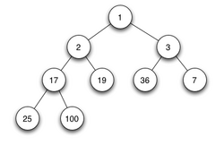
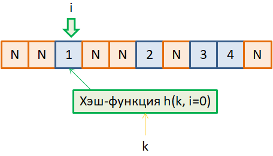
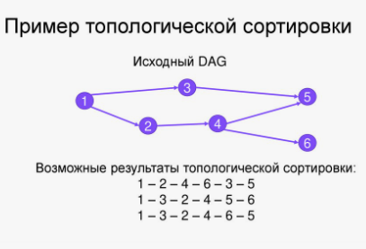
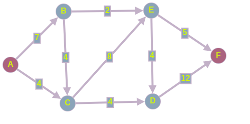
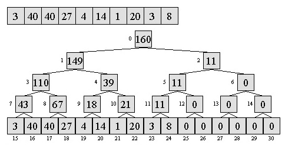
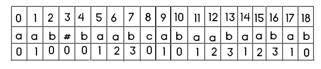
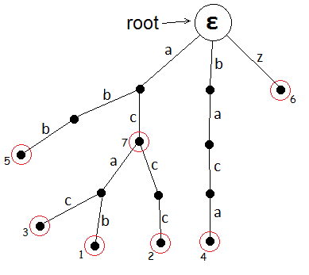

# Раздел 1. Алгоритмы и структуры данных

## *Содержание*

1. Сортировка слиянием (mergesort). Определение числа инверсий в перестановке за O(n log n).  
2. Быстрая сортировка (quicksort). Поиск k-й порядковой статистики за линейное в среднем время.  
3. Двоичная куча. Пирамидальная сортировка. Построение кучи за линейное время.  
4. Хеш-таблицы. Методы разрешения коллизий: метод цепочек, открытая адресация. Универсальное семейство хеш-функций.  
5. Амортизированная сложность. Динамический массив и оценка сложности его операций.  
6. Динамическое программирование: одномерное, двумерное.  
7. Самобалансирующиеся деревья поиска (рассказать любое на выбор). Реализация и оценка сложности операций вставки, удаления, поиска.  
8. Графы. Представление графов в памяти. Обход в ширину. Обход в глубину. Топологическая сортировка.  
9. Задача поиска кратчайших путей в графе. Алгоритм Дейкстры. Алгоритм Форда–Беллмана.  
10. Задача построения минимального остовного дерева. Алгоритм Крускала. Алгоритм Прима.  
11. Задача о максимальном потоке в графе. Теорема Форда–Фалкерсона. Алгоритм Эдмондса–Карпа.  
12. Дерево отрезков. Ограничения на поддерживаемую операцию. Запросы модификации на отрезке.  
13. Быстрое преобразование Фурье. Применение для умножения длинных чисел и многочленов.  
14. Нахождение обратного элемента по модулю. Быстрое возведение в степень.   
15. Задача поиска подстроки в строке. Алгоритм Рабина–Карпа. Алгоритм Кнута–Морриса–Пратта.  
16. Бор. Алгоритм Ахо–Корасик.

______
## 1. Сортировка слиянием (mergesort). Определение числа инверсий в перестановке за O(n log n).

#### Процедура Merge

*Задача:* Даны два отсортированных массива $a_1 \leq a_2 \leq ... \leq a_n$ и $b_1 \leq b_2 \leq ... \leq b_m$. Надо их слить в один отсортированный массив за $O(n+m)$ времени и доппамяти.

*Алгоритм:*
1. Заведем указатели на первые элементы массивов $i$ и $j$.
2. По индексу $i + j$ выпишем меньший из $a_i$ и $b_j$ и сдвинем соответствующий указатель на один вперед.
3. Так делаем, пока $i < n$ и $j < m$.
4. Оставшийся хвост одного из массивов дописываем в конец.

#### MergeSort

*Задача:* Дан массив $a_1, . . . , a_n$. Необходимо отсортировать его за $O(n \log{n})$ времени и $O(n)$ доппамяти.

*Алгоритм:*
1. Разделим массив на две равные части.
2. Каждую из них рекурсивно отсортируем.
3. Результаты сольем в один отсортированный массив.

#### Подсчёт числа инверсий

***def*** Пара $i < j$ называется *инверсией*, если $a_i > a_j$.

*Задача:* Дан массив $a_1, . . . , a_n$. Необходимо найти число инверсий за $O(n \log{n})$ времени и $O(n)$ доппамяти.

*Решение:*
1. Если при слиянии элемент левой части больше элемента правой части, то значит это и есть инверсия.
2. Пусть мы сравниваем в сортировке слиянием $l[i]$ и $r[j]$, тогда если $r[j] < l[i]$, то $r[j] < l[i] < l[i + 1] < . . . < l[N]$, то есть число инверсий это $N − i$ для $r[j]$.
3. Тогда для одного слияния итоговое число инверсий равно сумме по $j$ таких значений.
4. Итоговый ответ равен сумме по всем слияниям.

__________

## 2. Быстрая сортировка (quicksort). Поиск k-й порядковой статистики за линейное в среднем время.

#### QuickSort

*Цель:* Отсортировать массив $a_1, . . . , a_n$ за $O(n \log{n})$ времени в среднем.

*Алгоритм:*
1. Определённым образом выбрать опорный элемент `pivot`.
2. Произвести процедуру `partition`: все, что меньше `pivot` левее него, а все, что больше – правее.
3. Вызвать рекурсивно от правой и левой половин.

***th*** Среднее время работы быстрой сортировки массива $a_1,a_2, ..., a_N$ при случайном выборе опорного элемента составит $O(N \log{N})$.

$\square$

Будем считать, что в массиве нет повторяющихся элементов. Перенумеруем их таким образом, что $b_i$ – $i$-ый по возрастанию элемент.

Введём случайную величину $C$ – число сравнений: $C = \sum\limits_{i=1}^N \sum\limits_{j > i} C_{i, j}$, где $C_{i,j}$ – бинарная случайная величина, равная единице, если $b_i$ сравнивался с $b_j$. 

Пусть $x$ – опорный элемент, тогда впоследствии не будут сравниваться элементы, попавшие в разные стороны от $x$. При этом $b_i$ сравнивается с $b_j$ только если один из них был выбран опорным элементом. Вероятность, что кто-то был выбран опорным элементом равна $\frac{2}{j - i + 1}$ (всего промежутке $j - i + 1$ элемент). Откуда:

$\mathbb{E}[C] = \sum\limits_{i=1}^N \sum\limits_{j > i} P(C_{i,j} = 1) = \sum\limits_{i=1}^N \sum\limits_{j > i} \frac{2}{j - i + 1} = \sum\limits_{i=1}^N \sum\limits_{k = 1}^{N - i} \frac{2}{k} =^* \sum\limits_{i=1}^N O(\log{N}) = O(N \log{N})$

$*$ из факта $\sum\limits_{i=1}^k \frac{1}{i} = O(\log{k})$

$\blacksquare$

#### Поиск k-ой порядковой статистики

***def*** $k$-ая порядковая статистика массива — такой элемент, что после сортировки массива он окажется на $k$-ом месте.

*Алгоритм:*
1. Выбрать случай опорный элемент.
2. Провести разбиение.
3. Если индекс опорного элемента $i$ окажется больше данного $k$, то ищем слева $k$-ую порядковую, в случае равенства завершаемся, в противном случае – $(i − k − 1)$-ю порядковую.

***th (б/д)*** Время работы этого алгоритма линейно в среднем.

___________
## 3. Двоичная куча. Пирамидальная сортировка. Построение кучи за линейное время.

#### Бинарная куча

***def*** *Куча* – структура данных, которая позволяет добавлять в себя элементы и получать или извлекать минимум за логарифмическое время.

***def*** Бинарная куча — структура данных в виде полного бинарного дерева, для которого верно свойство кучи: все дети больше родителя.



*Просеивания:* Процедуры для восстановления свойств кучи при условии, что их нарушает один элемент.
- `siftUp` (просеивание элемента вверх) – процедура, поднимающая элемент как можно выше, пока не выполняется свойство кучи.
- `siftDown` (просеивание элемента вниз) – процедура, погружающая элемент как можно ниже, пока не выполняется свойство кучи.

*Операции:*
- `getMin` – вернуть элемент, находящийся в корне.
- `insert` – подвесить элемент в самое левое свободное место на нижнем уровне и просеять вверх.
- `extractMin` – поменять местами корневой элемент и самый правый лист, лист отрезать, корень просеять вниз.

Бинарная куча может быть представлена как массив. В таком случае:
- Дети узла с индексом $i$ имеют индексы $2i + 1$, $2i + 2$
- Родитель узла с индексом $i$ имеет индекс $\lfloor \frac{i - 1}{2} \rfloor$

#### Построение за линию на массиве (Heapify)

***def*** *Heapify* – функция, строящая кучу на заданном массиве. То есть надо переупорядочить элементы в массиве так, чтобы по индексам на всех парах родитель-сын было соблюдено свойство кучи.

*Алгоритм:* Будем просеивать вниз элементы, начиная с $\frac{N}{2}$-ого до нулевого.

*Корректность:* Вытекает из корректности `siftUp` при корректных поддеревьях.

*Время работы (б/д):* $O(N)$

#### Сортировка кучей (HeapSort)

*Цель:* Отсортировать массив за $O(N\log{N})$ времени и $O(1)$ доппамяти.

*Алгоритм:*
- Выполнить heapify.
- `x = extractMin()`, записываем его в конец массива.
- Повторяем $N-1$ раз.
- Развернуть массив.

__________
## 4. Хеш-таблицы. Методы разрешения коллизий: метод цепочек, открытая адресация. Универсальное семейство хеш-функций.

***def*** *Хеш-таблица* – контейнер, способный делать вставку, удаление и поиск в среднем за $O(1)$.

***def*** Пусть $U$ — множество рассматриваемых объектов, тогда $h : U \to \lbrace 0, 1, . . . , k − 1 \rbrace$ называется *хеш-функцией*.

***def*** Элементы $x, y \in U$, где $x \neq y$ образуют коллизию, если $h(x) = h(y)$.

#### Хеш-таблица на цепочках

***def*** *Бакетом* (bucket) называют нечто, хранящее все элементы, образующие коллизию.

Создадим массив некоторой длины $l$, где будем хранить по индексу цепочку из данных. Поиск в цепочке работает за линейное время, поэтому мы хотим уменьшить их максимальную длину.

Рассмотрим величину $L_q$ – длина цепочки, отвечающей ключу $q$. Пусть таблица построена для различных ключей $k_1, ..., k_n$, тогда: $L_q = \sum_{i=1}^{n} I[h(q) = h(k_i)]$

$\mathbb{E} L_q = \mathbb{E} \sum_{i=1}^{n} I[h(q) = h(k_i)] = \sum_{i=1}^{n} P[h(q) = h(k_i)]$

$$
P(h(x) = h(y)) = 
\begin{cases} 
1, & x = y \\ 
\frac{1}{k}, & x \neq y
\end{cases}
$$

С учётом того, что ключи различны:

$\mathbb{E} L_q = \sum_{i=1}^{n} P[h(q) = h(k_i)] \leq 1 + \frac{n-1}{k} \leq 1 + \frac{n}{k}$

***def*** Коэффициентом загруженности (load factor) называют величину $\alpha = \frac{n}{k}$. 

Тогда заведём константу $C$, т.ч. всегда $\alpha \leq \frac{n}{k}$. При соблюдении этого требования на load factor получим контейнер, выполняющий операции вставки, поиска и удаления за $O(1)$ в среднем.

#### Открытая адресация

Пусть вся хеш-таблица – один массив.



Пришёл $x$, считаем $h(x)$. Если $h(x)$ занят – смотрим следующий.

***def*** Пробой назовём функцию $g(x, i)$. 

То есть это "более умный шаг". Я не хочу давать конкретики, поэтому примеры:
- *Линейное пробирование*: $g(x, i) = h(x) + ai + b$
- *Квадратичное пробирование*: $g(x, i) = h(x) + ai^2 + bi + c$
- *Двойное хеширование*: $g(x, i) = h_1(x) + i \cdot h_2(x)$

Операции в хеш-таблице с открытой адресацией:
- *Insert*: Считаем $g(x, i=0) \sim h(x)$. В итоге вставим в $g(x, i=j)$, где $j$ – номер итерации прыжка, где нашли свободное место.
- *Lookup*: Идём от $g(x, i=0)$ до пустого, сравнивая в каждой ячейке с $x$. Если дошли до пустой, раньше, чем нашли $x$, то его не было.
- *Erase:* Просто удаление из ячейки может сломать "пути/цепочки поиска" других элементов. Введём новое состояние – $tombstone$. *Insert* будет видеть томбу как пустую ячейку, и сможет поверх неё перезаписать новый элемент. *Lookup* же воспринимает томбу как элемент, и идёт дальше по пробе.

Поддерживаем load factor $\alpha = \frac{n}{m}$. Если $\alpha > 0.5$, то рехеш+реалокация: $m \to 2m, h(x) = H(x) \mod{m} \to h'(x) = H(x) \mod{2m}$.

Время работы: $O(1)$ в среднем, вставка $O^*(1)$ в среднем.

#### Универсальное семейство хеш-функций

***def*** $\mathcal{H}$ – универсальное семейство хеш-функций. $\forall h \in \mathcal{H}, \forall x \neq y \hookrightarrow P(h(x) = h(y)) \leq \frac{1}{m}$

*Пример*: $\mathcal{H} = \lbrace h_{a,b}(x) = ((ax + b) \mod{p})\mod{m} \rbrace$, где $p$ – простое, $p > \vert Keys \vert$, $a \in \lbrace 1, 2, ..., p-1 \rbrace, b \in \mathbb{Z}_p$

***st*** Данное семейство универсально.

$\square$

$ax + b \equiv ay + b \space \mod{p}$ $\iff$ $ax \equiv ay \space \mod{p}$ $\iff$ $a$ взаимно просто $p$ $\iff$ $x \equiv y \space \mod{p}$ $\iff$ т.к. $x, y \in \mathbb{Z}_{\vert Keys \vert} \subset \mathbb{Z}_p$ $\iff$ $x = y$ противоречие.

$\implies$ Коллизий на первом этапе нет.

$$
\begin{cases} ax+b = c_1 \\ ay+b = c_2 \end{cases}
\iff
\begin{pmatrix} x & 1 \\ y & 1 \end{pmatrix}
\begin{pmatrix} a \\ b \end{pmatrix}
=
\begin{pmatrix} c_1 \\ c_2 \end{pmatrix}
\iff
\begin{pmatrix} a \\ b \end{pmatrix}
=
\begin{pmatrix} x & 1 \\ y & 1 \end{pmatrix}^{-1}
\begin{pmatrix} c_1 \\ c_2 \end{pmatrix}
$$

$$
\begin{vmatrix} x & 1 \\ y & 1 \end{vmatrix}
= x - y \neq 0
\implies
\exists
\begin{pmatrix} x & 1 \\ y & 1 \end{pmatrix}^{-1}
$$

$\implies$ По $c_1, c_2, x, y$ восстанавливаются $a, b$, то есть биекция $(x, y) \leftrightarrow (a, b)$

Зафиксируем $(a, b)$ и посчитаем число $(x, y)$: $h(x) = h(y)$. Всего пар ключей $< p^2$, считаем число пар, дающих коллизию: фикс. $x$ – $p$ способов. Число $y: h(x) = h(y) \iff x = y \mod{m} \sim \frac{p}{m}$ 

$\underset{h \in \mathcal{H}}{P} (h(x) = h(y)) = P_{x, y} (h(x) = h(y)) = \frac{p \cdot \frac{p}{m}}{p} = \frac{1}{m}$

$\blacksquare$

________
## 5. Амортизированная сложность. Динамический массив и оценка сложности его операций.

***def*** Пусть имеется последовательность операций, каждая из которых выполняется за время $t_i$, тогда *амортизированная стоимость* операции $t^* = \frac{1}{n} \sum\limits_{i=1}^n t_i$

Амортизированная сложность обозначается $O^* (f(n))$. Для доказательства амортизированной сложности применяется метод монеток (бухучёт) или метод потенциалов.

*Метод монеток:*
- Допустим, что каждая операция стоит определенной количество монет $C_i$ – учётная стоимость операции.
- Учётная стоимость не менее реальной. Оставшиеся монеты мы кладём в резерв, чтобы в будущем оплатить тяжёлую операцию.

*Метод потенциалов:*

***def*** Потенциалом от структуры $S$ назовём такую функцию $\phi(S)$, что:
- $\phi(S_0) = 0$, где $S_0$ – изначальное состояние структуры;
- $\phi(S) > 0$ в любой момент времени.

***def*** Пусть $t_i$ – реальное время $i$-ой операции, тогда $t_i^* = t_i + \phi(S_i) - \phi(S_{i-1})$ – учётное время.

***st*** $\frac{1}{n} \sum\limits_{i=1}^{n} t_i^* \geq t^*$

#### Динамический массив

***def*** *Динамически расширяющийся массив* (далее везде буду называть вектор) – массивоподобная структура, предлагающая следующий интерфейс:
- `push_back(n)` – добавить значение `n` в конец вектора.
- `pop()` – возвращает значение в конце вектора и удаляет его.
- `get(i)` – получить значение по индексу `i`

*Реализация на массиве:* у нас есть массив `T[] data`, его максимальная вместимость `cap = data.length` и нынешняя длина `size`.
- При добавлении элемента в конец перезаписываем его поверх `data[size]` и `size+=1`. При удалении с конца `size-=1`.
- Если добавляем в конец, но `size == cap`, то создаём новый массив `T[]` длины `cap*2`, и перезапишем в него `size` элементов из старого массива. Потом как обычно добавляем.
- Если удаляем с конца и вышло, что `size < cap / 4`, то создаём новый массив длины `cap/2`, и перезаписываем туда элементы.

*Амортизационный анализ (методом монеток)*:

Рассмотрим на примере `push_back` в векторе, `pop` аналогично:
- При добавлении элемента платим 3 монетки – одну за запись в массив, и две в резерв.
- Инвариант: к следующей реаллокации у нас монет в резерве не меньше, чем элементов.
- При реаллокации платим `cap` монеток на перемещение элемента. Повторные реаллокации будут оплачены резервом с добавления `cap` значений в правую половину.

___________
## 6. Динамическое программирование: одномерное, двумерное.

[TODO]

__________
## 7. Самобалансирующиеся деревья поиска (рассказать любое на выбор). Реализация и оценка сложности операций вставки, удаления, поиска.

[TODO]

________
## 8. Графы. Представление графов в памяти. Обход в ширину. Обход в глубину. Топологическая сортировка.

***def*** *Граф* – пара $G=(V, E)$, где $V$ – множество вершин, $E \subseteq V \times V$ – мультимножество рёбер.

Рёбра в памяти представляются парой вершин, в неориентированных графах при наличии ребра $(u, v)$ также есть и ребро $(v, u)$.

Есть следующие способы хранения графа:
- **Матрица смежности** – двумерный массив $G$ размера $|V| \times |V|$, где $G[u][v] = I[(u, v) \in E]$, т.е. бинарная матрица, хранящая на $u$-ой строке $v$-ом столбце наличие ребра $u \to v$
- **Список смежности** – массив $G$, где $G[u]$ – список всех соседей вершины $u$.

Сравнение по сложности операций:

| Операции                                  | Список Смежности                   | Матрица Смежности    |
| ----------------------------------------- | ---------------------------------- | -------------------- |
| $(u, v) \in E$ ?                          | $O(deg(u))$                        | $O(1)$               |
| $E' = E \backslash \lbrace (u, v)\rbrace$ | $O(deg(u))$                        | $O(1)$               |
| Получить список соседей                   | $O(1)$                             | $O(\vert V \vert)$   |
| Потребляемая память                       | $O(\vert V \vert + \vert E \vert)$ | $O(\vert V \vert^2)$ |
#### Depth-First Search

***def*** *DFS* (depth first seach) – обход в глубину, т.е. обход графа, в котором вершины посещаются как только обнаружены.
Псевдокод:
```java
private static void dfs(ArrayList<Integer>[] graph, int v, int visited) {
	visited[v] = true;
	
	for (int u: gragh[v]) {
		if (!visited[u]) {
			dfs(graph, u, visited);
		}
	}
	
	// Вот здесь выход из вершины (см. топсорт)
}
```
Чёт в таком духе. Без рекурсии пишется со стеком.

#### Breadth-First Search

***def*** *BFS* (breadth-first search) – обход в ширину, т.е. обход графа, в котором сначала посещаются соседи начальной вершины, затем их соседи и т.д.

*Алгоритм:*
- Заведём очередь вершин в неё положим стартовую $s$
- Пока очередь не пустая:
  1. Извлечём вершину $v$ из начала очереди, пометим $v$ как посещённую.
  2. Добавим все смежные не посещённые вершины в очередь.

*Псевдокод:*
```kotlin
private static void bfs(ArrayList<Integer>[] graph, int s) {
	bool[] visited = new bool[];
	ArrayDeque<Integer> queue = new ArrayDeque<Integer>();
	
	queue.add(s)
	while (queue.peek() != null) {
		int v = queue.pop();
		visited[v] = true;
		
		for (int u: graph[v]) {
			if (!visited[u]) {
				queue.add(u);
			}
		}
	}
}
```

#### Topsort

Рассмотрим ориентированный граф, присвоим каждой вершине номер. 

***def*** Перестановка $\sigma$ называется *топологической сортировкой*, если $\forall (u, v)\in E \hookrightarrow \sigma(u) < \sigma(v)$



Топологическая сортировка существует только в ацикличном орграфе (т.к. отношение "<" ациклично).

*Алгоритм построения:*
1. Запустим DFS на всём графе. В момент выхода DFS из вершины будем добавлять её в конец массива.
2. Развернём полученный массив. Он содержит перестановку, являющуюся корректным топсортом:
	   В DFS, если вершина $u$ достигается из $v$, то $u$ будет обработана раньше $v$ (раньше выйдет из стека), поэтому сортировка вершин в порядке убывания времён выхода является топологической сортировкой.

_____
## 9. Задача поиска кратчайших путей в графе. Алгоритм Дейкстры. Алгоритм Форда–Беллмана.

***def*** *Взвешенным графом* будем называть тройку $G=(V, E, w)$, где $V$ и $E$ – множества вершин и рёбер соответственно, а $w: E \to K \subseteq \mathbb{R}$ – весовая функция.

***def*** Весом пути $p=v_1...v_k$ будем называть величину $w(p) = \sum_{i=1}^{k-1}w(v_i, v_{i+1})$

***def*** Кратчайшим путём от вершины $s$ до вершины $t$, назовём такой путь $p=sv_1...v_kt$, что его вес минимален среди всех возможных путей от $s$ до $t$. Длину такого пути буде обозначать $dist(s, t)$ и называть расстоянием.

#### Алгоритм Дейкстры

*Цель:* Найти расстояния (+ кратчайшие пути) от вершины $s$ до всех остальных, если $w:E \to \mathbb{R}^+$

*Алгоритм:*
- Пусть $S={s}$ – множество вершин, для которых расстояние от $s$ вычислено корректно на текущий момент времени, $d[v]$ – оценка сверху на $dist(s, v)$ (инициализировать как +INF, $d[s] = 0$).
- Пока $S \neq V$:
  1. Выбрали $from = arg \underset{v \in V \backslash S}{min} d[v]$
  2. $S = S \cup {from}$, присвоим $dist(s, from) = d[from]$
  3. Для рёбер вида $(from, to)$ проведём релаксацию, т.е. $d[to]=min(dist(s, from) + w(from, to), d[to])$

*Корректность:*

***st*** На момент добавления $v$ в $S$ верно, что $dist(s, v) = d[v]$

$\square$ 

Индукция по размеру $S$:
- *База:* $S= \lbrace s \rbrace$ – всё корректно
- *Переход:* Пусть $d[v] > dist(s, v)$. Пусть $u$ – вершина, т.ч. на ней посчитали $d[v]$. Так как из $u$ была релаксация, значит $u \in S$. По предположению индукции, $d[u] = dist(s, u)$ $\implies d[v] = dist(s, u) + w(u, v)$. Если данный путь не кратчайший, то есть другой устроенный одним из двух образов:
	$u \to v$ (одно ребро) – путь до $v$ состоит только из вершин из $S$. Но мы выбрали вершину $u$ таким образом, что она заканчивает путь из вершин из $S$, т.е. этот случай уже рассмотрен.
	
	$u \to V \backslash S \to v = ut \to v$ – путь начался в $S$, далее попал в $V \backslash S$ и далее пришёл в v. Пусть ребро $(u, t)$ такое, что $u \in S, t \notin S$. Если таких несколько, то выберем последнее на пути из них. Так как $u \in S$, то $d[t] = dist(s, t)$, при этом известно, что $d[t] \geq  d[v]$, т.к. иначе мы бы рассматривали $t$, а не $v$. Известно, что $w(t...v) \geq 0$, откуда: $$dist(s, v) = dist(s, t) + w(t...v) \geq dist(s, t) = d[t] \geq d[v] > dist(s, v)$$Противоречие завершает доказательство. 

$\blacksquare$

*Время:*
- Уменьшение оценки d для вершины: каждое ребро уменьшает оценку не более одного раза, значит таких операций $O(\vert E \vert)$.
- Получение вершины с минимальной оценкой d не из S: каждая вершина извлекается не более одного раза, значит таких операций $O(\vert V \vert)$.

| Контейнер вершин | Релаксация               | Извлечение               | Итого                                  |
| ---------------- | ------------------------ | ------------------------ | -------------------------------------- |
| Массив           | $O(1)$                   | $O(\vert V \vert)$       | $O(\vert V \vert ^2)$                  |
| Дерево           | $O(\log{\vert V \vert})$ | $O(\log{\vert V \vert})$ | $O(\vert E \vert \log{\vert V \vert})$ |
	(Пути можно восстановить, если куда-то писать, какая вершина вызвала релаксацию в данной, тогда parent[to] = from)
#### Алгоритм Форда-Беллмана

*Цель:* Найти расстояния от вершины $s$ до всех остальных, если $w:E \to \mathbb{R}$, в предположении, что нет циклов отрицательного веса.

*Алгоритм (дп):*
1. *Что хранит в себе состояние динамики?* Пусть $dp[v][k]$ равно минимальному весу пути из $s$ в $v$ ровно из $k$ рёбер.
2. *База:* $dp[s][0] = 0, \space dp[:][:] = +\inf$
3. *Переход:* $dp[v][k]=\underset{(u, v) \in E}{min}(dp[u][k-1] + w(u,v))$
4. *Какой порядок пересчёта?* Внешний цикл по $k$, внутри цикл по рёбрам
5. *Где лежит ответ на задачу?* $ans[v] = \underset{k}{min} dp[v][k]$

Алгоритм рассчитывает матрицу $dp$. По первому измерению – все вершины, т.е. $\vert V \vert$, по второму – длина пути, т.е. $\vert V \vert - 1$, откуда памяти $O(\vert V \vert ^2)$

Время работы вытекает из порядка пересчёта, т.е. $O(\vert V \vert \vert E \vert)$

***def*** *Циклом отрицательного веса* назовём цикл $v_1...v_nv_1$, у которого $\sum_{i=1}^n w(v_i, v_{i+1}) \lt 0, \space v_{n+1} = v_1$. При поиске кратчайших путей можно ходить по нему бесконечно долго, получая путь сколь угодно малого веса.

Для поиска циклов отрицательного веса можно адаптировать алгоритм Форда-Беллмана: храним для каждой вершины предка, из которого она релаксировалась.

***st*** На $\vert V \vert$-ой итерации найдена вершина $v$, до которой расстояние уменьшилось по сравнению с $(\vert V \vert - 1)$-ой итерацией $\iff$ В графе есть цикл отрицательного веса, достижимый из $s$.

$\square$ 

$(\implies)$ Простой кратчайший путь не может быть длиннее $\vert V \vert -1$ рёбер, а если произошла релаксация, то существует **не** простой путь, имеющий вес строго меньший, а значит есть цикл отрицательного веса.

$(\impliedby )$ Рассмотрим цикл отрицательного веса $C = c_1...c_k$ т.к. $\vert C \vert < \vert V \vert$, на $\vert V \vert$-ой итерации найдётся вершина $c_i$ из $C$, которая будет рассмотрена ещё (второй или более) раз, при этом она будет рассмотрена по пути вдоль отрицательного цикла, а значит произойдёт релаксация.

$\blacksquare$

___
## 10. Задача построения минимального остовного дерева. Алгоритм Крускала. Алгоритм Прима.

***def*** *Остовом* графа $G = (V, E)$ будет называть граф $H = (V, E')$, где $E' \subseteq E$

***def*** *Остовным деревом* графа $G$ будем называть остов, образующий дерево.

***def*** *Минимальным остовным деревом* графа  $G = (V, E, w)$ будем называть такое остовное дерево $H = (V, E', w)$, что $\sum_{e \in E'} w(e)$ минимальна. Будем называть его *Minimum Spanning Tree (MST)*.

##### Лемма о безопасном ребре

***def*** $<S, T>$ – разрез, если $S \cup T = V, S \cap T = \varnothing$. Ребро $(u, v)$ пересекает разрез, если $u$ и $v$ в разных частях разреза.

***def*** Пусть $G' = (V, E')$ – подграф некоторого MST графа $G$. Ребро $(u, v) \in E$ безопасное, если при добавлении его в $G'$, $G'' = (V, E' \cup \lbrace (u, v) \rbrace)$ также является подграфом некоторого MST графа $G$.

***lemm*** Рассмотрим связный взвешенный граф $G = (V, E, w), w: E \to \mathbb{R}$. Пусть $G' = (V, E')$ – подграф некоторого MST графа $G$, $<S, T>$ – разрез $G$, т.ч. ни одно ребро из $E'$ не пересекает разрез, а $e = (u, v)$ – ребро минимального веса, пересекающее разрез $<S, T>$. Тогда ребро $e$ является безопасным.

$\square$

Достроим $E'$ до некоторого MST, который обозначим $T_{min}$. Если $e \in T_{min}$, то лемма доказана, поэтому предположим, что $e \notin T_{min}$. 

Рассмотрим путь в $T_{min}$ от вершины u до вершины v. Хотя бы одно ребро $e'$ на этом пути пересекает разрез (выберем любое). По условию, $w(e) \leq w(e')$. Заменим ребро $e'$ в $T_{min}$ на $e$. Полученное дерево также является MST $G$, поскольку все вершины $G$ по-прежнему связны и вес дерева не увеличился. $\implies$ $E' \cup \lbrace e\rbrace$ можно дополнить до миностова в графе $G$, т.е. ребро $e$ – безопасное.

$\blacksquare$

#### Алгоритм Прима

*Цель:* Найти MST графа $G = (V, E, w)$

*Алгоритм:*
Изначально $S = {s}$, где $s$ – произвольная вершина.
1. Рассмотрим разрез $<S, T>$. Найдём безопасное для него ребро $e=(u, v)$, где $u \in S$.
2. Добавим $e$ в миностов и $v$ в $S$.
3. Добавим в множество рёбер, пересекающих разрез, рёбра, выходящие из $v$ и идущие не в $S$.
4. Повторять пока $S \neq V$.

*Сложность:*
- Добавление рёбер в множество пересекающих разрез $\vert E \vert$ раз.
- Удаление ребра минимального веса через разрез $\vert V \vert - 1$ раз.

| Контейнер Рёбер | Добавление               | Извлечение               | Итого                                                  |
| --------------- | ------------------------ | ------------------------ | ------------------------------------------------------ |
| Массив          | $O(1)$                   | $O(\vert V \vert)$       | $O(\vert V \vert ^2)$                                  |
| Дерево Поиска   | $O(\log{\vert V \vert})$ | $O(\log{\vert V \vert})$ | $O(\vert E \vert + \vert V \vert \log{\vert V \vert})$ |
	Добавление в массиве можно реализовать так: изначально инициализировать вес равный +INF, а далее, при пересечении разреза, ставить реальный вес.

#### Алгоритм Крускала

*Цель:* Найти MST графа $G = (V, E, w)$

*Алгоритм:*
1. Отсортируем рёбра по весу.
2. Итерируясь по рёбрам, проверяем, приводит ли его добавление к циклу. Если нет – берём, иначе пропускаем.

	Второй шаг легко проверить, используя для хранения компонент связности DSU (Disjoint Set Union) – структуру данных с интерфейсом: unite(a, b) – объединить два множества, где находятся a и b, are_same(a, b) – узнать, лежат ли a и b в одном множестве. В реализации на массиве с весовой эвристикой и эвристикой сжатия путей время на запрос составляет $O(\alpha ( n))$, где $n$ – число вершин, $\alpha(x) = min\lbrace k \vert A(k, k) \geq x\rbrace$ – обратная функция Аккермана. 
	
	В большинстве случаев $\alpha(n) \leq 4$, однако опускать её при анализе нельзя.
	
	Пример: $A(4, 4) = 2^{2^{2^{2^{65536}}}} - 3$
	
	Сама функция Аккермана:

$$
A(m, n) = 
\begin{cases} 
n + 1, & m = 0 \\ 
A(m - 1, 1), & n = 0 \\ 
A(m - 1, A(m, n - 1)), & \text{else} 
\end{cases}
$$

По итогу время работы первого шага – $O(\vert E \vert \log{\vert E \vert})$, второго – $O(\vert E \vert \alpha (\vert V \vert))$. Итого, время работы алгоритма $O(\vert E \vert \log{\vert E \vert})$.

___
## 11. Задача о максимальном потоке в графе. Теорема Форда–Фалкерсона. Алгоритм Эдмондса–Карпа.

Пару рёбер $(u, v), (v, u) \in E$ в графе $G=(V, E)$ называют антипараллельными.

***def*** *Сетью* назовём кортеж $\mathcal{N} = (G, c, s, t)$, где $G=(V, E)$ – ориентированный граф без антипараллельных рёбер, $c: E \to \mathbb{R}^+$ – вместимость (capacity) , $s, t \in V, s \neq t$ – исток и сток соответственно. 

(Далее cчитаем, что $(u, v) \notin E \implies c((u, v)) = 0$. Tогда справедливо определять capacity на $V \times V$)

***def*** *Поток* в транспортной сети – функция $f: V \times V \to \mathbb{R}^+$, т.ч.:
1. $\forall u, v \in V \hookrightarrow 0 \leq f(u, v) \leq c(u, v)$ (свойство ограниченности потока)
2. $\forall u \in V \backslash \lbrace s, t\rbrace \hookrightarrow \underset{v \in V}{\sum} f(u, v) = \underset{v \in V}{\sum} f(v, u)$ (свойство сохранения потока)


***def*** Пусть в сети $\mathcal{N}$ зафиксирован поток $f$. Тогда *величиной потока* называют $\vert f \vert = \underset{v \in V}{\sum} f(s, v) - \underset{v \in V}{\sum} f(v, s)$

Задача о максимальном потоке – задача поиска в сети такого потока $f$, что $\vert f \vert$ максимален.

Ещё пара полезных терминов:

***def*** *Остаточная сеть* для сети $\mathcal{N} = (G, c, s, t)$ и потока *f* – сеть $\mathcal{N}_f = (G'=(V, E_f), c_f, s, t)$, где:

$$
\forall u, v \in V \quad c_f(u, v) = 
\begin{cases} 
c(u, v) - f(u, v), & (u, v) \in E \\ 
f(v, u), & (v, u) \in E \\ 
0, & \text{else} 
\end{cases}
$$





***def*** *Дополняющим потоком* для сети $\mathcal{N}$ и потока $f$ определим поток $f'$ в остаточной сети $\mathcal{N}_f$.

***def*** Сложение потоков $f + f'$ определяется следующим образом:

$$
\forall u, v \in V \quad (f+f')(u, v) = 
\begin{cases} 
f(u, v) + f'(u, v) - f'(v, u), & (u,v) \in E \\ 
0, & \text{else} 
\end{cases}
$$

***st*** Сложение потока $f$ с дополняющим потоком $f'$ также является потоком.

#### Теорема Форда-Фалкерсона

***def*** Разрезом в сети $\mathcal{N} = (G, c, s, t)$ назовём пару $(S, T)$, т.ч.:
- $S, T \subset V$
- $s \in S, t \in T$
- $S \cap T = \varnothing \text{ и } S \cap T = V$

***def*** *Потоком через разрез* $(S, T)$ назовём величину $f(S, T) = \underset{u \in S}{\sum}\underset{v \in T}{\sum}f(u, v) - \underset{u \in S}{\sum}\underset{v \in T}{\sum}f(v, u)$

***def*** *Вместимостью* или *пропускной способностью разреза* назовём: $c(S, T) = \underset{u \in S}{\sum}\underset{v \in T}{\sum}c(u, v)$

***def*** *Минимальным разрезом* назовём разрез с минимальной пропускной способностью.

***st*** Пусть в сети $\mathcal{N}$ задан поток $f$, тогда $\forall (S, T)$ – разрез $\hookrightarrow f(S, T) = \vert f \vert$

$\square$

По определению потока $\forall u \in V \backslash \lbrace s, t\rbrace \hookrightarrow \underset{v \in V}{\sum} f(u, v) - \underset{v \in V}{\sum} f(v, u) = 0$

Тогда, используя определение величины потока:

$\vert f \vert = \underset{v \in V}{\sum} f(s, v) - \underset{v \in V}{\sum} f(v, s) = \underset{v \in V}{\sum} f(s, v) - \underset{v \in V}{\sum} f(v, s) + \underset{u \in S \backslash \lbrace s \rbrace }{\sum}(\underset{v \in V}{\sum} f(u, v) - \underset{v \in V}{\sum} f(v, u) ) =$

$= \underset{v \in V}{\sum} \underset{u \in S}{\sum} f(u, v) - \underset{v \in V}{\sum}\underset{u \in S}{\sum} f(v, u) = \underset{v \in S}{\sum} \underset{u \in S}{\sum} f(u, v) + \underset{v \in T}{\sum} \underset{u \in S}{\sum} f(u, v) - \underset{v \in T}{\sum}\underset{u \in S}{\sum} f(v, u) - \underset{v \in T}{\sum} \underset{u \in S}{\sum} f(u, v) =$

$=\underset{v \in T}{\sum}\underset{u \in S}{\sum} f(u, v) - \underset{v \in T}{\sum}\underset{u \in S}{\sum} f(v, u) = f(S, T)$

$\blacksquare$

***conc*** Величина любого потока ограниченна в сети: не превосходит пропускной способности произвольного разреза.

$\square$

$\vert f \vert = f(S, T) = \underset{v \in T}{\sum}\underset{u \in S}{\sum} f(u, v) - \underset{v \in T}{\sum}\underset{u \in S}{\sum} f(v, u) \leq \underset{v \in T}{\sum}\underset{u \in S}{\sum} f(u, v) \leq \underset{v \in T}{\sum}\underset{u \in S}{\sum} c(u, v) = c(S, T)$

$\blacksquare$

***th (Форда-Фалкерсона)*** Пусть задана сеть $\mathcal{N}$ и поток $f$ в ней, тогда следующие утверждения эквивалентны:
1. Поток $f$ в сети максимален
2. В $\mathcal{N}_f$ нет пути из истока в сток.
3. Существует разрез $(S, T)$ т.ч. $\vert f \vert = c(S, T)$

$\square$

$(1 \to 2)$ Предположим противное: в $\mathcal{N}_f$ есть путь из истока в сток, пустим вдоль него дополняющий поток $f', \vert f' \vert > 0$. Тогда $f+f'$ – поток и $\vert f + f' \vert = \vert f \vert + \vert f' \vert > \vert f \vert$. Противоречие с максимальностью $f$.

$(2 \to 3)$ Пусть в $\mathcal{N}_f$ нет пути из $s$ в $t$, тогда определим разрез $(S, T)$ следующим образом: $S = \lbrace v \vert \text{ есть путь в остаточной сети из } s \text{ в } v \rbrace, \space T = V \backslash S$. Рассмотрим пару вершин $u \in S, v \in T$:
- Если $(u, v) \in E$, то $f(u, v) = c(u, v)$, т.к. иначе $c_f (u, v) > 0$ и есть в остаточной сети ребро $(u, v)$, а значит $t$ достижима из $s$, что неверно.
- Если $(v, u) \in E$, то $f(v, u) = 0$. Иначе был бы путь из $s$ в $t$ по появившемуся в остаточной сети обратному ребру.
Откуда: $f(S, T) = \underset{u \in S}{\sum}\underset{v \in T}{\sum}f(u, v) - \underset{u \in S}{\sum}\underset{v \in T}{\sum}f(v, u) = \underset{u \in S}{\sum}\underset{v \in T}{\sum}c(u, v) = c(S, T)$

$(3 \to 1)$ Для любого потока и разреза $\vert f \vert \leq c(S, T)$, но построен такой поток $f^*$, что $\vert f^* \vert \leq c(S, T) \implies f^*$ – максимальный.

$\blacksquare$

#### Алгоритм Эдмондса-Карпа

*Цель:* Найти максимальный поток в сети.

*Алгоритм:*
1. Построим сеть $\mathcal{N}$, определим поток $f \equiv 0$. Строим остаточную сеть $\mathcal{N}_f$.
2. Пока $\exists$ путь $p$ из $s$ в $t$ в $\mathcal{N}_f$:
- Пропустим поток $f'$ вдоль него: запускаем BFS из $s$ в $t$ в $\mathcal{N}_f$ и пропускаем вдоль пути сразу весь доступный поток (минимальный capacity на пути).
- Складываем поток $f = f + f'$
- Перестраиваем вдоль $p$ остаточную сеть.

*Анализ времени работы:*

***lemm (о неубывании расстояний)*** Если в сети $\mathcal{N} = (G, c, s, t)$ увеличение потока производится вдоль кратчайших (рёберная длина) путей из истока в сток в $\mathcal{N}_f$, то $\forall v \in V \backslash \lbrace s, t \rbrace$ длина кратчайшего пути $d_f (s, v)$ в $\mathcal{N}_f$ не убывает.

$\square$

Пусть $f, f'$ – потоки в $\mathcal{N}$, между которыми одна итерация алгоритма. Пусть $v$ – ближайшая вершина, для которой расстояние уменьшилось, т.е. $v = arg \underset{v \in V \backslash \lbrace s, t \rbrace}{min}\lbrace d_f (s, v) \vert d_{f'} (s, v) < d_f(s, v) \rbrace$.

Рассмотрим путь $p = s \leadsto u \to v$, являющийся кратчайшим от $s$ до $v$ в $\mathcal{N}_{f'}$. Тогда верно, что $d_{f'} (s, u) = d_{f'} (s, v) - 1$. Откуда, из выбора $v$, следует, что $d_{f'}(s, u) \geq d_{f}(s, u)$, $d_{f'}(s, v) < d_{f}(s, v)$ и $d_{f'}(s, u) \geq d_{f}(s, u)$.

- Если $(u, v) \in E$, то $d_f(s, v) \leq d_f(s, u) + 1 \leq d_{f'} (s, u) + 1= d_{f'}(s, v)$
- Если $(u, v) \notin E$, но $(u, v) \in E_f$, то появление $(u, v)$ означает увеличение потока по обратному ребру $(v, u)$. Увеличение потока производится вдоль кратчайшего пути, поэтому кратчайший путь из $s$ в $u$, вдоль которого происходило увеличение, выглядит как $s \leadsto v \to u$, откуда: $d_f(s, u) = d_f(s, v) - 1 \leq d_{f'}(s, u) - 1 = d_{f'}(s, v) - 2$

$\blacksquare$

***th*** Время работы алгоритма Эдмондса-Карпа составляет $O(\vert V \vert \vert E \vert ^2)$.

$\square$

Назовём ребро $e$ вдоль кратчайшего пути $p$ в $\mathcal{N}_f$ от $s$ до $t$, критическим, если $c_f(e) = \underset{e \in p}{min} \space c_f(e).$ Покажем, что каждое ребро становится критическим $O(\vert V \vert)$ раз.

Заметим, что после увеличения все критические рёбра исчезают из остаточной сети. Рассмотрим $(u, v) \in E$. Увеличение производится вдоль кратчайших путей, поэтому если $(u, v)$ становится критическим в первый раз, то $d_f(s, v) = d_f (s, u) + 1$. Затем оно исчезнет из сети, пока поток по нему не будет уменьшен по обратному ребру $(v, u)$. Пусть в момент перед увеличением поток в сети $\mathcal{N}$ с составлял $f'$, тогда $d_{f'}(s, u) = d_{f'} (s, v) + 1$. Из леммы $d_f (s, v) \leq d_{f'} (s, v)$, откуда: $d_{f'}(s, u) = d_{f'} (s, v) + 1 \geq  d_f (s, v) + 1 = d_f(s, u) + 2$. Получаем, что между итерациями, когда $(u, v) \in E$ становится критическим, расстояние от $s$ до $u$ увеличивается на $\geq 2$ ребра, откуда $O(\vert V \vert)$ раз оно могло становиться критическим.

Всего рёбер $O(\vert E \vert)$, значит суммарное число итераций составит $O(\vert V \vert \vert E \vert)$. Время работы каждой итерации – $O(\vert E \vert)$. Тогда итоговое время работы алгоритма Эдмондса-Карпа составит $O(\vert V \vert \vert E \vert ^2)$.

$\blacksquare$

___
## 12. Дерево отрезков. Ограничения на поддерживаемую операцию. Запросы модификации на отрезке.

***def*** *Дерево отрезков* способно за $O(log N)$ получать на подотрезке результат любой операции, которая ассоциативна, коммутативна и имеет нейтральный элемент.

В частности, задачи RSQ/RMQ, как правило, решается с использованием этой структуры данных.



- *Построение:* 
  
  Опишем нерекурсивное построение дерева на массиве длины $N$. Считаем, что $\log_2{N} \in \mathbb{N}$, иначе дозаполним до степени двойки нейтральным элементом. 
  
  Заведем массив длины $2N - 1$, последние $N$ элементов будут элементами исходного массива. Первые $N - 1$ элементов заполним следующим образом: $t[i] = F(t[2i + 1],t[2i + 2])$ (заполнение от элемента с номером $N − 2$ и до $0$ в цикле).
  
- *Запрос по отрезку:* 
  
  Пусть мы находимся в узле, отвечающего за подотрезок $[l,r]$, а изначальный запрос был $[L, R]$. 
  - Если $[l, r] \cap [L, R] = \varnothing$, то вернем нейтральный элемент.
  - Если $[l, r] \subseteq [L, R]$, то вернём ответ в узле.
  - Иначе вернём результат операции с ответов детей.

  То есть исходный отрезок разбивается на дизъюнктное объединение подотрезков.
  
  Заметим, что на каждом уровне раскрываться вниз могут не более двух узлов, так как только крайние могут порождать дочерние запросы. Следовательно, время работы $O(log N)$.
  
- *Модификация в точке:* 
  
  Пусть необходимо обновить элемент с индексом $i$.
  
  1. Найдем в дереве лист, отвечающий за $i$-й элемент. Это $(N − 1 + i)$-й.
  2. Индекс родителя: $\lfloor \frac{i-1}{2} \rfloor$
  3. Обновляем значение в родителе через результаты на деревьях.
  4. Повтори, пока не обновил корень.
  
#### Запросы модификации на отрезке

***def*** Операцией группового обновления $ch$ будем называть запрос, в ходе которого применяется на подотрезке операция $ch(\cdot , val)$.

Свойства на операцию $ch$, если $op$ – операция запроса на отрезке:
1. Существование нейтрального элемента.
2. Ассоциативность: $ch(a, ch(b, c)) = ch(ch(a, b), c)$
3. Дистрибутивность: $ch(op(a, b), c) = op(ch(a, c), ch(b, c))$

***def*** *Несогласованность* – величина, с которой надо выполнить операцию $op$, чтобы получить корректный результат.

В каждый момент времени в узле необязательно лежит истинное значение $op$ на отрезке. Но к моменту запроса будем осуществлять *проталкивание несогласованности*.

*Псевдокод из [презы](https://drive.google.com/drive/folders/12BKJGXZPgMPwiNMjqYUSZaHAQPCgrOvN):*

```
void push(int node) {
	tree[2∗node + 1].d = ch(tree[2∗node + 1].d, tree[node].d);
	tree[2∗node + 2].d = ch(tree[2∗node + 2].d, tree[node].d);
	tree[node].d = ch_neutral;
}
```
Проталкивание несогласованности детям. Необходимо выполнять как только идет рекурсивный запуск от текущей вершины к её детям. Нужно это для того, чтобы в детях в момент обработки были корректные данные.

```
void update(int node, int a, int b, T val) {
    l = tree[node].left, r = tree[node].right;
	if ([l, r) is subset [a, b)):
        tree[node].d = ch(tree[node].d, val);
        return;
    push(node);
    update(2 * node + 1, a, b, val);
    update(2 * node + 2, a, b, val);
    tree[node].ans =
        op(ch(tree[2*node+1].ans, tree[2*node+1].d),
           ch(tree[2*node+2].ans, tree[2*node+2].d));
}
```
Процедура обновления на отрезке. Данная процедура выполняет разбиение текущего отрезка на подотрезки и обновление в них несогласованности. Очень важно выполнить `push` как только идет рекурсивный вызов от детей, чтобы избежать некорректной обработки в детях. И так как значение в детях могло измениться, то необходимо выполнить обновление ответа по операции $op$ на текущем отрезке.


```
...
ans = op(query(2∗node + 1, a, b), query(2∗node +2, a, b));
tree[node].ans = op(ch(tree[2∗node + 1].ans, tree[2∗node + 1].d),
				ch(tree[2∗node + 2].ans, tree[2∗node + 2].d));
return ans;
```
Получение ответа по операции $op$ отличается от операции обновления лишь в том, что для каждого отрезка разбиения необходимо не обновить несогласованность, а сложить по операции $op$ с текущим ответом истинное значение на отрезке (то есть результат сложения по операции $ch$ значения в вершине с несогласованностью).

___
## 13. Быстрое преобразование Фурье. Применение для умножения длинных чисел и многочленов.

[TODO]

___
## 14. Нахождение обратного элемента по модулю. Быстрое возведение в степень.

[TODO]

___
## 15. Задача поиска подстроки в строке. Алгоритм Рабина–Карпа. Алгоритм Кнута–Морриса–Пратта.

*Задача:* Дан текст $T$ и паттерн $P$. Требуется найти все позиции, начиная с которых $P$ входит в $T$.

Определим префикс-функцию и линейный алгоритм её подсчёта, чтобы использовать в алгоритме Кнута-Морриса-Пратта. Аналогично можно посчитать с z-функцией.

***def*** Строка $S'$ называется *супрефиксом* $S$, если она является одновременно и префиском, и суффиксом строки $S$.

***def*** *Префикс-функцией* от строки $S$ называют массив $\pi(S)$ длины $\vert S \vert$, что $\pi(S)[i]$ равно длине максимального несобственного (не равного всей строке) супрефикса строки $S[:i+1]$



***st*** $\pi(S)[i+1] \geq \pi(S)[i] + 1$

$\square$

Рассмотрим подстроку вида: суффикс строки $S[:i+2]$ длины $\pi(S)[i+1]$. Удалив последний символ этой подстроки мы получим суффикс, оканчивающийся на позиции $i$ и имеющий длину $\pi(S)[i+1] - 1 \geq \pi(S)[i]$

$\blacksquare$

***st*** Супрефиксы $S$ в порядке вложенности имеют длины $\pi(S)[\vert S \vert -1]$, $\pi(S)[\pi(S)[\vert S \vert - 1] -1]$, ...

$\square$

Рассмотрим супрефикс строки $S$ длины $\pi(S)[\vert S \vert - 1]$, по определению – это максимальный супрефикс $S$. Следующий по вложенности супрефикс $S$ – супрефикс подстроки $S[:\pi(S)[\vert S \vert - 1]]$.

$\blacksquare$

*Линейный алгоритм:* Будем насчитывать индукцией по $i$:
1. База: $\pi(S)[0] = 0$, по определению.
2. Подсчёт $\pi(S)[i+1]$: пусть $\forall j \geq i$ известно $\pi(S)[j]$. Надо посчитать $\pi(S)[i+1]$. Рассмотрим два случая:
   - Если $S[i+1] = S[\pi(S)[i]]$, то $\pi(S)[i+1] = \pi(S)[i] + 1$ по определению.
   - Если $S[i+1] \neq S[\pi(S)[i]]$. Цель – максимальный по длине супрефикс, заканчивающийся в $(i+1)$-ой позиции. Он состоит из какого-то супрефикса строки $S[:i+1]$ и символа $S[i+1]$. Переберём все супрефиксы $S[:i+1]$ в порядке вложенности, пусть они имеют длины $j_1 > j_2 > ... > j_k$, тогда $\pi(S)[i+1] = j_m + 1$, где $m$ – первый из последовательности, такой что $S[j_m + 1] = S[i+1]$.
     
   Объединяя два случая выше и пользуясь утверждениями: $\pi(S)[i+1] = \pi[j] + 1$, где $j$ –такой индекс, что $S[\pi(S)[j]] = S[i+1]$ и при этом $j$ – первый такой индекс из последовательности $i$, $\pi(S)[i]$, $\pi(S)[\pi(S)[i]]$, ...

*Псевдокод:*
```python
def prefixFunction(s: str):
  p = [0] * len(s)
  for i in range(1, len(s)):
      k = p[i - 1]
      while k > 0 and s[i] != s[k]
          k = p[k - 1]
      if s[i] == s[k]
          k++
      p[i] = k
  return p
```

*Время работы:* определяется числом итераций внутреннего цикла `while`: счётчик k может увеличиться не больше, чем на 1, значит оно не больше $\vert S \vert - 1$. А внутри `while` оно убывает, значит суммарное число итераций `while` не превосходит $\vert S \vert - 1$ (ограниченно сверху числом увеличений счётчика). $\implies$ Итоговое время работы составит $O(\vert S \vert)$

#### Алгоритм Кнута-Морриса-Пратта

*Цель:* Дан текст $T$ и паттерн $P$, найти все вхождения паттерна в текст.
*Алгоритм:* 
- Построим строку $S = P \triangle T$, где $\triangle$ – любой символ, не входящий в алфавит $P$ и $T$.
- Вычислим $\pi(S)$
- Если в какой-то позиции $\pi(S)[i] = \vert P \vert$ , значит мы нашли конец очередного вхождения $P$ в $T$, значит начало вхождения – в позиции $i - \vert P \vert + 1$.

#### Алгоритм Рабина-Карпа

***def*** Полиномиальная *хеш-функция* для строки $S$ определяется, как $h(S) = (\sum\limits_{i = 0}^{\vert S \vert - 1} S[i]x^i)) \mod{p},$ где $p$ – простое, а $x \in \mathbb{Z}_p^*$ (мультипликативного кольца).

Заметим, что $h(Sc) = (\sum\limits_{i = 0}^{\vert S \vert - 1} S[i] x^i) \mod{p} + c * x^{\vert S \vert} \mod{p} = (h(s) + x^{\vert S \vert}) \mod{p}$ 

***st*** Пусть $h[i] = h(S[:i+1])$, тогда $h(S[l:r]) = \frac{h[r-1] - h[l-1]}{x^l}$

$\square$

$h(S[l:r]) = (\sum\limits_{i = 0}^{r-l-1}S[l+i] x^i) \mod{p} = \frac{\sum\limits_{i=l}^{r - 1} S[i]x^i}{x^l} \mod{p} = \frac{\sum\limits_{i=0}^{r - 1} S[i]x^i - \sum\limits_{i=0}^{l-1} S[i]x^i}{x^l} = \frac{h[r-1] - h[l-1]}{x^l}$

$\blacksquare$

Эта вся нужная информация, чтобы говорить об алгоритме.

*Цель:* Поиск паттерна $P$ в тексте $T$

*Алгоритм:*
1. Посчитаем полиномиальный хеш паттерна за $O(\vert P \vert)$
2. Посчитаем массив префиксных хешей $T$ за $O(\vert T \vert)$
3. Переберём в тексте все подстроки размера $\vert P \vert$ и для каждой сравним хеш с хешом $P$. Если не совпали, то точно пропускаем, если совпали, то проверяем в лоб.

*Время работы:*

***th(б/д)*** Полиномиальная хеш-функция, определённая выше, гарантирует, что вероятность коллизии не превосходит $\frac{\vert P \vert - 1}{p}$.

Как следствие, путём выбора простого $q > \vert P \vert ^2$ получаем, что вероятность коллизии меньше $\frac{1}{\vert P \vert}$, а значит в среднем время работы составит $O(\vert P \vert + \vert T \vert (1 + \vert P \vert P \cdot \frac{1}{\vert P \vert})) = O(\vert P \vert + \vert T \vert)$

___
## 16. Бор. Алгоритм Ахо–Корасик.

#### Бор

***def*** *Бор* – структура данных для хранения набора строк, представляющая из себя подвешенное дерево с символами на рёбрах.

Строки получаются последовательной записью всех символов на пути из корня в терминальную вершину.



*Операции в боре:*
- *Поиск строки:* Идём по бору, если в какой-то момент нет ребра по символу или закончили не в терминале, то строки нет в исходном множестве.
- *Добавление строки:* Идём по бору. Если в какой-то момент не смогли пойти – дописываем, создавая новую ветку. Конечная вершина должна стать терминалом.
- *Удаление строки:* Находим строку, далее удаляем её с конца, пока не наткнёмся на терминальную вершину или на вершину с более чем одним ребёнком.

| Контейнер              | Построение                                                              | Поиск                                       | Память                                                            |
| ---------------------- | ----------------------------------------------------------------------- | ------------------------------------------- | ----------------------------------------------------------------- |
| Массив                 | $O(\underset{w \in dict}{\sum} \vert w \vert)$                          | $O(\vert S \vert)$                          | $O(\vert \Sigma \vert \underset{w \in dict}{\sum} \vert w \vert)$ |
| map (на дереве поиска) | $O(\log{\vert \Sigma \vert} \underset{w \in dict}{\sum} \vert w \vert)$ | $O(\vert S \vert \log{\vert \Sigma \vert})$ | $O(\underset{w \in dict}{\sum} \vert w \vert)$                    |
| hash_map               | $O(\underset{w \in dict}{\sum} \vert w \vert)$                          | $O(\vert S \vert)$                          | $O(\underset{w \in dict}{\sum} \vert w \vert)$                    |
где $\Sigma$ – алфавит, $S$ – слово.

#### Алгоритм Ахо-Корасик

Пусть $[u]$ – слово, которое составляет путь от корня до вершины $u$ в боре. 

***def*** *Суффиксной ссылкой* вершины $u$ называют такую вершину $v = link(u)$, что $[v]$ является максимальным по длине суффиксом $[u]$, который можно прочесть, идя из корня до, быть может, нетерминальной вершины. 

Суффиксная ссылка для корня, в общем случае, не определена. Её можно доопределить как `null`, либо пропускать в коде.

***def*** Введём функцию $to(u, c)$, равную вершине, куда из вершины $u$ можно перейти по букве $c$. Определяется следующим образом:

$$
to(u, c) = 
\begin{cases} 
vertex([u] + c), & \text{если из вершины u есть переход по c} \\ 
to(link(u), c), & \text{если из вершины u нет перехода по c}
\end{cases}
$$

***st*** Если переход из $u$ по букве $c$ есть в боре, то $link(vertex([u] + c)) = vertex([to(link(u), c)])$

***def*** Автомат Ахо-Корасик – детерминированный конечный автомат (ДКА), построенный на боре с суффиксными ссылками и функцией перехода $to(\cdot, \cdot)$.


*Алгоритм построения (алгоритм Ахо-Корасик):*
1. Строим бор на данном наборе слов.
2. С помощью BFS из корня насчитаем функции $link$ и $to$ пользуясь утверждением выше.

*Корректность:*

Из соотношения выше следует, что функции можно насчитать через вершины выше текущей, для которых всё верно по предположению индукции. База индукции – корень, для него посчитаем всё по определению.

*Поиск множества паттернов в тексте:*

*Задача:* Пусть есть набор паттернов $P_1, ..., P_k$ и текст $T$, в котором мы хотим найти все вхождения этих паттернов.

***def*** *Сжатой суффиксной ссылкой* вершины $u$ называют такую вершину $v = comp(u)$, что

$$
comp(u) = 
\begin{cases} 
link(u), & \text{если link(u) – терминал} \\ 
comp(link(u)), & \text{иначе}
\end{cases}
$$

*Алгоритм:*
1. Построим автомат Ахо-Корасик за $O(\vert \Sigma \vert \sum\limits_{i = 1}^{k} \vert P_i \vert)$
2. Теперь будем идти по функции $to$ текстом $T$ из корня за $O(\vert T \vert)$
3. При очередном переходе будем прыгать по сжатым суффиксным ссылкам вверх и насчитывать вхождения.

Каждый прыжок по суффиксной ссылке ведёт либо в корень, либо даёт новое вхождение, т.е. прыжков будет $O(ans)$, где $ans$ – суммарное число вхождений всех паттернов в текст.