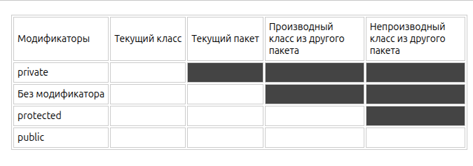
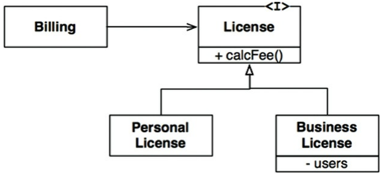

# Раздел 2. Основные концепции языков программирования (Java)

## *Содержание*

1. Фундаментальные типы данных. Целочисленные типы, представление отрицательных чисел. Числа с плавающей точкой, их двоичное представление. Символьный и логический типы. Явные и неявные приведения типов. Перегрузка функций.  
2. Классы. Объекты. Поля, методы. Конструкторы. Ключевое слово this. Статические члены класса. Модификаторы доступа, инкапсуляция. Внутренние классы, локальные классы, их особенности и примеры.  
3. Наследование. Преобразования типов между родителем и наследником. Переопределение методов у наследника. Абстрактные классы. Интерфейсы. Принцип подстановки Лисков.  
4. Исключения. Иерархия исключений. Проверяемые и непроверяемые исключения. Конструкция try with resources.  
5. Стандартные коллекции: ArrayList, LinkedList, HashMap, TreeMap, LinkedHashMap. Их основные методы и внутреннее устройство.  
6. Лямбда-функции. Элементы функционального программирования. Захват окружения. Ссылки на методы.  
7. Optional. Stream API. Промежуточные и терминальные операции. Коллекторы, комбинации коллекторов.  
8. Аннотации. Объявление и применение аннотаций. Мета-аннотации `@Target`, `@Retention`. Параметры аннотаций.  
9. Основы многопоточности. Потоки (threads). Создание и завершение потоков. Проблема race condition. Мьютексы и их использование.
10. Spring Framework. Чем отличается управление объектами через \`new\` от управления через Inversion of Control. Какие способы внедрения зависимостей поддерживаются. Что такое Spring Bean и какие аннотации используются для создания бинов. Скоупы бинов.  
11. Spring MVC. Отличие `@Controller` от `@RestController`. Маппинг HTTP-запросов (`@GetMapping`, `@PostMapping` и т.д). Обработка исключений с помощью `@ControllerAdvice`. Интерcепторы. Валидация объектов (`@NotBlank`, `@Email` и т.д).  
12. OpenAPI. Использование OpenAPI в документирование REST API. Инструменты для генерации документации OpenAPI в Spring.  
13. Hibernate. Как Hibernate связан с JPA. Как работают `@OneToMany`, `@ManyToOne`, `@ManyToMany`? В чем разница между `EAGER` и `LAZY` загрузкой? Жизненный цикл сущности в Hibernate. Транзакции в Spring (`@Transactional`), параметры `isolation` и`propagation`.  
14. Spring Security. Настройка аутентификации через базу данных. Реализация JWT-аутентификации в Spring Security.  
15. Синхронное и асинхронное взаимодействие в распределенной среде, их преимущества и недостатки. Реализации инструментов (HTTP, брокеры сообщений и т.д). 

___
## 1. Фундаментальные типы данных. Целочисленные типы, представление отрицательных чисел. Числа с плавающей точкой, их двоичное представление. Символьный и логический типы. Явные и неявные приведения типов. Перегрузка функций. 

Все значения в Java делятся на два типа: примитивы и объекты. К примитивам относятся следующие типы данных:
- `byte` - 8-битовое целое число со знаком. Может принимать значение от $-128$ до $127$.
- `short` - 16-битовое целое число со знаком. Может принимать значение от $-32768$ до $32767$.
- `int` - 32-битовое целое число со знаком. Может принимать значение от $-2^{31}$ до $2^{31} - 1$.
- `long` - 64-битовое целое число. Число со знаком может принимать значение от $-2^{63}$ до $2^{63} - 1$.
- `float` - 32-битовое число с плавающей запятой.
- `double` - 64-битовое число с плавающей запятой.
- `boolean` - логический тип данных, может иметь только 2 значения, `true` или `false`.
- `char` - один символ в формате Unicode.

Любые другие значения являются объектами.

В Java переменные хранятся следующим образом:
1. Локальные переменные, такие как примитивы и ссылки на объекты, создаются в стеке.
2. Объекты – в куче (heap).

Java – язык _pass by value_, то есть значения переменной копируются при передаче в функцию. В случаем примитивов копируется непосредственно значение, для объектов – копия ссылки.

#### Целочисленные типы

`byte` (1 байт), `short` (2 байт), `int` (4 байт) и `long` (8 байт).

`byte` в основном используется для уменьшения расхода памяти при хранении данных в массивах (например, хранение данных, полученных по сети в некотором буфере, который будет реализован в виде массива байт). В арифметических операциях он не используется. Связано это с реализацией Java Virtual Machine (JVM). Так как большинство систем 32 или 64 разрядные, то `byte` и `short` при вычислениях будут приведены к 32-битному `int`:

```Java
byte a = 1;
byte b = 2; 
byte result = a + b;
```
```
error: incompatible types: possible lossy conversion from int to byte
```

`long` позволяет считать большие числа. Часто используется при работе со временем (можно встретить как тип для аргумента millis при работе с потоками). Для обозначения того, что число это long после числа ставят литерал L: `long n = 10L; \\ можно 10l`

"Минус" для отрицательных чисел берётся из старшего бита, т.е. $10000000$ это запись $-128$, а $01111111$ – запись $127$.

#### Числа с плавающей точкой

`float` и `double`, литералы `1.1F` и `1.1` (или `1.1D`) соответственно. Они реализуют международный стандарт IEEE 754: числовые типы данных с плавающей точкой состоят из трёх частей: *знака* $s$, *мантиссы* $M$ и *порядка* $q$: $(-1)^s \cdot M \cdot 2^q$.

- **float**: 4 байта, точность ~7 десятичных знаков. Хранится как: 1 бит на знак, 8 на порядок, 23 на мантиссу.
- **double**: 8 байт, точность ~15–17 десятичных знаков. Хранится как: 1 бит на знак, 11 на порядок, 52 на мантиссу.

Особенности:
- Можно также использовать научную нотация для литералов: `1.1e-3`
- Из-за такой формы хранения существует два нуля: $0.0$ и $-0.0$
- Специальные значения: $Infinity$ и $-Infinity$ (деление на ноль полож./отриц. числа соответственно), а также $NaN$ (Not a Number, ноль на ноль, sqrt из отрицательного числа, сложение + и - бесконечностей и т.п.).

#### Символьный и логический типы.

`boolean` может хранить только два значения: `true` (истина) или `false` (ложь). Размер неизвестен и зависит от JVM (Например может быть: 8 бит в массивах `boolean[]` на куче, а на стеке он хранится как 32-битный int).

`char` занимает в памяти 16 бит и описывает символ. В Java для `char` используется кодировка Unicode. Символ можно задать в соответствии с двумя таблицами: таблица Unicode символов и таблица ASCII символов. Для литералов используются одинарные кавычки.

```
char symbolF = 'f';
symbolF = 102;
symbolF = '\u0066';
```

Также является числом и поддерживает математические операции (в которых кастуется к `int`).

#### Явные и неявные преобразования типов

Каждый примитивный тип в Java имеет фиксированный размер, что определяет его диапазон и точность. При взаимодействии типов с разной разрядностью возникают ситуации несоответствия, которые Java разрешает либо автоматически, либо требует вмешательства программиста (явное приведение).

Автоматические преобразования (неявные, расширение) выполняются по следующим цепочкам:


Стрелками на рисунке показано, какие преобразования типов могут выполняться автоматически. Пунктирными стрелками показаны автоматические преобразования с потерей точности.

Автоматически без каких-либо проблем производятся расширяющие преобразования (widening) – они расширяют представление объекта в памяти. Например:

```Java
byte b = 4;
int i = b;
```

Некоторые преобразования могут производиться автоматически между типами данных одинаковой разрядности или даже от типа данных с большей разрядностью к типа с меньшей разрядностью. Это следующие цепочки преобразований: `int -> float`, `long -> float` и `long -> double`. Они производятся без ошибок, но при преобразовании мы можем столкнуться с потерей информации.

```Java
int a = 2147483647;
float b = a; // int -> float
System.out.println(b);  // 2.1474836E9
```

Внутри арифметических выражений происходит *продвижение типов*. Java всегда подтягивает аргументы к "старшему" типу перед вычислением:
- Если есть хоть один `double`, всё станет `double`.
- Иначе, если есть `float`, всё станет `float`.
- Иначе, если есть `long`, всё станет `long`
- `byte`, `short` и `char` изначально преобразуются в `int`

Во всех остальных преобразованиях примитивных типов явным образом применяется операция преобразования типов. Обычно это сужающие преобразования (narrowing) от типа с большей разрядностью к типу с меньшей разрядностью:

```Java
long a = 4l;
int b = (int) a;
```

При применении явных преобразований мы можем столкнуться с потерей данных. Например, в следующем коде у нас не возникнет никаких проблем:

```Java
int a = 5;
byte b = (byte) a;
```

Число 5 вполне укладывается в диапазон значений типа `byte`, поэтому после преобразования переменная b будет равна 5. Однако в другом примере:

```Java
int a = 258
byte b = (byte) a;
```

результатом будет число 2. В данном случае число 258 вне диапазона для типа byte (от -128 до 127), поэтому произойдет усечение значения. Число a, которое равно 258, в двоичном системе будет равно `00000000 00000000 00000001 00000010`. Значения типа byte занимают в памяти только 8 бит. Поэтому двоичное представление числа int усекается до 8 правых разрядов, то есть `00000010`, что в десятичной системе дает число 2.

Другие подобные случаи:
```Java
int a = 130;
byte b = (byte) a;
System.out.println(b);
    
a = 128;
b = (byte) a;
System.out.println(b);
    
a = 256;
b = (byte) a;
System.out.println(b);
```
```
-126
-128
0
```

#### Перегрузка функций

Перегрузка – это возможность определить в одном классе несколько методов с одинаковым именем, но разными входными параметрами. Это проявление статического полиморфизма (того, что разрешается во время компиляции).

```Java
public class Program {
    public static void main(String[] args) {
        Calcualtor calc = new Calcualtor();
        System.out.println(calc.sum(2, 3));
        System.out.println(calc.sum(2.3, 3.2));
        System.out.println(calc.sum(2.3, 3.2, 4));
    }
}

class Calcualtor {
    int sum(int x, int y){
        return x + y;
    }
    
    double sum(double x, double y){
        return x + y;
    }

    double sum(double x, double y, long z){
        return x + y + z;
    }
}
```

 На перегрузку методов влияют количество и типы параметров. Однако различие в типе возвращаемого значения для перегрузки не имеют никакого значения. Например, в следующем случае методы sum различаются по типу возвращаемого значения:

```Java
public class Program{
    public static void main(String[] args){
        Calcualtor calc = new Calcualtor();
        System.out.println(calc.sum(2, 3));
        System.out.println(calc.sum(2, 3));
    }
}

class Calcualtor {
    int sum(int x, int y){
        return x + y;
    }
    
    // error: method sum(int,int) is already defined in class Calcualtor
    double sum(int x, int y){
        return x + y;
    }
}
```

___
## 2. Классы. Объекты. Поля, методы. Конструкторы. Ключевое слово this. Статические члены класса. Модификаторы доступа, инкапсуляция. Внутренние классы, локальные классы, их особенности и примеры.

Java является объектно-ориентированным языком, поэтому такие понятия как "*класс*" и "объект" играют в нем ключевую роль. Любую программу на Java можно представить как набор взаимодействующих между собой объектов. Шаблоном или описанием объекта является класс, а объект представляет экземпляр этого класса.

Класс определяется с помощью ключевого слова `сlass`, после которого идет название класса:

```Java
class MyAwesomeClass {
	\\todo
}
```

Объект создается с помощью оператора `new`. В этот момент на куче выделяется память.

```Java
MyAwesomeClass mac = new MyAwesomeClass();
```

Любой объект может обладать двумя основными характеристиками: состояние - некоторые данные, которые хранит объект, и поведение - действия, которые может совершать объект. Для хранения состояния объекта в классе применяются поля (переменные класса), поведение определяется методами:

```Java
class Person{
	String name;
	int age;

	void print(){
		System.out.printf("Name: %s \tAge: %d\n", name, age);
	}
}
```

Доступ к ним вне класса получаем через точку:

```
объект.полеКласса
объект.методКласса(параметры метода)
```

#### Конструкторы

Конструктор – это специальная функция, которая строит объект на основе переданных атрибутов. Если вы явно не добавляете никаких конструкторов, то Java все равно создаст для класса конструктор без аргументов. Если конструктор не инициализирует значения переменных объекта, то они получают значения по умолчанию. Для переменных числовых типов это число 0, а для типа String и классов – это значение `null`.

Если необходимо, чтобы при создании объекта производилась какая-то логика, например, чтобы поля класса получали какие-то определенные значения, то можно определить в классе свои конструкторы. При этом если в классе определяются свои конструкторы, то этот класс лишается конструктора по умолчанию.

```Java
class Graph {
	private List<Integer>[] adjList;
	
	public Graph(int V) {
		adjList = new ArrayList<Integer>[V];
		
		for (int i = 0; i < V; i++) {
			adjList[i] = new ArrayList<Integer>();
		}
	}
}
```

#### Ключевое слово `this`

Ключевое слово `this` представляет ссылку на текущий экземпляр (объект) класса. Через это ключевое слово мы можем обращаться к переменным и методам объекта, а также вызывать его конструкторы:

```Java
class Person {
	private String name;
	
	public Person(String name) {
		this.name = name;
	}
	
	public Person() {
		this.Person("Nameless");
	}
}
```

#### Статические члены класса

Кроме обычных полей, методов, свойств классы и структуры могут иметь статические поля и методы. Для обращения к ним необязательно создавать объект класса.

Пример: класс `Math` (`java.lang.Math`):

```Java
double x = 5.3;
double y = Math.exp(- x*x / 2);
```

Для объявления статических переменных, констант, методов и инициализаторов перед их объявлением указывается ключевое слово `static`. (Статические инициализаторы предназначены для инициализации статических переменных, либо для выполнения таких действий, которые выполняются при создании самого первого объекта)


```Java
class Person{
    int age;        // обычное поле
    static int retirementAge;  // статическое поле

    static { // статический инициализатор
        retirementAge = 65;
    }

    Person(int age){
        this.age = age;
        System.out.println("Constructor");
    }

    static void checkAge(Person p) { // статический метод
        if (p.age >= retirementAge) {
	        System.out.println("Уже на пенсии");
        } else {
	        System.out.printf("До пенсии осталось %d лет.\n", retirementAge - p.age);
        }
    }
}
```

Следует учитывать, что статические методы могут обращаться только к статическим членам класса. Обращаться к нестатическим методам и полям этого же класса внутри статического метода мы не можем. Поэтому, например, чтобы вызвать в методе main другие методы, которые определены в одном классе с методом main, они также должны иметь модификатор `static`.

#### Модификаторы доступа, инкапсуляция

*Инкапсуляция* – это объединение данных и поведения в одну единицу кода (пакет/модуль/класс и т.д.) и сокрытие деталей реализации (в нашем случае реализации полей и методов) от пользователей объекта. Конкретный объект, являющийся экземпляром класса, будет иметь определённые значения своих полей. Набор этих значений представляет собой текущее состояние объекта. При каждом вызове метода объекта его состояние может измениться.

Все компоненты класса в языке Java имеют модификаторы доступа. Модификаторы доступа управляют видимостью классов, методов и переменных, тем самым определяя, как к компонентам класса можно получить доступ из других частей программы. Они управляют тем, откуда можно получить доступ к конкретному классу, методу или переменной.

В Java используются следующие модификаторы доступа:
- **`public`**: публичный, общедоступный класс или компонент класса. Поля и методы, объявленные с модификатором public, видны другим классам из текущего пакета и из внешних пакетов, вообще в любом месте программы. В исходном файле может быть только один класс с модификатором public, но количество классов с другими модификаторами (или без них) может быть любым. Если в файле есть класс с модификатором public, то имя файла должно совпадать с именем этого класса.
- **`private`**: закрытый класс или компонент класса, противоположность модификатору public. Закрытый класс или компонент класса доступен только из кода в том же классе.
- **`protected`**: такой класс или компонент класса доступен из любого места в текущем классе или пакете или в производных классах, даже если они находятся в других пакетах
- **Модификатор по умолчанию**. Отсутствие модификатора у поля или метода класса предполагает применение к нему модификатора по умолчанию. Такие поля или методы видны всем классам в текущем пакете.


#### Внутренние классы, локальные классы, их особенности и примеры

**Внутренние классы** – это классы, объявленные внутри другого класса. Они имеют доступ ко всем полям и методам внешнего класса, включая `private`. Не могут содержать статические поля/методы. Чаще всего используются, когда логика тесно связана с внешним классом и не имеет смысла существовать отдельно. Для создания объекта внутреннего класса требуется объект внешнего класса.

**Локальные классы** объявляются внутри метода, конструктора или блока кода. Они применяются, когда класс нужен только в пределах одного метода. Локальные классы имеют доступ к полям внешнего класса и к локальным переменным метода (если после инициализации их значение не изменяется). Не могут иметь модификаторов доступа.

```Java
public class Outer {
    private int outerField = 10;

    class Inner {
        void printOuterField() {
            System.out.println("Outer field: " + outerField);
        }
    }

    void methodWithLocalClass() {
        int localVariable = 5;

        class Local {
            void printSum() {
                System.out.println("Sum: " + (outerField + localVariable));
            }
        }

        Local local = new Local();
        local.printSum();
    }

    public static void main(String[] args) {
        Outer outer = new Outer();
        Inner inner = outer.new Inner();
        inner.printOuterField();
        outer.methodWithLocalClass();
    }
}
```

___
## 3. Наследование. Преобразования типов между родителем и наследником. Переопределение методов у наследника. Абстрактные классы. Интерфейсы. Принцип подстановки Лисков.

Одним из ключевых аспектов объектно-ориентированного программирования является наследование. С помощью наследования можно расширить функционал уже имеющихся классов за счет добавления нового функционала или изменения старого.

Чтобы унаследовать один класс от другого, надо использовать после имени класса-наследника ключевое слово extends, после которого идет имя базового класса:

```Java
class Base {}

class Derived extends Base {}
```

Мы можем использовать функционал базового класса, обращаясь к объекту производного класса. Также можно в производном классе расширить функционал базового – добавить свои поля и методы.

Если в базовом классе определены конструкторы, то в конструкторе производного классы необходимо вызвать один из конструкторов базового класса с помощью ключевого слова super, в который передаются значения для параметров конструкторов.

```Java
class Base {
	String strField;
	
	public Base(String str) {
		this.strField = str;
	}
}

class Derived extends Base {
	int intField;
	
	public Derived(String str, int num) {
		super(str);
		this.intField = num;
	}
}
```

Стоит отметить, что при определении конструктора в производном классе до версии Java 25 вызов конструктора суперкласса должны был выполняться ДО всех остальных инструкций.

#### Преобразования типов между родителем и наследником

Преобразование от наследника к родителю происходит автоматически, так как дочерний класс всегда содержит в себе всё то, что есть в родительском.

```Java
Base base = new Derived("six", 7);
```

После такого преобразования будут доступны только методы, которые определённые в базовом классе.

Преобразование от родителя к наследнику не происходит автоматически, так как компилятор не может гарантировать, что в переменной родительского типа реально лежит нужный подкласс. Это придётся делать явно, причём если попытаться привести родителя к тому наследнику, которым он на самом деле не является, возникает `ClassCastException`.

```Java
Animal animal = new Cat();

Cat cat = (Cat) animal;
cat.meow(); // Теперь есть доступ к методам, определённым в Cat

Dog dog = (Dog) animal; // ClassCastException
```

Для безопасной проверки в Java есть оператор `isinstanceof`:

```Java
if (animal instanceof Cat) {
    Cat cat = (Cat) animal;
    cat.meow();
}

// С Java 14 есть PatternMatching и можно делать так:
if (animal instanceof Cat cat) {
    cat.meow();
}
```

#### Переопределение методов у наследника

Производный класс может переопределять методы, которые унаследованы от базового класса. При переопределении метода производный класс определяет метод с той же сигнатурой (имя, аргументы) и аннотацией `@Override` (аннотация не обязательна):

```Java
class DayPhaser extends Phaser {
    @Override
    protected boolean onAdvance(int phase, int registeredParties) {
        if (registeredParties == 0) {
            return true;
        }

        System.out.println("\n===== ДЕНЬ " + (phase + 2) + " =====");
        return false;
    }
}
```

При переопределении метода он должен иметь уровень доступа не меньше, чем уровень доступа в базовом класса. Например, если в базовом классе метод имеет модификатор public, то и в производном классе метод должен иметь модификатор public.

С помощью ключевого слова super мы также можем обратиться к реализации базового класса:

```Java
class DayPhaser extends Phaser {
    @Override
    protected boolean onAdvance(int phase, int registeredParties) {
        System.out.println("\n===== ДЕНЬ " + (phase + 2) + " =====");
        return super.onAdvance(phase, registedParties);
    }
}
```

Можно запретить переопределение методов или наследоваться от класса с помощью ключевого слова `final`:

```Java
final class FinalClassExample {}

class Base {
	int intField = 3;
	
	final void foo() {
		System.out.println(" -_- ");
	}
}
```

#### Абстрактные классы

Кроме обычных классов в Java есть абстрактные классы. Абстрактный класс похож на обычный класс. В абстрактном классе также можно определить поля и методы, но в то же время нельзя создать объект или экземпляр абстрактного класса. Абстрактные классы призваны предоставлять базовый функционал для классов-наследников. А производные классы уже реализуют этот функционал. При определении абстрактных классов используется ключевое слово `abstract`:

```Java
abstract class имяКласса {
	// Что-то написать сюды
}
```

Наряду с абстрактными классами в языке Java есть абстрактные методы. Такие методы также предваряются модификатором `abstract`, но при этом не имеют тела – не выполняют никаких конкретных действий:

```Java
abstract void foo(int a);
```

Производный класс обязан переопределить и реализовать все абстрактные методы, которые имеются в базовом абстрактном классе. Также следует учитывать, что если класс имеет хотя бы один абстрактный метод, то данный класс должен быть определен как абстрактный (и производные абстрактные классы не обязаны реализовывать все абстрактные методы).

Чтобы не писать ещё банальный пример, вот мой абстрактный класс альпиниста из задачи про шерпов. Базовые правила симуляции и порядок действий определяются моделью задачи, однако стратегию для перекладывания еды нужно в каждом наследнике написать свою (это можно было сделать лучше, но даже в таком виде, это показательный пример):

```Java
abstract class HeightBoundClimber extends Thread {
    public static final int DAYS_TO_SUMMIT = 8;
    public static final int BACKPACK_SIZE = 4;

    public static final AtomicBoolean someoneDied = new AtomicBoolean(false);

    protected static DayPhaser phaser;
    protected static SharedEnvironment env;

    protected int height = 0;
    protected int backpack = BACKPACK_SIZE;
    protected boolean ascending = true;

    protected final int maxHeight;

    protected HeightBoundClimber(String name, int maxHeight) {
        super(name);
        this.maxHeight = maxHeight;
        phaser.register();
    }

    @Override
    public final void run() {
        try {
            while (true) {
                pickFood();

                if (!eat()) break;

                move();

                dropFood();

                phaser.arriveAndAwaitAdvance();

                if (isFinished()) break;
            }
        } finally {
            phaser.arriveAndDeregister();
        }
    }

    protected abstract void pickFood();
    protected abstract void dropFood();

    protected boolean eat() {
        if (backpack == 0) {
            someoneDied.set(true);
            System.out.println(getName() + " погиб в горах (нет еды)");
            return false;
        }
        backpack--;
        return true;
    }

    protected void move() {
        if (ascending) height++;
        else height--;
    }

    protected boolean isFinished() {
        if (!ascending && height == 0) {
            System.out.println(getName() + " вернулся домой.");
            return true;
        }
        return false;
    }
}
```

#### Интерфейсы

Механизм наследования очень удобен, но он имеет свои ограничения. В частности, в Java нет множественного наследования (от классов).

Подобную проблему частично позволяют решить интерфейсы. Интерфейсы определяют "контракт" т.е. множество методов (по умолчанию, `public abstract`), не имеющих конкретной реализации, которые затем реализуют классы, применяющие эти интерфейсы. И один класс может применить множество интерфейсов.

Чтобы определить интерфейс, используется ключевое слово `interface`.

```Java
interface Animal {
	public void makeSound();
}
```

Чтобы указать, что класс реализует интерфейс, после названия класса указывается ключевое слово `implements`, после которого идет название интерфейса:

```Java
class Cat implements Animal {
	@Override
	public void makeSound() {
		System.out.println("Meow");
	}
}
```

Интерфейсы в языке Java также могут иметь методы по умолчанию (default methods) – методы с реализацией по умолчанию, которая используется, если класс, реализующий данный интерфейс, не реализует метод. Метод по умолчанию – это обычный метод без модификаторов (формально имеет модификатор `public`), который помечается ключевым словом `default`:

```Java
interface Animal {
	public void makeSound();
	default void info() {
		System.out.println("Is animal.");
	}
}
```

#### Принцип подстановки Лисков

Тут будет частично цитироваться книга "Чистая Архитектура" Роберта Мартина. Рекомендую прочитать 9-ую главу из неё.

> В 1988 году Барбара Лисков написала следующие строки с формулировкой определения подтипов:
> 	*Если для каждого объекта o1 типа S существует какой-то объект o2 типа T, что для всех программ P, определённых в типах T, поведение P не изменяется при подстановке o1 вместо o2, то S является подтипом T.*

Проще говоря: если код зависим от интерфейса, то подстановка любой его реализации не должна ломать код.

Пример архитектуры, соблюдающей этот принцип:



Есть интерфейс License. В нём определён метод calcFee(), который вызывается приложением Billing. Существует два "подтипа" класса License: PersonalLicense и BusinessLicense. Они реализуют разные алгоритмы расчёта лицензионных отчислений. Оба подтипа могут служить заменой для типа License.

___
## 4. Исключения. Иерархия исключений. Проверяемые и непроверяемые исключения. Конструкция try with resources. 

Нередко в процессе выполнения программы могут возникать ошибки, при том необязательно по вине разработчика. Некоторые из них трудно предусмотреть или предвидеть, а иногда и вовсе невозможно. Подобные ситуации называются исключениями.

В языке Java предусмотрены специальные средства для обработки подобных ситуаций. Одним из таких средств является конструкция **try...catch...finally***. При возникновении исключения в блоке `try` управление переходит в блок `catch`, который может обработать данное исключение (можно добавлять несколько блоков catch под разные виды исключений). После выполнения всех блоков try/catch выполняется блок `finally`. Если подходящего блока `catch` не найдено, то пользователю отображается сообщение о необработанном исключении, а дальнейшее выполнение программы останавливается. 

```Java
try {
	/// smth
} catch (Exception e) {
	/// smth
} finally {
	/// smth
}
```

Единственным обязательным блоком в этой конструкции является try. Компилятор позволит написать либо catch, либо finally, а не оба. Собственно, в связи с этим чаще всего встречается именно **try...catch** конструкция.

Чтобы бросить исключение в своём коде применяется оператор `throw`.

```Java
public class Main {
  public static void main(String args[]) {
    Integer a = 555;
    Integer b = 555;
    
    if (a != b) {
        throw new RuntimeException("Це ловушка в жабе.");
    }
  }
}
```
	Да это реально упадёт. Прикол в том, что Integer – обёртка над int и на самом деле является ссылкой на объект в памяти. Объекты для чисел от -128 до 127 создаются при запуске программы (IntegerCache). Ссылки на объект типа Integer со значением в этом диапазоне будут на один и тот же объект в памяти. Поэтому поменяв значение, например, на 55 код не упадёт.

Если метод генерирует проверяемое исключение, то нам надо либо обработать это исключение, либо сообщить компилятору, что метод генерирует данное исключение. В случае, если метод не обрабатывает его сам, в объявлении метода необходимо указать тип исключения, который генерирует метод. Для этого используется оператор throws в следующем виде:

```Java
public void funnyIslandMethod() throws NumberFomatException, FileNotFoundException
```

#### Иерархия исключений. Проверяемые и непроверяемые исключения.


Все исключения в Java являются объектами. Базовым классом для них является Throwable (наследник Object). Любой класс, который наследуется от Throwable, считается исключением. Блоки `try`...`catch` и оператор `throw` будут работать с Throwable, но это не рекомендуется наследоваться от него напрямую. Иерархия чётко разделяет все исключительные ситуации на две ветви – те, которые программа должна обрабатывать, и те, которые не должна, а если точнее:
- **`Error`** – ошибка, которая означает серьезную проблему в программе, и при её возникновении восстанавливать работу программы не предполагается. Наследуется от Throwable. Примеры: переполнения стека вызовов (`StackOverflowError`), недостаток памяти (`OutOfMemoryError`)
- **`Exception`** – проверяемое исключение, наследуется от Throwable. Пример: поток прерван другим потоком (`InterruptedException`)
- **`RuntimeException`** – непроверяемое исключение, наследуется от Exception. Примеры: деление на ноль (`ArithmeticException`), использование пустой ссылки (`NullPointerException`), индекс вне границ массива (`IndexOutOfBoundException`), - использование неверного аргумента при вызове метода (`IllegalArgumentException`).

Наследники `Error` и `RuntimeException` называют непроверяемыми. Компилятор не проверяет факт их обработки в try...catch блоках.

Наследники `Exception` – проверяемые исключения, компилятор не позволит запустить программу, если она не обрабатывает их.

#### Конструкция try with resources

При завершении работы с потоком (I/O Stream, а не Thread) его надо закрыть с помощью метода `close()`, который определен в интерфейсе `Closeable`: `void close() throws IOException`. Этот интерфейс уже реализуется в классах InputStream и OutputStream, а через них и во всех классах потоков. При закрытии потока освобождаются все выделенные для него ресурсы, например, файл. В случае, если поток окажется не закрыт, может происходить утечка памяти.

Если не использовать конструкцию try-with-resources, придётся закрывать вручную, и выйдет много кода. Для ресурсов, реализующих интерфейс `Closeable` (или `AutoClosable`) закрытие вызывается автоматически, сокращая код до:

```Java
try (FileInputStream fin = new FileInputStream("text.txt")) {
	/// read and do smth
} catch (IOException e) {
	System.out.println(e.getMessage())
}
```

В этой конструкции также можно открыть сразу несколько ресурсов, через точку с запятой:

```Java
try (FileInputStream fin = new FileInputStream("text.txt");
	FileOutputStream fout = new FileOutputStream("out.txt")) {
	/// read and do smth
} catch (IOException e) {
	System.out.println(e.getMessage())
}
```

___
## 5. Стандартные коллекции: ArrayList, LinkedList, HashMap, TreeMap, LinkedHashMap. Их основные методы и внутреннее устройство.


Вот +- полная иерархия коллекций в Java. Зелёные классы – абстрактные, синие – интерфейсы, красные – имплементации.

#### Collection

Начнём со схемы слева, она начинается с интерфейса `Iterable<E>`. В нём определён метод `iterator()`, возвращающий итератор `Iterator<E>`. т.е. если какой-то класс/интерфейс наследует `Iterable<E>`, то по нему можно пройтись в цикле for: `for (E element : iterable)`.

Интерфейс Collection расширяет Iterable. В отличие от Iterable, он олицетворяет собой какую-то коллекцию с конечным количество элементов. Из методов, объявленных в `Collection<E>` стоит выделить: 
- `int size()`
- `boolean isEmpty()`
- `boolean contains(Object o)`
- `boolean add(E e)`
- `boolean remove(E e)`
- `void clear()`

Правее на схеме можно заметить интерфейс Queue для FIFO структур данных. Из него упомяну методы: `E peek()` и `E poll()`. В принципе про эту ветвь иерархии говорить имеет смысл, только чтобы упомянуть, что двусвязный список `LinkedList<E>` реализует как интерфейс `List<E>`, так и `Deque<E>`. На этом всё с доп. инфой, перейдём к основному содержанию билета.

#### Списки: ArrayList и LinkedList

Для создания простых списков применяется интерфейс `List`, который расширяет функциональность интерфейса `Collection`. Некоторые наиболее часто используемые методы интерфейса `List`:
- `void add(int index, E obj)`: добавляет в список по индексу index объект obj
- `void addFirst(E obj)`: добавляет объект в начало списка
- `void addLast(E obj)`: добавляет объект в конец списка
- `boolean addAll(int index, Collection<? extends E> col)`: добавляет в список по индексу index все элементы коллекции col. Если в результате добавления список был изменен, то возвращается true, иначе возвращается false
- `E get(int index)`: возвращает объект из списка по индексу index
- `E getFirst()`: возвращает первый элемент списка
- `E getLast()`: возвращает последний элемент списка
- `int indexOf(Object obj)`: возвращает индекс первого вхождения объекта obj в список. Если объект не найден, то возвращается -1
- `int lastIndexOf(Object obj)`: возвращает индекс последнего вхождения объекта obj в список. Если объект не найден, то возвращается -1
- `ListIterator<E> listIterator ()`: возвращает объект ListIterator для обхода элементов списка
- `static <E> List<E> of(элементы)`: создает из набора элементов объект List
- `E remove(int index)`: удаляет объект из списка по индексу index, возвращая при этом удаленный объект
- `E removeFirst()`: удаляет первый элемент из списка
- `E removeLast()`: удаляет последний элемент из списка
- `E set(int index, E obj)`: присваивает значение объекта obj элементу, который находится по индексу index
- `void sort(Comparator<? super E> comp)`: сортирует список с помощью компаратора comp
- `List<E> subList(int start, int end)`: получает набор элементов, которые находятся в списке между индексами start и end
- `static <E> List<E>of(E... elements)`: возвращает неизменяемый список (тип `java.util.ImmutableCollections$ListN`), который содержит элементы elements.

Класс ArrayList представляет обобщенную коллекцию, которая наследует свою функциональность от класса AbstractList и применяет интерфейс List. Это, по сути, динамический массив. 

Размер по умолчанию – 10, но его также можно задать в конструкторе. При расширении, новый размер вычисляется по формуле: `capacity = capacity * 3 / 2`, то есть увеличивается на 50%.

В Java нет доступа к capacity, поэтому, чтобы продемонстрировать это в эксперименте, пришлось взять небольшой трик с reflection со StackOverflow. И то это работает только на старых версиях (я запускал на Java 12):

```Java
import java.util.ArrayList;
import java.util.List;
import java.lang.reflect.Field;

public class Main
{
	public static void main(String[] args) throws Exception {
		List<Integer> list = new ArrayList<>();
		
		for (int i = 0; i < 1024; i++) {
		    list.add(i);
		    System.out.println(i + " " + getCapacity(list));
		}
	}
	
	static int getCapacity(List al) throws Exception {
        Field field = ArrayList.class.getDeclaredField("elementData");
        field.setAccessible(true);
        return ((Object[]) field.get(al)).length;
    }
}
```
```output
0 10
...
9 10
10 15
...
14 15
15 22
...
21 22
22 33
...
32 33
33 49
...
49 73
...
73 109
...
109 163
...
1023 1234
```

Обобщенный класс `LinkedList<E>` представляет структуру данных в виде двусвязного списка. Он наследуется от класса `AbstractSequentialList` и реализует интерфейсы `List, Deque` и `Queue`. То есть он соединяет функциональность работы со списком и функциональность очереди. 

Класс LinkedList имеет следующие конструкторы:
- `LinkedList()`: создает пустой список
- `LinkedList(Collection<? extends E> col)`: создает список, в который добавляет все элементы коллекции col

Из методов ранее упомянутых интерфейсов, реализуемых двусвязным списком, следует выделить:
- addFirst() / offerFirst(): добавляет элемент в начало списка
- addLast() / offerLast(): добавляет элемент в конец списка
- removeFirst() / pollFirst(): удаляет первый элемент из начала списка
- removeLast() / pollLast(): удаляет последний элемент из конца списка
- getFirst() / peekFirst(): получает первый элемент
- getLast() / peekLast(): получает последний элемент

#### Иерархия Map

Словари (также называемые картами и отображениями) позволяют сопоставить с определенным ключом некоторое значение. В языке Java для определения базового функционала словарей имеется интерфейс `Map<K, V>`. Он представляет структуру данных, где каждый элемент представляет пару "ключ-значение". При этом в рамках объекта `Map` все ключи уникальные.

Непосредственно итератора у них нет (не реализуют Iterable), но того же эффекта можно достичь другими способами:
```Java
for (Map.Entry<K, V> entry : map.entrySet()) { 
	K key = entry.getKey();
	V value = entry.getValue();
}
```

Среди методов интерфейса `Map` можно выделить следующие:
- `int size()`. Возвращает количество записанных пар ключ-значение.
- `boolean isEmpty()`. Возвращает true, если Map пустая.
- `boolean containsKey(Object key)`. Возвращает true, если в Map присутствует указанный ключ.
- `boolean containsValue(Object value)`. Возвращает true, если в Map присутствует указанное значение.
- `V get(Object key)`. Возвращает значение по указанному ключу.
- `V put(K key, V value)`. Записывает пару ключ-значение. Возвращает предыдущее значение, которое было под этим ключом, или null, если ключ до этого отсутствовал.
- `V putIfAbsent(K k, V v)`: помещает в коллекцию новый объект с ключом k и значением v, если в коллекции еще нет элемента с подобным ключом.
- `V remove(Object key)`. Удаляет пару ключ-значение по переданному ключу. Возвращает значение, которое было удалено, или null, если по ключу ничего не было записано.
- `void clear()`. Удаляет все пары ключ-значение.
- `Set<K> keySet()`. Возвращает Set из всех ключей, которые записаны в Map.
- `Collection<V> values()`. Возвращает коллекцию из всех значений, которые записаны в Map.
- `Set<Map.Entry<K, V>> entrySet()`. Возвращает Set из всех пар ключ-значение.
- `void clear()`: очищает коллекцию
- `boolean replace(K key, V oldValue, V newValue)`: заменяет значение для указанного ключа key на newValue, если только старое значение равно oldValue

#### HashMap и LinkedHashMap

HashMap – реализация Map как хеш-таблицы. Для корректной работы ключи должны правильно реализовывать equals/hashCode. При этом значениям реализовывать эти методы необязательно.

Под капотом это хеш-таблица на цепочках. Но стоит выделить пару особенностей:
- Изначально массив длины `capacity`, содержащий связные списки – бакеты.
- Если в бакете оказалось больше восьми ключей, то он преобразуется из связного списка в красно-чёрное дерево.
- Ресайз происходит, когда количество элементов превышает `(loadFactor * capacity)`. Тогда `capacity` увеличивается в двое. Значения по умолчанию: loadFactor=0.75, capacity=16

У HashMap еще имеется наследник LinkedHashMap. Работает точно так же, только элементы гарантировано хранятся в том порядке, в каком их добавили. Узел `LinkedHashMap.Entry` наследует `HashMap.Node` и добавляет поля: `Entry<K,V> before` и `Entry<K,V> after` – ссылки на предыдущий и следующий вставленные элементы.

#### TreeMap

Осталось рассмотреть самую правую ветвь иерархии с картинки.

Интерфейс `SortedMap` расширяет `Map` и позволяет обеспечить полное упорядочение своих ключей. По умолчанию элементы упорядочиваются в соответствии с естественным порядком ключей (по возрастанию) или с помощью компаратора.

`SortedMap` добавляет ряд методов:
- `K firstKey()`: возвращает ключ первого элемента коллекции
- `K lastKey()`: возвращает ключ последнего элемента коллекции
- `SortedMap<K, V> headMap(K end)`: возвращает объект `SortedMap`, который содержит все элементы оригинального SortedMap вплоть до элемента с ключом end
- `SortedMap<K, V> tailMap(K start)`: возвращает объект `SortedMap`, который содержит все элементы оригинального SortedMap, начиная с элемента с ключом start
- `SortedMap<K, V> subMap(K start, K end)`: возвращает объект `SortedMap`, которые содержит все элементы оригинального SortedMap вплоть от элемента с ключом start до элемента с ключом end

Интерфейс `NavigableMap` расширяет интерфейс ``SortedMap`` и обеспечивает возможность получения элементов коллекции относительно других элементов (условно говоря, навигацию). Его основные методы:
- `Map.Entry<K, V> ceilingEntry(K key)`: возвращает элемент с наименьшим ключом k, который больше или равен ключу key (k >=key). Если такого ключа нет, то возвращается null.
- `Map.Entry<K, V> floorEntry(K key)`: возвращает элемент с наибольшим ключом k, который меньше или равен ключу key (k <=key). Если такого ключа нет, то возвращается null.
- `Map.Entry<K, V> higherEntry(K key)`: возвращает элемент с наименьшим ключом k, который больше ключа key (k >key). Если такого ключа нет, то возвращается null.
- `Map.Entry<K, V> lowerEntry(K key)`: возвращает элемент с наибольшим ключом k, который меньше ключа key (k <key). Если такого ключа нет, то возвращается null.
- `Map.Entry<K, V> firstEntry()`: возвращает первый элемент коллекции
- `Map.Entry<K, V> lastEntry()`: возвращает последний элемент коллекции
- `Map.Entry<K, V> pollFirstEntry()`: возвращает и одновременно удаляет первый элемент из коллекции
- `Map.Entry<K, V> pollLastEntry()`: возвращает и одновременно удаляет последний элемент из коллекции
- `K ceilingKey(K key)`: возвращает наименьший ключ k, который больше или равен ключу key (k >=key). Если такого ключа нет, то возвращается null.
- `K floorKey(K key)`: возвращает наибольший ключ k, который меньше или равен ключу key (k <=key). Если такого ключа нет, то возвращается null.
- `K lowerKey(K key)`: возвращает наибольший ключ k, который меньше ключа key (k <key). Если такого ключа нет, то возвращается null.
- `K higherKey(K key)`: возвращает наименьший ключ k, который больше ключа key (k >key). Если такого ключа нет, то возвращается null.
- `NavigableSet<K> descendingKeySet()`: возвращает объект NavigableSet, который содержит все ключи коллекции в обратном порядке
- `NavigableMap<K, V> descendingMap()`: возвращает коллекцию NavigableMap, которое содержит все элементы в обратном порядке
- `NavigableSet<K> navigableKeySet()`: возвращает объект NavigableSet, который содержит все ключи коллекции
- `NavigableMap<K, V> headMap(K upperBound, boolean incl)`: возвращает коллекцию NavigableMap, которое содержит все элементы оригинальной коллекции `NavigableMap` вплоть от элемента с ключом upperBound. Параметр incl при значении true указывает, что элемент с ключом upperBound также включается в выходной набор.
- `NavigableMap<K, V> tailMap(K lowerBound, boolean incl)`: возвращает коллекцию NavigableMap, которое содержит все элементы оригинальной коллекции `NavigableMap`, начиная с элемента с ключом lowerBound. Параметр incl при значении true указывает, что элемент с ключом lowerBound также включается в выходной набор.
- `NavigableMap<K, V> subMap(K lowerBound, boolean lowIncl, K upperBound, boolean highIncl)`: возвращает коллекцию NavigableMap, которое содержит все элементы оригинальной коллекции `NavigableMap` от элемента с ключом lowerBound до элемента с ключом upperBound. Параметры lowIncl и highIncl при значении true включают в выходной набор элементы с ключами lowerBound и upperBound соответственно.

Встроенной реализацией выше упомянутых интерфейсов является класс `TreeMap<K, V>`. Под капотом там красно-чёрное дерево. 
Отметим, что методы вроде `keySet()`, `values()` и `entrySet()` в `TreeMap` не создают новые коллекции. Они возвращают представления. Все операции над ними напрямую транслируются в запросы к дереву:

```Java
import java.util.NavigableMap;
import java.util.TreeMap;

public class MyClass {
  public static void main(String args[]) {
    NavigableMap<Integer, Integer> map = new TreeMap<>();
    map.put(2, 0);
    map.put(3, 0);
    map.put(4, 0);
    
    var tmap = map.tailMap(3, true);
    tmap.remove(3);
    tmap.replace(4, 0, 1);

    System.out.println(map.get(2)); // 0
    System.out.println(map.get(3)); // null
    System.out.println(map.get(4)); // 1
  }
}
```

Класс TreeMap имеет следующие конструкторы:
- `TreeMap()`: создает пустое коллекцию в виде дерева
- `TreeMap(Map<? extends K, ? extends V> map)`: создает дерево, в которое добавляет все элементы из коллекции map
- `TreeMap(SortedMap<K, ? extends V> smap)`: создает дерево, в которое добавляет все элементы из коллекции smap
- `TreeMap(Comparator<? super K> comparator)`: создает пустое дерево, где все добавляемые элементы впоследствии будут отсортированы компаратором.

___
## 6. Лямбда-функции. Элементы функционального программирования. Захват окружения. Ссылки на методы.

#### Лямбда-функции и функциональные интерфейсы

**Lambda-выражения** – это анонимные функции, т.е. метод без объявления. Лямбды в Java обычно имеют следующий синтаксис `(аргументы) -> (тело)`. Например:

```Java
(int a, int b) -> { return a + b; } 

() -> System.out.println("Hello World"); 

(String s) -> {
	/// some other code idk
	System.out.println(s); 
};

() -> 42

() -> { return 3.1415 };
```

- Lambda-выражения могут иметь от 0 и более входных параметров.
- Тип параметров можно указывать явно либо может быть получен из контекста.
- Когда параметр один, если тип не указывается явно, скобки можно опустить. Например, `x -> return x * x`
- Если тело состоит из одного оператора, его можно не заключать в фигурные скобки, а возвращаемое значение можно указывать без ключевого слова `return`. В противном случае фигурные скобки обязательны (блок кода), а в конце надо указывать возвращаемое значение с использованием ключевого слова `return` (в противном случае типом возвращаемого значения будет `void`).

**Функциональный интерфейс** (functional interface) – это интерфейс, который содержит ровно один абстрактный метод. Каждое lambda-выражение может быть неявно привязано к какому-нибудь функциональному интерфейсу.

`java.lang.Runnable` – это пример функционального интерфейса. В нем объявлен только один метод `void run()`. К нему можно привязать любую лямбду, не принимающую аргументов и возвращающую `void`:

```Java
Runnable r1 = () -> System.out.println("Hello");

int[] array = new int[3];
Runnable r2 = () -> {
	array[0]++;
	array[1]--;
};

r1.run();
r2.run();
```

В `java.util.function` есть функциональные интерфейсы, покрывающие большинство необходимых случаев использования:

| Интерфейс             | Метод                 | Описание                                                                                                                                      |
| --------------------- | --------------------- | --------------------------------------------------------------------------------------------------------------------------------------------- |
| `Predicate<T>`        | `boolean test(T t)`   | проверяет соблюдение некоторого условия                                                                                                       |
| `Consumer<T>`         | `void accept(T t)`    | выполняет некоторое действие над объектом типа T, при этом ничего не возвращая                                                                |
| `Function<T, R>`      | `R apply(T t)`        | функция перехода от объекта типа T к объекту типа R                                                                                           |
| `BiFunction<T, U, R>` | `R apply(T t, U u)`   | представляет функцию с двумя параметрами типа T и U и результатом типа R                                                                      |
| `Supplier<T>`         | `T get()`             | не принимает никаких аргументов, но должен возвращать объект типа T                                                                           |
| `UnaryOperator<T>`    | `T apply(T t)`        | принимает в качестве параметра объект типа T, выполняет над ними операции и возвращает результат операций в виде объекта типа T               |
| `BinaryOperator<T>`   | `T apply(T t1, T t2)` | принимает в качестве параметра два объекта типа T, выполняет над ними бинарную операцию и возвращает ее результат также в виде объекта типа T |
Ещё простой пример использования:

```Java
import java.util.Random;
import java.util.function.Supplier;

enum Interval {
    MORNING(0),
    AFTERNOON(1),
    EVENING(2),
    NIGHT(3);

    final int priority;

    Interval(int priority) {
        this.priority = priority;
    }
}

public class Main { 
    public static void main(String[] args) {
        Random random = new Random(42);
        
        Supplier<Interval> nextInterval = () -> {
            return Interval.values()[random.nextInt(0, 4)];
        };
        
        System.out.println(nextInterval.get());
        System.out.println(nextInterval.get());
        System.out.println(nextInterval.get());
    }
}
```

Для определения своего функционального интерфейса нужно объявить интерфейс с одним методом. Ещё можно добавить аннотацию `@FunctionalInterface`:

```Java
@FunctionalInterface
interface Unpack<T> {
	T get(Optional<T> opt);
}
```

При необходимости использовать обычный метод как лямбда-выражение применяется оператор двойное двоеточие `::`, это ссылка на метод.
```Java
Function<String, Integer> len = String::length;
System.out.println(len.apply("Adios"));
```
```Java
List<Integer> list = Arrays.asList(1, 2, 3, 4, 5, 6, 7);
list.forEach(System.out::println);
```

Помимо статических/нестатических методов классов можно применить `::` так:
- `someObject::someMethod` – ссылка на метод конкретного объекта.
- `ArrayList::new` – ссылка на конструктор.

Касаемо функционального программирования отмечу, что лямбды могут быть аргументами или результатом методов, например, `Collections.sort(List<T> list, Comparator<? super T> c)`.

#### Захват окружения

В примерах ранее можно заметить, что лямбда может использовать переменные, которые объявлены во вне в более общей области видимости – на уровне класса или метода, в котором лямбда-выражение определено. Однако в зависимости от того, как и где определены переменные, могут различаться способы их использования в лямбдах.

Переменные, объявленные на уровне класса можно получить и изменять:

```Java
public class Main { 
	static int x = 2;
	
    public static void main(String[] args) {
        Runnable r = () -> {
	        x *= x;
	        System.out.println(x);
        };
        
        r.run(); // 4
    }
}
```

Локальные переменные уровня метода мы также можем использовать в лямбдах, но изменять их значение нельзя т.е. переменная должна быть final или effectively final. Если мы попробуем это сделать, то код не скомпилируется. 

```Java
public class Main { 
    public static void main(String[] args) {
        int x = 2;
        
        Runnable r = () -> {
	        // error: local variables referenced from a lambda expression must be final or effectively final
	        x *= x;
	        System.out.println(x);
        };
        
        r.run();
    }
}
```

___
## 7. Optional. Stream API. Промежуточные и терминальные операции. Коллекторы, комбинации коллекторов.

#### Optional

Класс `Optional<T>` (`java.util.Optional`) – это контейнер, который может содержать, а может не содержать значение определенного типа. 

```Java
public class CustomerRepository { 
	/* поля и конструктор, методы ... */ 
	
	public Optional<Customer> findById(CustomerId id) { 
		if (!existsById(id)) { 
			return Optional.empty(); 
		}
		return Optional.ofNullable(customer); 
	} 
}
```

Способы создать Optional:
- `Optional.empty()` – Создает пустой контейнер. Внутри него нет ссылки на объект.
- `Optional.of(obj)` – Создает `Optional` с гарантированным значением. Если передать `null`, будет выброшено `NullPointerException`.
- `Optional.ofNullable(obj)` –  "Безопасный" способ: если объект есть – создаст заполненный `Optional`, если передана null-ссылка – вернет пустой.

Основные методы:
- `boolean isPresent()` и `boolean isEmpty()`
- `T get()` – если не пустой, возвращает объект, иначе `NoSuchElementException`
- `void ifPresent(Consumer<? super T> consumer)` – вызывает переданную лямбду, если значение есть, иначе – ничего.
- `Optional<T> filter(Predicate<? super T> predicate)` – если есть значение и для него выполняется предикат (лямбда вернула true), то возвращает непустой контейнер со значением, иначе пустой.
- `Optional<U> map(Function<? super T, Optional<U>> mapper)` – если есть значение, то применяет к нему преобразование `mapper.apply()` и возвращает `Optional<U>` с этим значением, иначе пустой опционал.
- `T orElse(T other)` – если есть значение, то возвращает его, иначе – `other`.
- `T orElseGet(Supplier<? extends T> other)` – если есть значение, то возвращает его, иначе возвращает результат вызова `other.get()`.
- `T orElseThrow(Supplier<? extends X> exceptionSupplier) throws X` – если есть значение, то возвращает его, иначе вызывает `exceptionSupplier` для выброса исключения. В официальной документации предлагается использовать для этого ссылку на конструктор по умолчанию, например: `opt.orElseThrow(NoSuchElementException::new)`. Если не передать аргумент, то вызовется конструктор `NullPointerException`.

### StreamAPI

Начиная с JDK 8 в Java появился новый API – Stream API. Его задача – упростить работу с наборами данных, в частности, упростить операции фильтрации, сортировки и другие манипуляции с данными. Вся основная функциональность данного API сосредоточена в пакете java.util.stream. Ключевым понятием в Stream API является поток данных – канал передачи данных из источника данных. В качестве источника могут выступать как файлы, так  и коллекции. Одной из отличительных черт Stream API является применение лямбда-выражений, которые позволяют значительно сократить запись выполняемых действий.

Использование потока можно поделить на три части:
1. Его создание
2. Промежуточные операции: сортировка, фильтрация, преобразование и т.п.
3. Терминальную операцию: они приводят поток к финальному виду и закрывают его (в частности, коллекторы).

#### Создание потока

Есть множество вариантов того, как можно создать поток, например:

##### *Из существующей коллекции* (метод `stream()`):
```Java
List<String> strings = List.of("a", "b", "c");
Stream<String> stream = strings.stream();
```
  
##### *Используя генератор* (передать лямбду вида `Supplier<T>`):
```Java
Random random = new Random(42);
Stream.generate(random.nextGaussian()).limit(10);
```

Кстати, в Random есть готовые методы для создания потоков (см. `doubles()`, `ints()` и `longs()` в [документации](https://docs.oracle.com/javase/8/docs/api/java/util/Random.html)).

##### *Range примитивов*

Можно задать начальный и конечный элемент с помощью методов `range(firstElement, lastElement)` и `rangeClosed(firstElement, lastElement)`, первый исключает lastElement из стрима, второй - включает.

```Java
IntStream.range(0, 3).boxed(); // 0, 1, 2 
LongStream.rangeClosed(0L, 3L).boxed(); // 0L, 1L, 2L, 3L
```

Здесь `boxed()` применяется для получения `Stream<Integer>` из `IntStream`.
##### *Билдер*

Со стримами можно использовать паттерн builder и наполнять стрим постепенно:

```Java
Stream<Integer> builtStream = Stream.<Integer>builder()
	.add(1)
	.add(2)
	.add(3)
	.build();

Stream<Object> builtStream = Stream.builder()
	.add(1)
	.add("hi")
	.add(List.of(1, 2, 3))
	.build();
```

Здесь стоит обратить внимание на то, что в первой строчке мы указываем тип данных, который мы будем класть в стрим, иначе автоматически подставится тип Object, и проверка типов элементов не будет осуществляться, как во втором случае.  
  
Также нужно не забыть "собрать" наш стрим методом `build()`, в противном случае будет тип не `Stream<T>`, а `Stream.Builder<T>`.

#### Промежуточные операции

Промежуточные операции обрабатывают поступающие элементы и возвращают стрим. Промежуточных операторов в цепочке обработки элементов может быть много. Их также называют "ленивыми" (lazy), потому что они не будут выполняться, пока не будет вызван терминальный метод.

Рассмотрим несколько примеров:
- `Stream<T> filter(Predicate<? super T> predicate)` –  принимает в качестве параметра лямбду вида `Predicate<T>` и возвращает новый поток из элементов, которые удовлетворяют этому условию.
- `Stream<T> sorted(Comparator<? super T> comparator)` – возвращает отсортированный в соответствии с условием поток.
- `<R> Stream<R> map(Function<? super T,? extends R> mapper)` – преобразует элементы типа T в элементы типа R и возвращает поток с элементами R.
- `<R> Stream<R> flatMap(Function<? super T, ? extends Stream<? extends R>> mapper)` – позволяет преобразовать элемент типа T в несколько элементов типа R и возвращает поток с элементами R.
- `Stream<T> skip(long n)` – возвращает поток, в котором отсутствуют первые n элементов.
- `Stream<T> limit(long maxSize)` – оставляет в потоке только maxSize элементов.
- `Stream<T> takeWhile​(Predicate<? super T> predicate)` – берёт элементы из потока, пока выполняется предикат.
- `Stream<T> dropWhile​(Predicate<? super T> predicate)` – пропускает элементы, которые соответствуют условию в predicate, пока не попадется элемент, который не соответствует условию.
- `Stream<T> concat​(Stream<? extends T> a, Stream<? extends T> b)` – объединяет два потока.
- `Stream<T> distinct()` – возвращает поток, в котором имеются только уникальные данные с типом T.

#### Терминальные операции

Терминальные операции обрабатывают элементы и завершают работу стрима, так что терминальный оператор в цепочке может быть только один. Также называются eager, до их вызова не применяются lazy операции.

Вот некоторые из них:
- `long count()` – возвращает количество элементов в потоке.
- `void forEach(Consumer<? super T> action)` – для каждого элемента выполняется действие action.
- `boolean allMatch(Predicate<? super T> predicate)` – возвращает true, если все элементы потока удовлетворяют условию в предикате.
- `boolean anyMatch(Predicate<? super T> predicate)` – возвращает true, если хоть один элемент потока удовлетворяют условию в предикате.
- `boolean noneMatch(Predicate<? super T> predicate)` – возвращает true, если ни один из элементов в потоке не удовлетворяет условию в предикате.
- `Optional<T> findFirst()` – возвращает первый элемент из потока.
- `Optional<T> findAny()` – возвращает первый попавшийся элемент из потока. Это не то же самое, что findFirst, по крайней мере при параллелизме: он возвращает первый же результат, найденный любым из свободных ядер процессора, не дожидаясь завершения обработки "более ранних" элементов.
- `Object[] toArray()` – возвращает массив из элементов потока.
- `<R,A> R collect(Collector<? super T,A,R> collector)` – добавляет элементы в неизменяемый контейнер с типом R. T представляет тип данных из вызывающего потока, а A - тип данных в контейнере.

Про коллекторы стоит рассказать подробнее (тем более это требует билет).

##### Простые коллекторы

Вернёмся к методу `<R,A> R collect(Collector<?` `super` `T,A,R> collector)`. Здесь параметр R представляет тип результата метода, параметр Т - тип элемента в потоке, а параметр А - тип промежуточных накапливаемых данных. В итоге параметр collector представляет функцию преобразования потока в коллекцию. Эта функция представляет объект Collector, который определен в пакете `java.util.stream`.

В классе `Collectors` Java предоставляет несколько готовых коллекторов:
- toList(): преобразование к типу List
- toSet(): преобразование к типу Set
- toMap(): преобразование к типу Map

toList и toSet вызываются без аргументов:

```Java
List<Integer> list = IntStream.range(0, 9).boxed().collect(Collectors.toList());
```

toMap() так или иначе требует получать ключи и значения с помощью лямбд (ещё есть перегрузка с бинарным оператором, и перегрузка с supplier, лучше глянуть [документацию](https://docs.oracle.com/javase/8/docs/api/java/util/stream/Collectors.html)).

Рассмотрим несколько примеров использования, чтобы покрыть эти кейсы.

```Java
import java.util.*;
import java.util.stream.*;

record User(String email, String name) {}

public class Main {
  public static void main(String args[]) {
    Map<String, String> map = Stream.of(
		    new User("yasos.biba@phystech.edu", "MemeLordSixSeven"),
		    new User("somemail@rambler.ru", "TestUser13")
	    )
        .collect(Collectors.toMap(u -> u.email(), u -> u.name()));
  }
}
```

Здесь record – класс с приватными полями и геттерами, это небольшой QoL из Java 17 для создания DTO и т.п. В качестве лямбд keyMapper и valueMapper применяются соответствующие геттеры.

```Java
Map<Integer, Integer> integerMap = Stream.of(1, 1, 1, 2, 3, 3, 3, 3, 3) .collect(Collectors.toMap(e -> e, e -> 1, Integer::sum));
```

Здесь считается количество вхождений числа в список. Если значение по ключу уже есть в мапе, то третий аргумент (`BinaryOperator<U> mergeFunction`) применяет бинарный оператор к результату valueMapper и значению в мапе.

```Java
SortedMap<Integer, Integer> integerMap = Stream.of(1, 1, 1, 2, 3, 3, 3, 3, 3) .collect(Collectors.toMap(e -> e, e -> 1, Integer::sum, TreeMap::new));
```

Четвёртый аргумент позволяет выбрать конкретную получаемую реализацию `Map`. По умолчанию, это `HashMap`. В этом примере мы получили `TreeMap`. Это полезно, если нам нужно получить именно `SortedMap` или `NavigableMap`, где ключи отсортированы.

##### Сложные коллекторы

Сложные коллекторы – это, по сути, композиция коллекторов. Стандартные реализации позволяют делать ряд агрегирующих/редуцирующих операций.

Коллектор [`Collectors.groupingBy()`](https://docs.oracle.com/javase/8/docs/api/java/util/stream/Collectors.html#groupingBy-java.util.function.Function-java.util.function.Supplier-java.util.stream.Collector-) группирует данные по некоторому признаку:
```Java
record Book(String author, String title, String genre, int pageCount) {} 

List<Book> books = List.of( 
	new Book("Пушкин", "Евгений Онегин", "Роман", 352), 
	new Book("Лермонтов", "Герой нашего времени", "Роман", 224), 
	new Book("Гоголь", "Мёртвые души", "Поэма", 560), 
	new Book("Гоголь", "Шинель", "Повесть", 64)
);

Map<String, List<Book>> byGenre = books.stream()
	.collect(groupingBy(Book::getGenre));
// byGenre = {Поэма=['Мёртвые души'], Роман=['Евгений Онегин', 'Герой нашего времени'], Повесть=['Шинель']}
```

Также может принимать другой коллектор как аргумент, вот полезные примеры:
-  `Collectors.counting()` применяется в `Collectors.groupingBy()` для вычисления количества элементов в каждой группе.
- Коллекторы `Collectors.summingInt()`, `Collectors.summingLong()`, `Collectors.summingDouble()` применяются для подсчёта суммы.
- Коллекторы `Collectors.averagingInt()`, `Collectors.averagingLong()`, `Collectors.averagingDouble()` применяются для подсчёта среднего.
- `Collectors.maxBy` и `Collectors.minBy` применяются для подсчета минимального и максимального значения в каждой группе. В качестве параметра эти методы принимают функцию компаратора, которая нужна для сравнения значений.
- Методы `summarizingInt() / summarizingLong() / summarizingDouble()` позволяют объединить в набор значения соответствующих типов. Результатом будет объект типа `IntSummaryStatistics` / `LongSummaryStatistics` / `DoubleSummaryStatistics`, имеющий методы `getAverage()`, `getMin()`, `getMax()`, `getCount()`, `getSum()`, ...
- Сгруппированные элементы можно преобразовать, применив коллектор `Collectors.mapping`
- Сгруппированные элементы можно отфильтровать, применив дополнительный коллектор `Collectors.filtering`

И несколько примеров:

```Java
Map<String, Integer> totalLengthByGenre = books.stream()
	.collect(groupingBy(Book::getGenre, 
		summingInt(Book::getPageCount)));
	
// totalLengthByGenre = {Поэма=560, Роман=576, Повесть=64}

Map<String, Double> averageLength = books.stream()
	.collect(groupingBy(Book::getGenre,
		averagingInt(Book::getPageCount))); 

// averageLength = {Поэма=560.0, Роман=288.0, Повесть=64.0}

Map<String, IntSummaryStatistics> statisticsByGenre = books.stream()
	.collect(groupingBy(Book::getGenre,
		summarizingInt(Book::getPageCount))); 
/* 
statisticsByGenre = { 
	Поэма=IntSummaryStatistics{
		count=1, sum=560, min=560, average=560.000000, max=560},
	Роман=IntSummaryStatistics{
		count=2, sum=576, min=224, average=288.000000, max=352},
	Повесть=IntSummaryStatistics{
		count=1, sum=64, min=64, average=64.000000, max=64} 
} 
*/

Map<String, Optional<Book>> maxLengthByAuthor = books.stream()
	.collect(groupingBy(Book::getAuthor,
		maxBy(Comparator.comparingInt(Book::getPageCount)))); 

// maxLengthByAuthor = {Пушкин=Optional['Евгений Онегин'], Гоголь=Optional['Мёртвые души'], Лермонтов=Optional['Герой нашего времени']}

Map<String, Set<String>> genresByAuthor = books.stream() 
	.collect(groupingBy(Book::getAuthor,
		mapping(Book::getGenre, toSet()))); 

// genresByAuthor = {Пушкин=[Роман], Гоголь=[Поэма, Повесть], Лермонтов=[Роман]}

Map<String, Set<Book>> shortBooks = books.stream()
	.collect(groupingBy(Book::getAuthor,
		filtering(b -> b.getPageCount() < 100, toSet()))); 

// shortBooks = {Пушкин=[], Гоголь=['Шинель'], Лермонтов=[]}
```

#### Параллелизм в StreamAPI

Это можно не учить, пишу для себя.

[TODO]

___
## 8. Аннотации. Объявление и применение аннотаций. Мета-аннотации `@Target`, `@Retention`. Параметры аннотаций.

[TODO]

___
## 9. Основы многопоточности. Потоки (threads). Создание и завершение потоков. Проблема race condition. Мьютексы и их использование.

[TODO]

___
## 10. Spring Framework. Чем отличается управление объектами через `new` от управления через Inversion of Control. Какие способы внедрения зависимостей поддерживаются. Что такое Spring Bean и какие аннотации используются для создания бинов. Скоупы бинов.

[TODO]

___
## 11. Spring MVC. Отличие `@Controller` от `@RestController`. Маппинг HTTP-запросов (`@GetMapping`, `@PostMapping` и т.д). Обработка исключений с помощью `@ControllerAdvice`. Интерcепторы. Валидация объектов (`@NotBlank`, `@Email` и т.д).

[TODO]

___
## 12. OpenAPI. Использование OpenAPI в документирование REST API. Инструменты для генерации документации OpenAPI в Spring.

[TODO]

___
## 13. Hibernate. Как Hibernate связан с JPA. Как работают `@OneToMany`, `@ManyToOne`, `@ManyToMany`? В чем разница между `EAGER` и `LAZY` загрузкой? Жизненный цикл сущности в Hibernate. Транзакции в Spring (`@Transactional`), параметры `isolation` и`propagation`.

[TODO]

___
## 14. Spring Security. Настройка аутентификации через базу данных. Реализация JWT-аутентификации в Spring Security.

[TODO]

___
## 15. Синхронное и асинхронное взаимодействие в распределенной среде, их преимущества и недостатки. Реализации инструментов (HTTP, брокеры сообщений и т.д). 

[TODO]