# Раздел 3. Базы данных

## *Содержание:*

1. Реляционная модель данных: Основные понятия: отношение, атрибут, кортеж, домен, схема, степень. Ключи: потенциальный, первичный, внешний.
2. Основы SQL. SELECT: cинтаксис, порядок выполнения. Фильтрация, сортировка, агрегация. Соединений (JOIN), типы соединений. Теоретико-множественные операции. 
3. Оконные функции в SQL: cинтаксис OVER(), PARTITION BY, ORDER BY. агрегатные функции в оконном контексте. Ранжирующие функции. Смещения. Фреймы.
4. CTE (Common Table Expressions): Синтаксис WITH, рекурсивные CTE.
5. Проектирование баз данных. Обеспечение целостности, устранение аномалий, минимизация избыточности. Этапы проектирования: Концептуальное (ER-диаграммы, связи), логическое (нормализация), физическое.
6. Нормализация в базах данных. Нормальные формы: определения 1НФ, 2НФ, 3НФ, НФ Бойса-Кодда.
7. Транзакции в SQL. Команды для работы с транзакциями. Свойства ACID: Атомарность, Согласованность, Изолированность, Долговечность.
8. Уровни изоляции транзакций. Проблемы изолированности: "Грязное чтение", "Неповторяющееся чтение", "Фантомы".
9. План запроса: Операторы EXPLAIN и ANALYZE. Чтение и анализ плана (Seq Scan, Index Scan, Join методы).
10. Индексы: Назначение, условия использования. Типы: B-Tree, Hash, GiST, GIN, BRIN (номинально)
11. Методы доступа к данным: Seq Scan, Index Scan, Index Only Scan, Bitmap Scan.
12. Буферный кэш и WAL (Write-Ahead Log): Принципы работы, роль в обеспечении ACID. 
13. Реализация изоляций транзакций в PostgreSQL. Версии строк. Снимки данных. Отмена транзакций. Горизонт транзакции и горизонт базы данных. Ручная и автоматическая очистка (VACUUM).

___
## *Введение (Главные определения раздела):*

***def***  **База данных (БД)** – это:
- совокупность данных, хранимых в соответствии со схемой данных, манипулирование которыми выполняют в соответствии правилами средств моделирования данных.
- Некоторый набор перманентных (постоянно хранимых) данных, используемых прикладными программными системами какого-либо предприятия.

***def*** **Система Управления БД (СУБД)** – это совокупность программных и лингвистических средств, обеспечивающих управление созданием и использованием БД.

___
## 1. Реляционная модель данных: Основные понятия: отношение, атрибут, кортеж, домен, схема, степень. Ключи: потенциальный, первичный, внешний.

***def*** **Модель данных** – это
- Абстрактное, самодостаточное, логическое определение объектов, операторов и прочих элементов, в совокупности составляющих абстрактную машину доступа к данным, с которой взаимодействует пользователь.
- Инструмент, формальная теория представления и обработки данных в СУБД, включающая по меньшей мере три аспекта:
	  - Аспект структуры: методы описания типов и логических структур данных в БД;
	  - Аспект манипуляции: методы манипулирования данными;
	  - Аспект целостности: методы описания и поддержки целостности БД.

### Реляционная модель данных

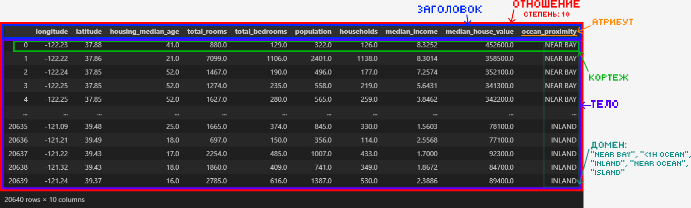

***def*** **Отношение** – математическая структура, которая формально определяет свойства различных объектов и их взаимосвязи. (*Проще: табличка с данными, в которой не определен порядок строк и столбцов, а также нет двух одинаковых строк*)

***def*** **Реляционная алгебра** – коллекция операций, которые принимают отношения в качестве операндов и возвращают отношение в качестве результата. (*Проще: набор функций, принимающих на вход и возвращающих табличку (отношение)*)

***def*** **Домен** – это множество допустимых значений.

***def*** **Атрибут** – наименование домена. (*Проще: название колонки*)

***def*** **Кортеж** – упорядоченный набор фиксированной длины. (*Проще: строка таблицы*)

***def*** **Арность отношения (степень)** – количество атрибутов отношения.

***def*** **Заголовок отношения** – список атрибутов.

***def*** **Тело отношения** – множество кортежей в составе отношения.

### Ключи

***def*** **Потенциальный ключ (Candidate key, CK)** – это подмножество атрибутов отношения, удовлетворяющее требованиям уникальности и минимальности:
- Уникальность: нет и не может быть двух кортежей данного отношения, в которых значения этого подмножества атрибутов совпадают.
- Минимальность: в составе потенциального ключа отсутствует меньшее подмножество атрибутов, удовлетворяющее условию уникальности. (Не можем из имеющегося потенциального ключа вычеркнуть атрибут и вновь получить потенциальный ключ)

***def*** **Первичный ключ (Primary key, PK)** – это один из потенциальных ключей отношения, выбранный в качестве основного.
- Если в отношении имеется лишь один CK, он и будет первичным ключом. В противном случае один ключ выбирается в качестве первичного, а остальные называются альтернативными.
- Отсутствие значения для PK недопустимо.
- В теории, все потенциальные ключи одинаково пригодны для использования в качестве PK, но на практике используется CK, занимающий меньше места при хранении и который не утратит свою уникальность со временем.

***def*** **Суррогатный ключ** – это дополнительное служебное поле, которое добавляется к уже имеющимся информационным полям таблицы только чтобы служить первичным ключом. 
- Значение генерируется искусственно и смысловой нагрузки значение не несёт.
- Обычно является числовым полем и генерируется за счет автоинкремента. (Для PostgreSQL это реализовано в типе данных `SERIAL`)

| Достоинства суррогатных ключей                                                                                 | Недостатки суррогатных ключей                                                                                       |
| -------------------------------------------------------------------------------------------------------------- | ------------------------------------------------------------------------------------------------------------------- |
| *Неизменность:* заполнили одним значением раз и навсегда (кроме экстраординарных ситуаций).<br>                | *Уязвимость генераторов:* по номерам ключей возможно узнать число новых записей за определенный период времени.<br> |
| *Гарантированная уникальность:* т.к. значение генерируется автоинкрементом, повторение значений исключено.<br> | *Неинформативность:* усложняется ручная проверка БД.<br>                                                            |
| *Гибкость:* т.к. такой ключ не несет никакой информативной нагрузки, его можно свободно заменить.<br>          | *Склоняет к пропуску нормализации:* декомпозиции предпочитают создание суррогатного ключа.<br>                      |
| *Эффективность:* удобнее при создании ссылок на другие таблицы.                                                | *Привязка разработчика к поведению генератора ключей в конкретной СУБД.*                                            |

***def*** Пусть $R_1$ и $R_2$ – две переменные отношения, необязательно различные. **Внешним ключом (Foreign Key, FK)** в $R_2$ является подмножество атрибутов переменной $R_1$ такое, что выполняются следующие требования:
- В переменной отношения $R_1$ имеется потенциальный ключ PK такой, что PK и FK совпадают с точностью до переименования атрибутов.
- В любой момент времени множество всех значений FK в $R_2$ является подмножеством значений PK в $R_1$.

то есть:
- $R_1$ содержит потенциальный ключ и является главным, целевым или родительским отношением.
- $R_2$ содержит внешний ключ (Foreign Key, FK) и называется подчиненным или дочерним отношением.

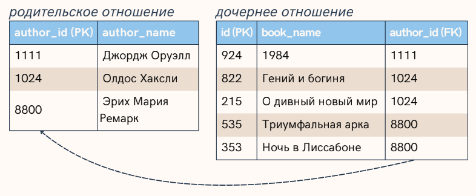

***def*** Ссылочная целостность – это необходимое качество реляционной БД, заключающееся в отсутствии в любом её отношении внешних ключей, ссылающихся на несуществующие кортежи.

___

### 2. Основы SQL. SELECT: cинтаксис, порядок выполнения. Фильтрация, сортировка, агрегация. Соединений (JOIN), типы соединений. Теоретико-множественные операции.

### Основы SQL

***def*** **SQL (Structured Query Language)** – декларативный язык программирования, применяемый для создания, модификации и управления данными в реляционной БД,
управляемой соответствующей СУБД.

*Декларативный = описывается ожидаемый результат, а не способ его получения.*

Виды операторов в SQL:
- **Data Definition Language (DDL)**:  `CREATE`, `ALTER`, `TRUNCATE`, `DROP`
- **Data Manipulation Language (DML)**: `SELECT`, `INSERT`, `UPDATE`, `DELETE`
- **Data Control Language (DCL)**: `GRANT`, `REVOKE`
- **Data Transaction Language (DTL)**: `COMMIT`, `ROLLBACK`

#### *{skippable}* Типы данных в SQL

Типы данных:

- Целочисленные:
	- `SMALLINT` – знаковое 2-байтное целое число $[-32 768,32 767]$
	- `INTEGER` – знаковое 4-байтное целое число $[-2 147 483 648,2 147 483 647]$
	- `BIGINT` – знаковое 8-байтное целое число $[- 2^{63},2^{63} - 1]$
- Числа с произвольной точностью `NUMERIC(p [, s])` (= `DECIMAL(p [, s])`): 
	- Числа с заданной точность `p` – максимальным число хранимых десятичных разрядов (слева и справа включительно). 
	- Опциональный параметр `s` (гамма, scale) задаёт максимальное число разрядов *справа* от десятичной запятой. Может быть указан, только если есть `p` и должен быть $0 \leq s \leq p$.
	- С ростом $p$ увеличиваются затраты на хранение, например при $p \in [29, 38]$ требует 17 байт.
- Числа с плавающей точкой:
	- `REAL` (`FLOAT4`) – 4-байтное число с плавающей точкой.
	- `DOUBLE PRECISION`, (`FLOAT8`) – 8-байтное число с плавающей точкой.
- `BOOLEAN` – `TRUE` или `FALSE`
- Символьные типы данных:
	- **VARCHAR(n)** – строка переменной длины с ограничением.
	- **CHAR(n)** – строка фиксированной длины, (дополняется ведущими пробелами). 
	- **TEXT** – строка переменной неограниченной длины.
- Типы данных даты и времени:
	- `DATE` - только дата
	- `TIME` - только время
	- `TIMESTAMP` - дата и время
	- `TIME WITH TIMEZONE` / `TIMETZ` - время с учётом часового пояса
	- `TIMESTAMP WITH TIMEZONE` / `TIMESTAMPTZ` - дата и время с учётом часового пояса
	- `INTERVAL` - временной интервал

#### *{skippable}* DDL операторы

| Оператор   | Описание                                       |
| ---------- | ---------------------------------------------- |
| `CREATE`   | Оператор создания объектов БД                  |
| `ALTER`    | Оператор модификации объектов БД               |
| `TRUNCATE` | Оператор удаления всего содержимого объекта БД |
| `DROP`     | Оператор удаления объектов БД                  |
*Примеры:*

```SQL
CREATE SCHEMA IF NOT EXISTS user_data; 

/*
CREATE [TEMPORARY] TABLE [IF NOT EXISTS] table_name (
	col_name_1   datatype   constraints,
	col_name_2   datatype   constraints,
	...
	col_name_N   datatype   constraints
);
*/

CREATE TABLE IF NOT EXISTS user_data.users (
	user_id     UUID                                  PRIMARY KEY,
	email       TEXT                                  UNIQUE NOT NULL,
	enc_pass    TEXT                                  NOT NULL,
	created_at  TIMESTAMP  DEFAULT CURRENT_TIMESTAMP  NOT NULL 
);

ALTER TABLE user_data.users 
ADD CONSTRAINT check_email_format CHECK ( 
	email ~* '^[A-Za-z0-9._%+-]+@[A-Za-z0-9.-]+\.[A-Za-z]{2,}$' 
);

TRUNCATE TABLE users_data.users;

DROP TABLE IF EXISTS users_data.users 
```

#### *{skippable}* DML операторы (кроме SELECT)

| Оператор | Описание                                |
| -------- | --------------------------------------- |
| `INSERT` | Оператор добавления новых записей       |
| `UPDATE` | Оператор изменения существующих записей |
| `DELETE` | Оператор удаления записей по условию    |
*Примеры:*

```SQL
/*
INSERT INTO table_name (column1, column2, ..., columnM) 
VALUES
	(Avalue1, Avalue2, ..., AvalueM),
	(Bvalue1, Bvalue2, ..., BvalueM),
	...,
	(Nvalue1, Nvalue2, ..., NvalueM);
*/

INSERT INTO users_data.users (user_id, email, enc_pass)
VALUES 
	("1ec3e839-5c60-4929-885d-481ff1d2280d", "somemail@mail.ru", "..."),
	("2e0b614d-1015-4e2a-b5bd-019e33db8a54", "somemail@gmail.com", "..."),
	("f1f01166-de24-45f7-99e2-f1504cb424db", "somemail@phystech.edu", "...");

/*
UPDATE table_name 
	SET column1 = value1, ..., columnN = valueN
	[WHERE condition];
*/

UPDATE users_data.users
	SET enc_pass = "..."
	WHERE email = "somemail@gmail.com"

/*
DELETE 
	FROM table_name 
	[WHERE condition];
*/

DELETE 
	FROM users_data.users
	WHERE email LIKE "%@phystech.edu"
```

### Оператор SELECT

Оператор `SELECT` осуществляет выборку данных по условию.

*Синтаксис*:

```SQL
SELECT [DISTINCT] select_item_comma_list
FROM table_reference_comma_list
	[WHERE conditional_expression]
	[GROUP BY column_name_comma_list]
	[HAVING conditional_expression]
	[ORDER BY order_item_comma_list];
```

Порядок выполнения:
1. `FROM` (и `JOIN`) – определяются таблицы и связываются источники.
2. `WHERE` – фильтруются исходные строки по заданным условиям.
3. `GROUP BY` – оставшиеся строки объединяются в группы.
4. `HAVING` – фильтруются уже сгруппированные данные.
5. `SELECT` – вычисляются выражения, создаются псевдонимы (алиасы) и формируется итоговый набор колонок. (Если с `DISTINCT`, то после SELECT удаляются дубликаты из результирующего набора)
6. `ORDER BY` – сортирует строки.
   (И в конце `LIMIT` / `OFFSET` / `TOP` для ограничения количества возвращаемых строк)

#### SELECT: Фильтрация (WHERE)

Оператор `WHERE` принимает на вход одну таблицу и порождает таблицу с теми же атрибутами, что и входная и в которой все строки соответствуют условию фильтрации. Если во входной таблице ни одна строка не соответствует условию, то на выходе будет пустая таблица.

Условия фильтрации могут состоять из:
- Операторов сравнения:
	  *Важное замечание*: В SQL работает тернарная логика: на выходе операторов сравнения, помимо `TRUE` и `FALSE`, мы можем получить `UNKNOWN` в ситуациях, когда один из операндов `NULL`.
	- `=` – Равенство
	- `<=>` – Эквивалентность (Аналогичен равенству, но при сравнении `NULL` с `NULL` вернёт `TRUE`, а при сравнении `NULL` с другим значением вернёт `FALSE`)
	- `<>` или `!=` – Неравенство
	- `<` – Меньше
	- `<=` – Меньше или равно
	- `>` – Больше
	- `>=` – Больше или равно
	- `IS NULL` – Проверяет отсутствие значения
	- `BETWEEN` (`BETWEEN lower_bound AND upper_bound`) – Проверяет попадание значения в диапазон
	- IN – Проверяет наличие значения в списке.
	- `LIKE` – Проверяет соответствие строки паттерну. Маски задаются следующим образом:
		- `%` – любая последовательность символов.
		- `_` – один символ.
		- `\` – дефолтный символ для экранирования.
		- Свой символ для экранирования можно задать через оператор `ESCAPE`, например: `SELECT item, sale FROM items WHERE sale LIKE "%!%" ESCAPE "!`;
	- `REGEXP` – Оператор для обработки строк с помощью регулярных выражений.
- Логических операторов: `NOT`, `AND`, `OR`, `XOR`
- `COALESCE(value_list)` – возвращает первый попавшийся аргумент, отличный от NULL. Если же все аргументы равны NULL, результатом также будет NULL.
- Ветвления:
	- `IF ... THEN ... [ELSIF ... THEN ... ELSE ...] END IF`
	- `CASE [...] WHEN ... THEN ... ELSE ... END CASE`

*Примеры:*

```SQL
SELECT
    IF number = 0 THEN
        'zero'
    ELSIF number > 0 THEN
        'positive'
    ELSIF number < 0 THEN
        'negative'
    ELSE
        'NULL'
    END IF AS number_class
FROM
    numbers

SELECT
    CASE
        WHEN number = 0 THEN
            'zero'
        WHEN number > 0 THEN
            'positive'
        WHEN number < 0 THEN
            'negative'
        ELSE
            'NULL'
    END CASE AS number_class
FROM
    numbers
```
#### SELECT: Сортировка (ORDER BY)

При выполнении `SELECT` запроса, строки по умолчанию возвращаются в неопределённом порядке. Фактический порядок строк в этом случае зависит от плана соединения и сканирования, а также от порядка расположения данных на диске, поэтому полагаться на него нельзя. Для упорядочивания записей используется конструкция `ORDER BY`.

Общая структура:
```SQL
SELECT поля_таблиц FROM наименование_таблицы
...
ORDER BY столбец_1 [ASC | DESC][, столбец_n [ASC | DESC]];
```

где `ASC` и `DESC` задают направление сортировки, по возрастанию (default) и по убыванию соответственно.

В целом как происходит сравнение очевидно, упомяну что для строк оно идёт в лексикографическом порядке, а для тернарок при `ASC` сначала идут `NULL`, потом `FALSE`, потом `TRUE`, а при `DESC` наоборот – `NULL` в конце.

#### SELECT: Агрегация (GROUP BY)

`GROUP BY` принимает на вход одну таблицу и на выход порождает тоже одну таблицу, с тем же количеством атрибутов, но эти атрибуты уже разделены на два набора. А строк `GROUP BY` возвращает не больше, чем во входной таблице – по одной на каждое уникальное значение кортежа группировочных атрибутов.

Двумя наборами атрибутов таблицы на выходе являются группирующие и негруппирующие атрибуты. Группирующие атрибуты – это те, что перечислены после `GROUP BY`, а негруппирующие – все остальные атрибуты входной таблицы.

Группирующие атрибуты остаются обычными атрибутами, и с ними далее можно работать как обычно.

А вот с негруппирующими атрибутами просто так далее по конвейеру сделать ничего не получится – ни использовать в сортировке, ни выбрать и выдать наружу. Потому что эти атрибуты содержат не одно значение, а множество. Для того чтобы со значениями негруппирующих атрибутов можно было работать, их необходимо снова превратить в скаляры с помощью агрегирующих функций:
- `count()` – число записей с непустым значениям.
- `count(DISTINCT field_nm)` – число уникальных непустых значений.
-  `min()` / `max()` – находят мин. / макс. в группе.
- `avg()` – Среднее значение в группе.
- `sum()` – Сумма значений группы.

Оператор `AS` используется для создания алиасов для столбцов или таблиц.

*Пример*:

```SQL
SELECT sex, sum(survived) AS sum_survived
FROM titanic
GROUP BY sex;
```

### Соединение JOIN

`JOIN` – операция, которая комбинирует столбцы из двух или более отношений (таблиц) в одну виртуальную таблицу на основе условия связи (предиката).

Операции соединения делятся на 3 группы:
- `CROSS JOIN` – декартово произведение 2 таблиц
- `INNER JOIN` – соединение 2 таблиц по условию. В результирующую выборку попадут только те записи, которые удовлетворяют условию соединения
- `OUTER JOIN` – соединение 2 таблиц по условию. В результирующую выборку могут попасть записи, которые не удовлетворяют условию соединения:
    - `LEFT (OUTER) JOIN` – все строки "левой" таблицы попадают в итоговую выборку
    - `RIGHT (OUTER) JOIN` – все строки "правой" таблицы попадают в итоговую выборку
    - `FULL (OUTER) JOIN` – все строки обеих таблиц попадают в итоговую выборку

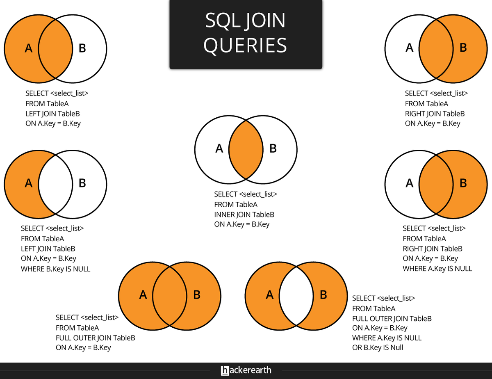

### Теоретико-множественные операции

Периодически требуется к результату выполнения запроса добавить или исключить строки, полученные другим запросом. Для решения подобных задач в стандарте `SQL` предусмотрены операции над множествами:
- `UNION` – объединение строк (дополнение результатов первого запроса результатами второго запроса);
- `INTERSECT` – пересечение строк (остаются строки, присутствующие в результатах обоих запросов);
- `EXCEPT` – исключение строк (из строк первого запроса исключаются строки второго запроса).

*Синтаксис*:

```SQL
query_1

UNION или INTERSECT или EXCEPT

query_2

...

UNION или INTERSECT или EXCEPT

query_n
```

Все запросы должны удовлетворять следующим правилам:
- количество полей во всех запросах должно совпадать;
- типы данных соответствующих полей должны совпадать.

Название поля в результате выборки берется из первого запроса.

Пример:

```SQL
SELECT num_group, full_name
FROM aisd.submitions
	GROUP BY num_group, full_name
	HAVING sum(points) >= 36

EXCEPT

SELECT num_group, full_name
FROM aisd.skats
	GROUP BY num_group, full_name
	HAVING count(task_name) > 2
```

___
## 3. Оконные функции в SQL: cинтаксис OVER(), PARTITION BY, ORDER BY. Агрегатные функции в оконном контексте. Ранжирующие функции. Смещения. Фреймы.

Оконные функции в SQL – это функции, которые выполняют вычисления над набором строк, связанным с текущей строкой, и возвращают отдельное значение для каждой строки результирующего набора. В отличие от `GROUP BY`, оконные функции не объединяют несколько строк в одну и не уменьшают степень детализации результата. Исходные строки сохраняются, а к каждой из них добавляется вычисленное значение.

Например, с помощью оконной функции можно одновременно вывести зарплату каждого сотрудника и среднюю зарплату по его отделу:

```sql
SELECT
    name,
    department,
    salary,
    AVG(salary) OVER (PARTITION BY department) AS department_avg
FROM employees;
```

Для каждой строки функция `AVG()` вычисляет среднюю зарплату по соответствующему отделу, но сами строки сотрудников при этом не объединяются.

**Основные свойства оконных функций:**
- возвращают значение для каждой строки результирующего набора;
- могут выполнять вычисления по всему набору строк, по отдельным секциям или как скользящее окно;
- вычисляются над набором строк, сформированным после выполнения `FROM`, `WHERE`, `GROUP BY`, агрегатных функций и `HAVING`; непосредственно использовать оконные функции можно только в списке `SELECT` и в итоговом `ORDER BY`.

***note*** Если необходимо отфильтровать строки по результату оконной функции, используется подзапрос или общее табличное выражение.

### Синтаксис оконной функции и инструкция `OVER`

Предложение `OVER` указывает, что функция должна быть выполнена в оконном контексте и задаёт описание окна, относительно которого производится вычисление.

Общий синтаксис оконной функции выглядит следующим образом:

```sql
function_name(arguments) OVER (
    [PARTITION BY expressions]
    [ORDER BY expressions]
    [frame_clause]
) AS attribute_name
```

В круглых скобках после `OVER` указывается описание окна. Оно может включать:
1. `PARTITION BY` – разделение набора строк на независимые секции;
2. `ORDER BY` – определение порядка строк внутри каждой секции;
3. `ROWS`, `RANGE` или `GROUPS` – определение границ фрейма.

В качестве оконных могут использоваться:
1. агрегатные функции;
2. ранжирующие функции;
3. функции смещения;
4. функции доступа к значениям внутри фрейма.

(Подробнее о них позже).

В одном запросе можно использовать несколько оконных функций с разными окнами:

```sql
SELECT
    name,
    department,
    salary,
    AVG(salary) OVER (PARTITION BY department) AS department_avg,
    AVG(salary) OVER () AS company_avg
FROM employees;
```

Если несколько оконных функций используют одинаковое описание окна, его можно вынести в отдельное предложение `WINDOW`:

```sql
SELECT
    name,
    department,
    salary,
    SUM(salary) OVER w AS department_total,
    AVG(salary) OVER w AS department_avg
FROM employees
WINDOW w AS (
    PARTITION BY department
);
```

Именованные окна уменьшают дублирование кода и упрощают сопровождение запроса.

#### `PARTITION BY`

`PARTITION BY` разделяет результирующий набор строк на независимые секции. Оконная функция применяется отдельно к каждой секции.

Основные свойства `PARTITION BY`:
- является необязательной частью описания окна;
- может использовать один или несколько столбцов;
- не объединяет строки;
- определяет независимые секции для вычисления функции;
- при отсутствии `PARTITION BY` весь результирующий набор считается одной секцией.

#### `ORDER BY`

`ORDER BY` внутри `OVER` определяет порядок строк в каждой секции.

Синтаксически некоторые оконные функции могут использоваться без `ORDER BY`, однако без явно заданного порядка результат может быть неопределённым или малоинформативным. Например, `ROW_NUMBER() OVER ()` присвоит строкам номера, но порядок присвоения не будет гарантирован.

Для агрегатных функций `ORDER BY` необязателен:

Без `ORDER BY` агрегат обычно вычисляется по всей секции:

```sql
SELECT
    name,
    department,
    salary,
    SUM(salary) OVER (
        PARTITION BY department
    ) AS department_total
FROM employees;
```

Одинаковая сумма отдела будет указана для каждой строки этого отдела.

При добавлении `ORDER BY` агрегатная функция может использоваться для вычисления нарастающего итога:

```sql
SELECT
    name,
    salary,
    SUM(salary) OVER (
        ORDER BY salary
        ROWS BETWEEN UNBOUNDED PRECEDING
                 AND CURRENT ROW
    ) AS running_total
FROM employees;
```

Здесь для каждой строки рассчитывается сумма от начала набора до текущей строки.

### Фреймы

**Фрейм** – это подмножество строк текущей секции, которое используется при вычислении оконной функции для текущей строки.

Секция определяется с помощью `PARTITION BY`, а фрейм ограничивает количество строк внутри этой секции.
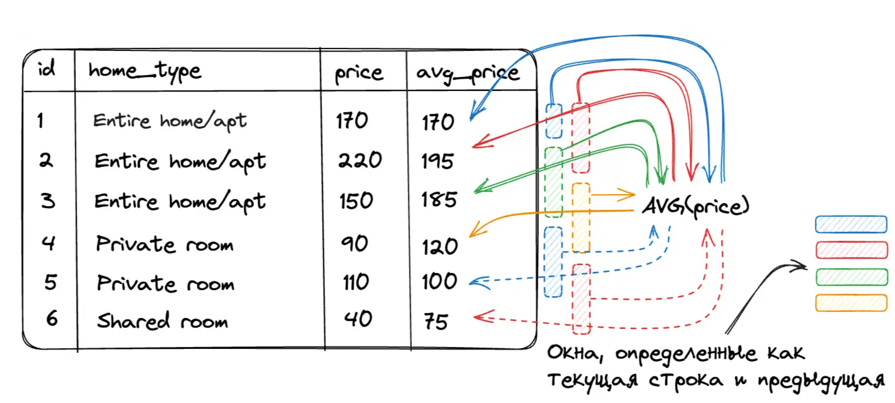

Общий синтаксис определения фрейма:

```sql
ROWS | RANGE | GROUPS
BETWEEN frame_start AND frame_end
```

Начальная и конечная границы могут задаваться следующими конструкциями:
- `CURRENT ROW` – текущая строка или текущая группа равноправных строк;
- `N PRECEDING` – определённое количество строк, групп или единиц значения до текущей позиции;
- `N FOLLOWING` – определённое количество строк, групп или единиц значения после текущей позиции;
- `UNBOUNDED PRECEDING` – начало текущей секции;
- `UNBOUNDED FOLLOWING` – конец текущей секции.

Режимы `ROWS`, `RANGE` и `GROUPS` по-разному определяют границы фрейма:
#### `ROWS BETWEEN`

`ROWS` определяет границы фрейма по физическому положению строк.

*Пример*:

```sql
-- Вычисление скользящего среднего

SELECT
    year,
    month,
    expense,
    ROUND(AVG(expense) OVER w, 2) AS rolling_avg
FROM expenses
WINDOW w AS (
    ORDER BY year, month
    ROWS BETWEEN 1 PRECEDING AND 1 FOLLOWING
)
ORDER BY year, month;
```

Для каждого месяца среднее рассчитывается по расходам предыдущего, текущего и следующего месяцев.

Для первой строки предыдущей строки нет, поэтому в расчёте участвуют только текущая и следующая строки. Для последней строки аналогично используются текущая и предыдущая строки.
#### `GROUPS BETWEEN`

`GROUPS` определяет границы фрейма по группам строк, имеющих одинаковую позицию с точки зрения оконной сортировки `ORDER BY`.

*Пример*:

```sql
-- Считаем количество записей нарастающим итогом.

SELECT
    id,
    name,
    department,
    COUNT(*) OVER w AS cnt
FROM employees
WINDOW w AS (
    ORDER BY department
    GROUPS BETWEEN UNBOUNDED PRECEDING
               AND CURRENT ROW
)
ORDER BY department, id;
```

#### `RANGE BETWEEN`

`RANGE` определяет фрейм на основе диапазона значений выражения, указанного в `ORDER BY`.

*Пример*:

```sql
-- Посмотрим для каждой гитары количество альтернатив с ценой в диапазоне +-100$ от текущей и их средний рейтинг.

SELECT
    model,
    type,
    price,
    rating,
    COUNT(*) OVER w AS alternatives_count,
    ROUND(AVG(rating) OVER w, 2) AS alternatives_avg_rating
FROM guitars
WINDOW w AS (
    PARTITION BY type
    ORDER BY price
    RANGE BETWEEN 100 PRECEDING AND 100 FOLLOWING
    EXCLUDE CURRENT ROW
);
```

`EXCLUDE CURRENT ROW` исключает текущую строку из фрейма. При этом другие строки с такой же ценой могут оставаться во фрейме.

### Функции в оконном контексте

#### Агрегирующие функции

Агрегатные функции вычисляют обобщённое значение по набору строк.

|Функция|Описание|
|---|---|
|`MIN(value)`|Возвращает минимальное значение среди строк текущей секции или фрейма|
|`MAX(value)`|Возвращает максимальное значение|
|`COUNT(value)`|Подсчитывает количество значений, не равных `NULL`|
|`COUNT(*)`|Подсчитывает количество строк|
|`AVG(value)`|Вычисляет среднее значение, игнорируя `NULL`|
|`SUM(value)`|Вычисляет сумму значений|
|`STRING_AGG(value, separator)`|Объединяет значения в строку с указанным разделителем|

#### Ранжирующие функции

Ранжирующие функции присваивают строкам номера или ранги в соответствии с порядком, заданным в оконном `ORDER BY`.

Основные ранжирующие функции:

|Функция|Описание|
|---|---|
|`ROW_NUMBER()`|Присваивает каждой строке уникальный последовательный номер|
|`RANK()`|Присваивает одинаковый ранг строкам с одинаковыми значениями сортировки и оставляет пропуски после совпадений|
|`DENSE_RANK()`|Присваивает одинаковый ранг строкам с одинаковыми значениями, но не оставляет пропусков|
|`NTILE(n)`|Распределяет строки по `n` группам и возвращает номер группы|

Пример:

```sql
SELECT
    ROW_NUMBER() OVER w AS row_number,
    DENSE_RANK() OVER w AS dense_rank,
    RANK() OVER w AS rank,
    name,
    department,
    salary
FROM employees
WINDOW w AS (
    ORDER BY salary DESC
)
ORDER BY salary DESC;
```

Результат может выглядеть следующим образом:

|row_number|dense_rank|rank|name|department|salary|
|--:|--:|--:|---|---|--:|
|1|1|1|Иван|it|120|
|2|2|2|Леонид|it|104|
|3|2|2|Марина|it|104|
|4|3|4|Анна|sales|100|
|5|4|5|Вероника|sales|96|
|6|4|5|Григорий|sales|96|
|7|5|7|Ксения|it|90|
|8|6|8|Елена|it|84|
|9|7|9|Борис|hr|78|
|10|8|10|Дарья|hr|70|

***note*** `ntile(n)` в случае, когда количество строк в окне `k` не кратно `n`, в первые несколько (`k mod n`) групп помещает `n+1` строку, а в остальные – `n`.

#### Функции смещения

Функции смещения позволяют получать значения из предыдущих или следующих строк текущей секции.

| Функция                        | Описание                                                       |
| ------------------------------ | -------------------------------------------------------------- |
| `LAG(value, offset, default)`  | Возвращает значение из предыдущей строки с указанным смещением |
| `LEAD(value, offset, default)` | Возвращает значение из следующей строки с указанным смещением  |

- Параметр `offset` определяет величину смещения и по умолчанию равен `1`.
- Параметр `default` определяет значение, которое будет возвращено, если соответствующей строки не существует. По умолчанию возвращается `NULL`.

*Пример*:

```sql
-- Для каждой строки будет выведена выручка предыдущего месяца.

SELECT
    month,
    revenue,
    LAG(revenue) OVER (
        ORDER BY month
    ) AS previous_revenue
FROM monthly_revenue;

-- Можно сразу вычислить разницу:
SELECT
    month,
    revenue,
    revenue - LAG(revenue) OVER (
        ORDER BY month
    ) AS revenue_change
FROM monthly_revenue;
```

#### Функции доступа к значениям фрейма

Следующие функции возвращают значения из определённых строк текущего фрейма:

|Функция|Описание|
|---|---|
|`FIRST_VALUE(value)`|Возвращает значение из первой строки текущего фрейма|
|`LAST_VALUE(value)`|Возвращает значение из последней строки текущего фрейма|
|`NTH_VALUE(value, n)`|Возвращает значение из `n`-й строки текущего фрейма|

_Пример_:

```sql
SELECT
    name,
    department,
    salary,
    FIRST_VALUE(salary) OVER (
        PARTITION BY department
        ORDER BY salary DESC
    ) AS highest_salary
FROM employees;
```

Поскольку строки внутри отдела отсортированы по убыванию зарплаты, `FIRST_VALUE()` возвращает максимальную зарплату в отделе.

***note*** При использовании `LAST_VALUE()` необходимо учитывать границы фрейма. Если фрейм не задан явно, функция может вернуть значение текущей строки или последней строки, равной ей с точки зрения оконной сортировки.

___
## 4. CTE (Common Table Expressions): синтаксис `WITH`, рекурсивные CTE

***def*** Обобщённое табличное выражение или CTE (Common Table Expressions) – это временный результирующий набор данных, к которому можно обращаться в последующих запросах. Для написания обобщённого табличного выражения используется оператор WITH.

```SQL
-- Пример использования конструкции WITH
WITH Aeroflot_trips AS
    (SELECT TRIP.* FROM Company
        INNER JOIN Trip ON Trip.company = Company.id WHERE name = 'Aeroflot')

SELECT plane, COUNT(plane) AS amount FROM Aeroflot_trips GROUP BY plane;
```

Выражение с `WITH` считается "временным", потому что результат не сохраняется где-либо на постоянной основе в схеме базы данных, а действует как временное представление, которое существует только на время выполнения запроса, то есть оно доступно только во время выполнения операторов SELECT, INSERT, UPDATE, DELETE или MERGE. Оно действительно только в том запросе, которому он принадлежит, что позволяет улучшить структуру запроса, не загрязняя глобальное пространство имён.
### Синтаксис `WITH`


```SQL
WITH cte_name [(col_1 [, col_2 ] …)] AS (subquery)
    [, cte_name_2 [(col2_1 [, col2_2 ] …)] AS (subquery_2)] …

```

*Пример*:

```sql
-- После имени CTE можно явно указать имена его столбцов.
-- Количество указанных имён должно совпадать с количеством столбцов, возвращаемых подзапросом.

WITH Aeroflot_trips (
    aeroflot_plane,
    town_from,
    town_to
) AS (
    SELECT
        plane,
        town_from,
        town_to
    FROM Company
    INNER JOIN Trip
        ON Trip.company = Company.id
    WHERE name = 'Aeroflot'
)
SELECT *
FROM Aeroflot_trips;
```

*Пример*:

```sql
-- В одном операторе `WITH` можно объявить несколько CTE. Их определения разделяются запятыми

WITH
    Aeroflot_trips AS (
        SELECT Trip.*
        FROM Company
        INNER JOIN Trip
            ON Trip.company = Company.id
        WHERE name = 'Aeroflot'
    ),
    Don_avia_trips AS (
        SELECT Trip.*
        FROM Company
        INNER JOIN Trip
            ON Trip.company = Company.id
        WHERE name = 'Don_avia'
    )
SELECT *
FROM Aeroflot_trips

UNION

SELECT *
FROM Don_avia_trips;
```

### Рекурсивные CTE

CTE также могут быть использованы для выполнения рекурсивных запросов, которые позволяют итеративно обрабатывать данные, например, для работы с иерархическими структурами данных, такими как "руководитель - подчинённый".

Такое выражение объявляется с помощью `WITH RECURSIVE` и состоит из двух частей, разделенных оператором UNION ALL:
1. начального запроса, который формирует исходный набор строк;
2. рекурсивного запроса, который обращается к самому CTE.

```sql
WITH RECURSIVE cte_name (col_1, col_2, ...) AS (
    -- Начальный набор данных
    SELECT col_1, col_2, ...
    FROM table_name
    WHERE condition

    UNION ALL

    -- Рекурсивная часть
    SELECT col_1, col_2, ...
    FROM cte_name
    INNER JOIN table_name ON cte_name.col = table_name.col
    WHERE condition
)

SELECT * FROM cte_name;
```

*Пример*:

Рассмотрим таблицу `Employees`:

|`id`|`name`|`managerId`|
|--:|---|--:|
|1|John Smith|`NULL`|
|2|Michael Johnson|1|
|3|Robert Williams|1|
|4|James Brown|2|
|5|David Jones|2|
|6|Richard Davis|3|

Следующий запрос находит всех подчинённых сотрудника с `id = 1` на всех уровнях иерархии:

```sql
WITH RECURSIVE Subordinates AS (
    SELECT
        id,
        name,
        managerId
    FROM Employees
    WHERE managerId = 1

    UNION ALL

    SELECT
        e.id,
        e.name,
        e.managerId
    FROM Employees AS e
    INNER JOIN Subordinates AS s
        ON e.managerId = s.id
)
SELECT *
FROM Subordinates;
```

Сначала начальный запрос выбирает непосредственных подчинённых сотрудника с `id = 1`. Затем рекурсивная часть ищет сотрудников, руководителями которых являются уже найденные подчинённые. Процесс повторяется для каждого нового набора строк и завершается, когда рекурсивная часть больше не возвращает результатов.

`UNION ALL` сохраняет все строки, полученные на каждой итерации. Вместо него можно использовать `UNION`, который удаляет повторяющиеся строки, однако требует дополнительной проверки уникальности.

Рекурсивный CTE должен быть составлен так, чтобы на некоторой итерации рекурсивная часть перестала возвращать новые строки. Иначе выполнение может продолжаться до достижения ограничения глубины рекурсии, установленного СУБД.

___
## 5. Проектирование баз данных. Обеспечение целостности, устранение аномалий, минимизация избыточности. Этапы проектирования: концептуальное, логическое и физическое

**Проектирование БД** – процесс создания детализированной модели данных, определения связей между ними и необходимых ограничений целостности.

Основные задачи проектирования БД:
- обеспечение хранения всей необходимой информации;
- обеспечение возможности получения данных по необходимым запросам;
- минимизация избыточности и дублирования данных;
- предотвращение аномалий при добавлении, изменении и удалении данных;
- обеспечение целостности базы данных.

**Целостность БД** означает корректность, непротиворечивость и согласованность хранящихся данных. Она обеспечивается с помощью первичных и внешних ключей, ограничений уникальности, проверок допустимых значений и других правил, заданных в схеме БД.

Основные шаги проектирования БД:
1. Определение данных, которые должны храниться в БД.
2. Определение взаимосвязей между элементами данных.
3. Формирование логической структуры данных на основе выявленных связей и ограничений.
4. Реализация спроектированной БД средствами выбранной СУБД.

Этапы проектирования:
1. **Концептуальное проектирование** – описание основных объектов предметной области и отношений между ними без привязки к конкретной модели данных или СУБД.
2. **Логическое проектирование** – преобразование концептуальной модели в реляционную схему, уточнение атрибутов, ключей, связей и ограничений целостности.
3. **Физическое проектирование** – отображение логической схемы на физические структуры, поддерживаемые выбранной СУБД.

### Концептуальное проектирование: ER-диаграммы

_**def**_ **ER-модель** (_entity-relationship model_, модель "сущность – связь") – модель данных, предназначенная для описания сущностей предметной области, их свойств и отношений между ними.

Шаги концептуального проектирования:

1. Определяем предметную область, с которой будем работать.
2. Выделяем основные, пока не детализированные сущности.
3. Определяем связи между сущностями и их кратность: один к одному, один ко многим, многие ко многим и т. д.
4. Строим концептуальную ER-диаграмму в нотации "Воронья лапка" (_Crow’s Foot_) без явного перечисления атрибутов.

Основные элементы ER-диаграммы:

- сущность изображается в виде прямоугольника, содержащего её имя;
- атрибуты сущности указываются внутри прямоугольника при переходе к логической модели;
- связь изображается линией, соединяющей участвующие в ней сущности;
- обозначения на концах линии показывают обязательность связи и её кратность.

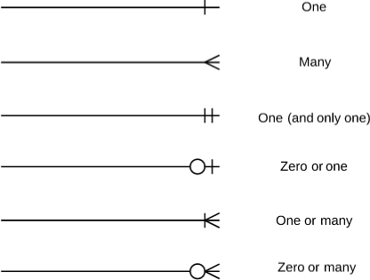

_Пример ER-диаграммы_:

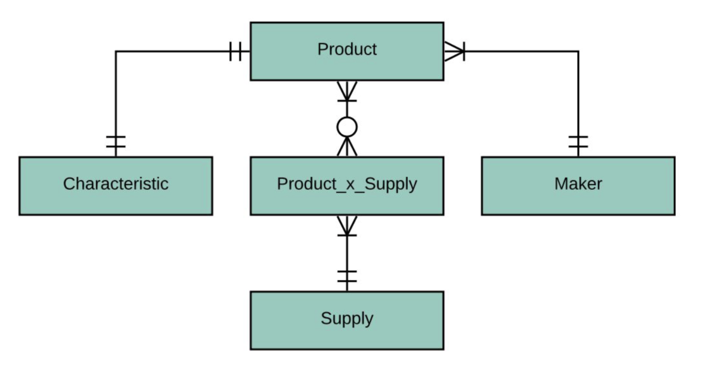

### Логическое проектирование

Основные цели логического проектирования:
- уточнение состава атрибутов сущностей;
- определение первичных и внешних ключей;
- уточнение связей и ограничений целостности;
- минимизация избыточности данных;
- нормализация отношений.

Шаги логического проектирования:

1. Преобразуем сущности концептуальной модели в детализированные отношения в соответствии с выбранной моделью данных.
2. Определяем атрибуты, первичные и внешние ключи, а также связи между отношениями.
3. Проверяем схему на наличие избыточности и возможных аномалий.
4. Строим логическую ER-диаграмму в нотации "Воронья лапка" с явным указанием атрибутов.

*Пример результата*:

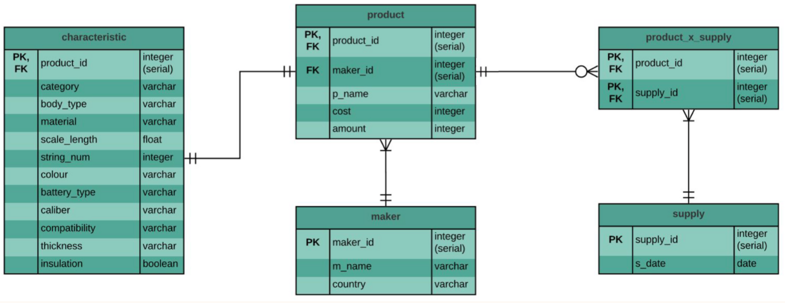

#### Нормализация отношений

_**def**_ **Нормализация БД** – процесс преобразования отношений с целью уменьшения избыточности и устранения аномалий, основанный на анализе зависимостей между атрибутами.

***def*** **Нормальная форма** – совокупность требований, которым должно удовлетворять отношение, чтобы снизить вероятность возникновения избыточности, противоречий и аномалий изменения данных.

Нормализация предназначена для:
- минимизации логической избыточности;
- уменьшения вероятности возникновения противоречивых данных;
- устранения некоторых видов дублирования;
- предотвращения аномалий вставки, обновления и удаления.

Нормализация непосредственно не предназначена для уменьшения физического объёма БД или повышения производительности. В некоторых случаях нормализованная схема может требовать большего количества соединений таблиц.

_**def**_ **Избыточность данных** – хранение одной и той же информации в нескольких местах. Полностью исключить избыточность не всегда возможно или целесообразно, поэтому при проектировании стремятся к её минимизации: каждый факт должен по возможности храниться в одном месте и однозначно определяться соответствующим ключом.

Избыточность увеличивает объём хранения и создаёт риск несогласованности: при изменении одного факта необходимо корректно обновить все его копии.

_**def**_ **Декомпозиция** – разложение исходного отношения на несколько отношений. Декомпозиция называется **декомпозицией без потерь**, если исходное отношение можно восстановить естественным соединением полученных отношений без появления лишних или потери существующих кортежей.

_**def**_ **Аномалия** – ситуация, при которой структура отношения приводит к противоречиям или затрудняет добавление, изменение либо удаление данных. Обычно причиной аномалий является избыточное дублирование информации, связанное с нежелательными функциональными зависимостями.

Основные виды аномалий:
- **аномалия вставки** – невозможность добавить один факт без добавления другого;
- **аномалия обновления** – необходимость изменять одно и то же значение в нескольких строках;
- **аномалия удаления** – потеря полезной информации при удалении строки, содержащей также другой факт.

_**def**_ **Функциональная зависимость** между множествами атрибутов **A** и **B** означает, что каждому значению **A** соответствует не более одного значения **B**. Иначе говоря, если два кортежа совпадают по значениям атрибутов **A**, то они совпадают и по значениям атрибутов **B**.

_**def**_ **Минимальная функциональная зависимость** – функциональная зависимость, из левой части которой нельзя удалить ни один атрибут, сохранив эту зависимость. То есть множество определяющих атрибутов не содержит лишних элементов.

### Физическое проектирование

При физическом проектировании логическая схема адаптируется к возможностям и особенностям конкретной СУБД.

Шаги физического проектирования:
1. Создаём схему базы данных для выбранной СУБД.
2. Выбираем поддерживаемые типы данных и учитываем ограничения на именование объектов.
3. Определяем способы физического хранения и доступа к данным: индексы, секционирование и другие структуры, если они необходимы.
4. Подготавливаем SQL-скрипт создания таблиц, ключей и ограничений либо детальное описание схемы для дальнейшей реализации.

________
## 6. Нормализация в базах данных. Нормальные формы: определения 1НФ, 2НФ, 3НФ, НФ Бойса-Кодда.

***def*** **Нормализация БД** – процесс преобразования отношений с целью уменьшения избыточности и устранения аномалий, основанный на анализе зависимостей между атрибутами.

**Нормальная форма** – совокупность требований, которым должно удовлетворять отношение, чтобы снизить вероятность возникновения избыточности, противоречий и аномалий изменения данных.

Нормализация предназначена для:
- минимизации логической избыточности;
- уменьшения вероятности возникновения противоречивых данных;
- устранения некоторых видов дублирования;
- предотвращения аномалий вставки, обновления и удаления.

### Нормальные формы:

#### 1НФ

***def*** Переменная отношения находится в **1НФ** тогда и только тогда, когда в любом допустимом значении этой переменной отношения каждый её кортеж содержит скалярное значение для каждого из атрибутов.

*Пример:*

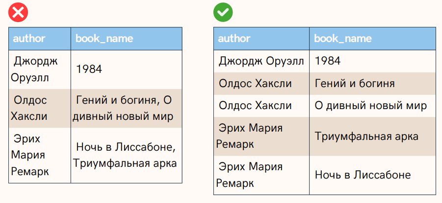

#### 2НФ

***def*** Переменная отношения находится в **2НФ** тогда и только тогда, когда она находится в 1НФ и каждый неключевой атрибут минимально функционально зависит от его первичного ключа.

***def*** **Функциональная зависимость** между множествами атрибутов A и B означает, что для любого допустимого набора кортежей в данном отношении верно следующее: если два кортежа совпадают по значению A, то они совпадают по значению B. 

***def*** **Минимальная функциональная зависимость** означает, что в составе первичного ключа отсутствует меньшее подмножество атрибутов, от которого можно также вывести данную функциональную зависимость.

*Пример:*

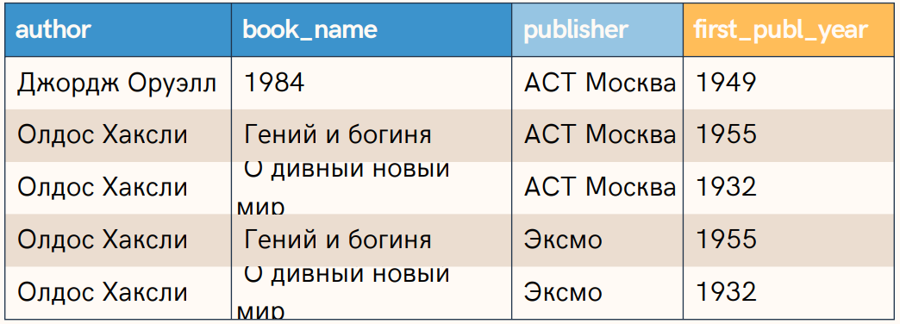

В данной таблице PK выступает множество (author, book_name, publisher)

Однако дата первой публикации книги в целом не зависит от издательства.

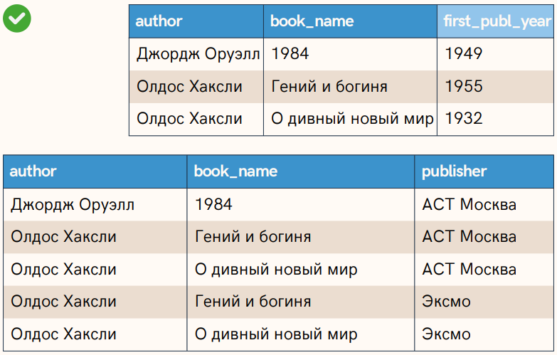

#### 3НФ

***def*** Переменная отношения находится в **3НФ** в том и только в том случае, когда она находится в 1НФ и 2НФ и каждый неключевой атрибут нетранзитивно функционально зависит от первичного ключа.

*Пример:*

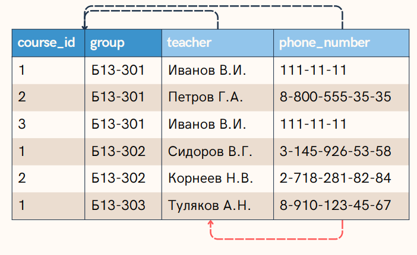
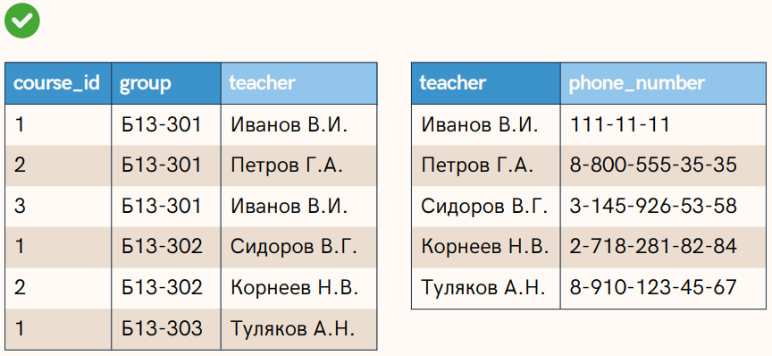

#### НФ Бойса-Кодда

***def*** Пусть $X$ и $Y$ – произвольные подмножества множества атрибутов отношения $R$. Тогда **$Y$ функционально зависимо от $X$** ($X \to Y$) тогда и только тогда, когда каждое значение множества $X$ отношения $R$ связано точно с одним значением множества $Y$ отношения $R$. В этом случае $X$ называют детерминантом, а $Y$ – зависимой частью.

- Функциональная зависимость называется **тривиальной**, если зависимая часть является подмножеством детерминанта. 
- **Неприводимость** означает, что в составе потенциального ключа отсутствует меньшее подмножество атрибутов, от которого можно также вывести данную функциональную зависимость.

***def*** Переменная отношения находится в **НФ Бойса-Кодда (BCNF)** в том и только в том случае, тогда и только тогда, когда каждая её нетривиальная и неприводимая слева функциональная зависимость имеет в качестве своего детерминанта некоторый потенциальный ключ, т.е.
не только любой неключевой атрибут полностью функционально зависит от любого ключа, но и любой ключевой атрибут полностью зависит от любого ключа.

*Пример:*

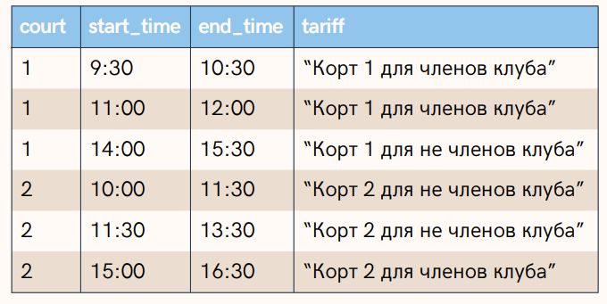

В исходном отношении существует функциональная зависимость $tariff → court$: каждому тарифу соответствует ровно один корт, однако `tariff` не является потенциальным ключом, так как одному тарифу соответствует несколько временных интервалов. Следовательно, отношение удовлетворяет 3НФ, но нарушает BCNF.

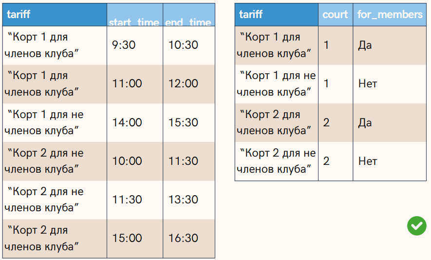

Отношение разбивается на две таблицы: расписание `(court, start_time, end_time, tariff)` и справочник тарифов `(tariff, court, for_members)`. Теперь в каждой таблице любой детерминант является потенциальным ключом, поэтому обе таблицы находятся в нормальной форме Бойса-Кодда.

___
## 7. Транзакции в SQL. Команды для работы с транзакциями. Свойства ACID: Атомарность, Согласованность, Изолированность, Долговечность.

***def*** **Транзакция** – это группа последовательных операций с базой данных, которая представляет собой логическую единицу работы с данными, гарантированно переводящая БД из одного непротиворечивого состояния в другое.

Транзакции обеспечивают целостность БД в условиях:
- Параллельной обработки данных
- Физических отказов диска
- Аварийного сбоя электропитания
- И других

### Команды для работы с транзакциями

| Команда                       | Описание                                                                                                                                            |
| ----------------------------- | --------------------------------------------------------------------------------------------------------------------------------------------------- |
| `BEGIN` / `START TRANSACTION` | Начинает новую транзакцию. Открывает логический блок, в котором все изменения накапливаются, но не применяются окончательно к основной базе данных. |
| `COMMIT`                      | Применяет транзакцию, т.е. сохраняет изменения, произведенные в процессе выполнения транзакции.                                                     |
| `ROLLBACK`                    | Откатывает (отменяет) все изменения, произведенные в процессе выполнения транзакции.                                                                |
| `SAVEPOINT`                   | Создает так называемую точку останова (breakpoint).                                                                                                 |
| `ROLLBACK TO SAVEPOINT name`  | Откатывает все изменения транзакции до<br>определённой ранее точки сохранения.                                                                      |
| `RELEASE SAVEPOINT name`      | Высвобождает (уничтожает) ранее определённую точку<br>сохранения, при коллизиях обозначения – последнюю.                                            |

*Синтаксис*:

```SQL
BEGIN TRANSACTION transaction_mode [, ...]
   ISOLATION LEVEL { SERIALIZABLE | REPEATABLE READ | READ COMMITTED | READ UNCOMMITTED }
   READ WRITE | READ ONLY
   [NOT] DEFERRABLE -- — (специфично для PostgreSQL) включает/отключает откладывание транзакции до тех пор, пока её выполнение не станет безопасным (работает только в режиме SERIALIZABLE READ ONLY)

BEGIN / START
   COMMIT
   ROLLBACK

SAVEPOINT name
   ROLLBACK TO SAVEPOINT name
   RELEASE SAVEPOINT name
```

*Пример*:

```SQL
BEGIN TRANSACTION ISOLATION LEVEL READ COMMITED, READ WRITE; 

UPDATE accounts SET balance = balance - 100 WHERE id = 1;
UPDATE accounts SET balance = balance + 100 WHERE id = 2;

COMMIT;
```

### Свойства транзакции (ACID)

#### Atomicity (атомарность)

- Никакая транзакция не будет зафиксирована в системе частично – выполнены либо все
- подоперации, либо никакая.
- На практике одновременное и атомарное выполнение транзакций невозможно.
- На практике "атомарность" реализуется с использованием "отката"»" (оператор ROLLBACK). В процессе отката отменяются все уже произведенные операции.

#### Consistency (согласованность)

- Фиксируются только допустимые результаты операций. Допустимость в большей степени определяется пользователем БД, а не самой БД.
- В ходе выполнения операции согласованность не требуется.
- Вследствие атомарности промежуточная несогласованность остается скрытой.

***note*** Атомарность, изоляция и устойчивость – свойства БД, в то время как согласованность (в смысле ACID) – свойство приложения. Оно может полагаться на свойства атомарности и изоляции БД, чтобы обеспечить согласованность, но не на одну только базу.

#### Isolation (изоляция)

- *Создаем для пользователя иллюзию, что он единственный пользователь БД.*
- Параллельные транзакции не оказывают влияния на друг друга.
- В реальных БД полная изолированность не поддерживается.
- Уровень изолированности – характеристика соответствия БД свойству изолированности.

#### Durability (устойчивость)

- Вне зависимости от сбоев системы (ошибка/падение ПО, проблемы с питанием, сбои оборудования) результаты успешных транзакций сохранятся в системе (памяти приложения/ОС/контроллера или энергонезависимую память).
- Если пользователь получил подтверждение об успешности транзакции, гарантируется сохранность результатов.

*Например*, Cassandra и Mongo по умолчанию пишут в оперативную память приложения. Запись на диск происходит при заполнении буфера или по расписанию (например, раз в 10 секунд).

| Вид проблемы                     | Причина                                                | Решение                               |
| -------------------------------- | ------------------------------------------------------ | ------------------------------------- |
| Ошибка чтения после записи       | Износ носителя                                         | Контрольные суммы, doublewrite buffer |
| Потеря носителя                  | Скачок напряжения, короткое замыкание, сбой микросхемы | RAID, репликация                      |
| Потеря данных                    | Ошибка оператора БД                                    | Резервные копии                       |
| Потеря одного или нескольких ЦОД | Цунами, Беспилотники                                   | Кросс-ДЦ репликация, пиринг           |

___
## 8. Уровни изоляции транзакций. Проблемы изолированности: "Грязное чтение", "Неповторяющееся чтение", "Фантомы".

Уровень изоляции транзакции – степень близости к полной изоляции, выраженная в виде возможного наличия на данном уровне нарушений изоляции.

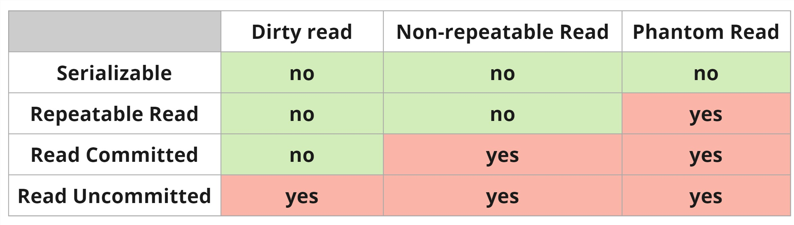

### Проблемы изолированности

#### DIRTY READ

Чтение данных, измененных впоследствии откатившейся транзакцией.
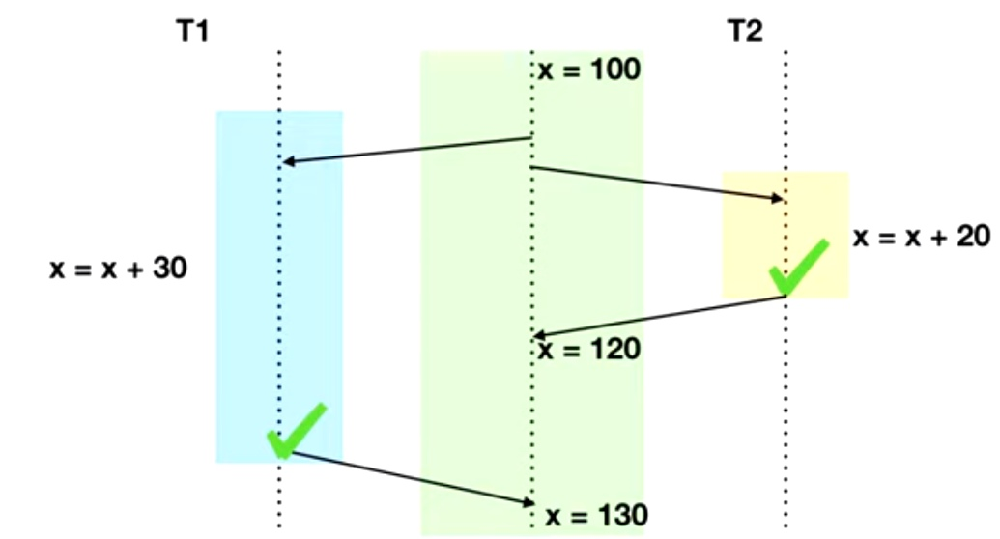

#### NON-REPEATABLE READ

Повторное чтение измененных данных одной и
той же транзакцией.
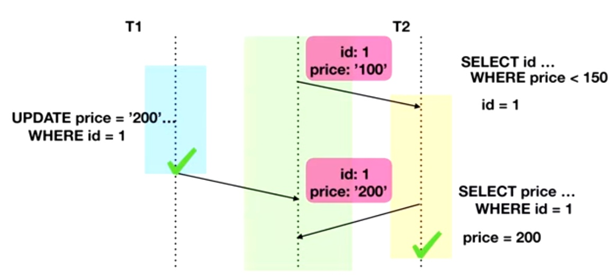

#### PHANTOM READ

Взаимосвязанные критерии изменения данных двумя транзакциями.
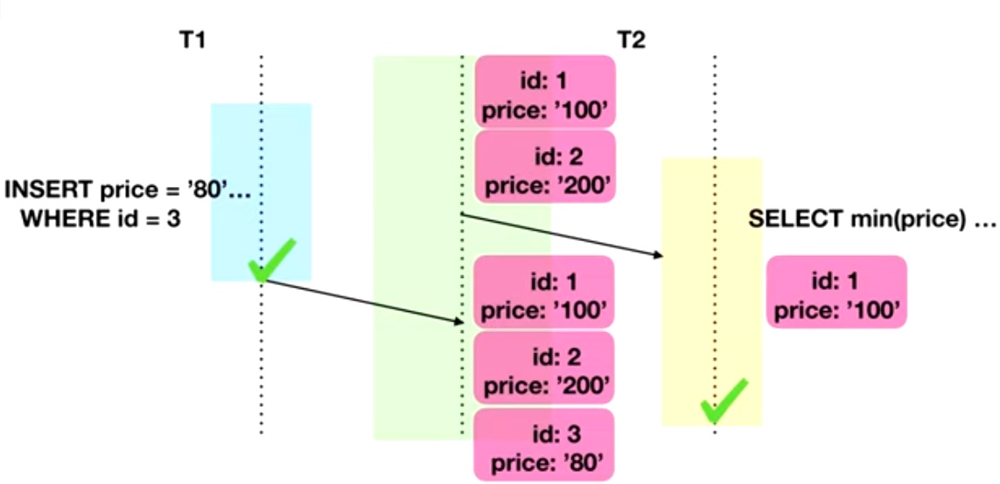

### Уровни изоляции
#### READ UNCOMMITED

**Реализация:**
- Данные блокируются на время внесения изменений.
- На время чтения данных блокировка отсутствует.

- Итоговое значение – результат выполнения каждой транзакции.
- Возможно считывание незафиксированных изменений.
- ***note*** На самом деле формален и заменяется постгресом на READ COMMITED (т.к. DIRTY READ это кринж)

#### READ COMMITED

**Реализация:**
- Блокирование читаемых и изменяемых данных;
- Сохранение нескольких версий параллельно изменяемых строк.

- Используется в большей части СУБД.
- Защита от "грязного" чтения.
- В процессе выполнения одна из транзакций успешно завершается, после чего остальные работают с измененными данными.
- Возможно неповторяющееся чтение.

#### REPEATABLE READ

- Читающая транзакция игнорирует изменения в данных, которые были ей ранее прочитаны.
- Никакая транзакция не может изменять данные, читаемые текущей транзакцией, пока чтение не завершено.
- Защищает от неповторяющегося чтения.

#### SERIALIZABLE

***def*** **Serializability** – последовательность операций сериализуема, если их можно упорядочить в порядке времени начала так, чтобы пересекающиеся по временным отрезкам транзакции не оперировали одинаковыми наборами данных.

SERIALIZABLE – полная изоляция с гарантией строгой сериализуемости. Результат параллельной работы неотличим от строго последовательной. Исключает грязное, неповторяемое и фантомное чтение за счёт блокировки конфликтующих данных и их диапазонов на всё время транзакции.

---
## 9. План запроса: Операторы EXPLAIN и ANALYZE. Чтение и анализ плана (Seq Scan, Index Scan, Join методы).

***def*** **Планировщик** – компонент PostgreSQL, который выбирает наиболее эффективный (по оценке стоимости) план выполнения SQL-запроса.

### Оператор `EXPLAIN`

- Выводит план выполнения, генерируемый планировщиком PostgreSQL для заданного оператора.
- Показывает, как будут сканироваться таблицы, затрагиваемые оператором – просто последовательно, по индексу и т.д.
- Показывает, какой алгоритм соединения будет выбран для объединения считанных из таблиц строк.
- Показывает оценочную стоимость выполнения операций (в условных единицах).
- ОТСУТСТВУЕТ в стандарте SQL.

*Синтаксис:*
```SQL
EXPLAIN [ ( option [, ...] ) ] statement
EXPLAIN [ ANALYZE ] [ VERBOSE ] statement

where option can be one of:
ANALYZE [ boolean ]
VERBOSE [ boolean ]
COSTS [ boolean ]
BUFFERS [ boolean ]
TIMING [ boolean ]
FORMAT { TEXT | XML | JSON | YAML }
```

*Пример:*

```SQL
    INSERT INTO my_table ...;
    EXPLAIN SELECT * FROM my_table;
- - - -
QUERY PLAN
Seq Scan on my_table (cost=0.00..18334.00 rows=1000000 width=37)
```

- Данные читаются методом Seq Scan из таблицы my_table
- `cost` – затраты (в некоторых условных единицах) на получение первой строки..всех строк
- `rows` – оценочное количество строк, которое, по мнению планировщика, вернет операция.
- `width` – средний размер одной строки в байтах
- Если статистика устарела, оценки в плане могут быть неточными. Команда `ANALYZE` обновляет статистику.
### Оператор `ANALYZE`:

- Собирает статистику распределения значений столбцов и сохраняет её в системном каталоге `pg_statistic`.
- Без параметров анализирует все таблицы в текущей базе данных.
- Если в параметрах передано имя таблицы, обрабатывает только заданную таблицу.
- Если в параметрах передан список имен столбцов, то сбор статистики запустится только по этим столбцам.
- ОТСУТСТВУЕТ в стандарте SQL.

*Синтаксис:*

```SQL
ANALYZE [ VERBOSE ] [ table_name [ ( column_name [, ...] ) ] ]
```

*Пример:*

```SQL
ANALYZE my_table;
EXPLAIN SELECT * FROM my_table;

EXPLAIN (ANALYZE) SELECT * FROM my_table;
- - - -
QUERY PLAN
Seq Scan on foo (cost=0.00..18334.10 rows=1000010 width=37)
(actual time=0.402..97.000 rows=1000010 loops=1)

Planning time: 0.042 ms
Execution time: 138.229 ms
```

В отличие от обычного `EXPLAIN`, запрос действительно выполняется, после чего выводится фактическая статистика выполнения.

- `actual time` – реальное время в миллисекундах, затраченное для получения первой строки и всех строк соответственно.
- `rows` – реальное количество строк, полученных при Seq Scan.
- `loops` – сколько раз пришлось выполнить операцию Seq Scan.
- `Planning time` – время, потраченное планировщиком на построение плана запроса.
- `Execution time` – общее время выполнения запроса.

### Чтение и анализ плана

- **Seq Scan**:Последовательное, блок за блоком, чтение данных таблицы.
- **Index Scan**:Используется индекс для условий `WHERE` (селективность условия), читает таблицу при отборе строк.
- Подробнее и про Index Only Scan / Bitmap Index Scan в пункте 11.

### Join методы
#### Nested Loop

**Идея:** Для каждой строки внешней таблицы ищутся подходящие строки во внутренней таблице.

**Преимущества:**
- Дешевый и быстрый на небольших объемах данных;
- Хорошо работает с 1 маленькой и 1 большой таблицей;
- Не требует много памяти;
- Умеет соединять не только по равенству.

**Недостатки:** Плохо работает для больших объемов данных.

#### Hash Join

**Идея:** По одной таблице строится хэш-таблица, затем строки второй таблицы ищутся в ней по значению ключа.

**Преимущества:**
- Не нужен индекс;
- Относительно быстрый;
- Может быть использован для `FULL OUTER JOIN`.

**Недостатки:**
- Требует много памяти.
- Соединение только по равенству.
- Большое время получения первой строки
- Тратится доп. время на вычисление хэша

#### Merge Join

**Идея:** Одновременно просматриваются две отсортированные последовательности и объединяются совпадающие строки.

**Преимущества:**
- Быстрый на больших и малых объемах данных;
- Не требует много памяти;
- Умеет в `OUTER JOIN`;
- Подходит для соединения более чем двух таблиц.

**Недостатки:**
- Требует отсортированные потоки данных, что подразумевает индекс или сортировку;
- Соединение только по равенству.

___
## 10. Индексы: Назначение, условия использования. Типы: B-Tree, Hash, GiST, GIN, BRIN (номинально)

***def*** **Индекс** – специальный объект БД, хранящийся отдельно от таблиц и обеспечивающий более быстрый поиск строк по сравнению с последовательным просмотром таблицы. Это вспомогательные структуры: любой индекс можно удалить и восстановить заново по информации в таблице. Индексы служат также для поддержки некоторых ограничений целостности.

В PostgreSQL 9.6 встроены _шесть разных видов индексов_: B-Tree, Hash, GiST, SP-SiST, GIN, BRIN

**Свойства:**

- Все индексы PostgreSQL являются вторичными, они отделены от таблицы. Вся информация о них содержится в системном каталоге.
- При изменении индексируемых данных индекс также обновляется, что замедляет операции INSERT, UPDATE и DELETE.
- В основе различных типов индексов лежат разные структуры данных (B-деревья, хеш-таблицы, инвертированные индексы и др.).
- Индексы могут быть многоколоночными (поддержание условия на несколько полей).
- Индексы связывают ключи и TID (tuple id - page: offset) – номер страницы и строки на ней.
- Обновление полей таблицы, по которым не создавались индексы, не приводит к перестроению индексов (Heap-Only Tuples, HOT).

_Оптимизация HOT:_ при апдейте строки, если это возможно, Postgres поставит новую копию строки сразу после старой копии строки. Также в старой копии строки проставляется специальная метка, указывающая на то, что новая копия строки находится сразу после старой. Благодаря этому PostgreSQL может не обновлять записи в индексах, если изменяются только неиндексируемые столбцы.

**Условия использования:**

- Оператор запроса должен поддерживаться данным типом индекса, а типы аргументов должны соответствовать классу операторов индекса.
- Индекс валиден.
- Важен порядок полей внутри многоколоночного индекса, чтобы накладывать условия, ожидая, что оптимизатор выберет индекс.
- Планировщик запросов должен оценить использование индекса как более выгодное, чем альтернативные способы доступа (например, последовательное сканирование).

**Синтаксис:**

```sql
CREATE [UNIQUE] INDEX [CONCURRENTLY] [name] ON table_name [USING METHOD]...
CREATE INDEX ON my_table(column_2);
ALTER INDEX [IF EXISTS] name RENAME TO new_name
DROP INDEX [CONCURRENTLY] [IF EXISTS] name [, ...] [CASCADE|RESTRICT]

ALTER INDEX [IF EXISTS] name RENAME TO new_name
ALTER INDEX [IF EXISTS] name SET TABLESPACE tablespace_name
ALTER INDEX [IF EXISTS] name SET (storage_parameter = value [, ... ])
ALTER INDEX [IF EXISTS] name RESET (storage_parameter [, ... ])
DROP INDEX [CONCURRENTLY] [IF EXISTS] name [, ...] [CASCADE|RESTRICT]
```

**Общая информация**

- При увеличении числа подходящих строк стоимость использования индекса возрастает, поэтому при низкой селективности планировщик может предпочесть последовательное сканирование таблицы.
- Ситуация усугубляется тем, что последовательное чтение выполняется быстрее, чем чтение страниц "вразнобой". Это особенно верно для жестких дисков, где механическая операция подведения головки к дорожке занимает существенно больше времени, чем само чтение данных; в случае дисков SSD этот эффект менее выражен.

### Типы индексов

#### B-дерево (B-Tree)

Индекс построен на основе **сбалансированного B-дерева**. Это основной и наиболее универсальный тип индекса в PostgreSQL, используемый по умолчанию.

Предназначен для поиска по точному значению, диапазонам и упорядоченным данным. Эффективен для большинства запросов с операторами сравнения (`=`, `<`, `<=`, `>`, `>=`), а также может использоваться при сортировке (`ORDER BY`) и поиске по префиксу строки (`LIKE 'abc%'`).

_**note**_ B-Tree – тип индекса по умолчанию. Если при создании индексного метода не указать `USING`, будет создан именно B-Tree.

#### Hash

Индекс основан на **хеш-таблице**: для каждого значения вычисляется хеш-код, по которому выполняется поиск.

Предназначен исключительно для поиска по точному совпадению (`=`). Не поддерживает диапазонные запросы и сортировку, поэтому применяется значительно реже B-Tree.

#### GiST (Generalized Search Tree)

GiST построен на основе **обобщённого сбалансированного дерева поиска** и представляет собой каркас для реализации различных методов индексирования.

Предназначен для сложных типов данных: геометрии, диапазонов, сетевых адресов, полнотекстового поиска и других. Особенно полезен для пространственных запросов, поиска пересечений, вхождения объектов и поиска ближайшего соседа.

_**note**_ GiST – это не один конкретный алгоритм, а универсальный каркас, который может реализовывать различные стратегии индексирования с помощью классов операторов.

#### GIN (Generalized Inverted Index)

GIN основан на **инвертированном индексе**, где каждому элементу составного значения соответствует отдельная запись индекса.

Предназначен для работы с данными, содержащими множество элементов: массивами, `JSONB`, документами полнотекстового поиска (`tsvector`). Эффективен при проверке наличия отдельных элементов внутри значения.

 _**note**_ В отличие от B-Tree, индексируется не всё значение целиком, а его отдельные компоненты.
#### BRIN (Block Range Index)

BRIN хранит **сводную информацию о диапазонах страниц (блоков) таблицы** (например, минимальное и максимальное значение в каждом диапазоне страниц), а не индексирует каждую строку отдельно.

Предназначен для очень больших таблиц, данные в которых физически расположены в порядке изменения значений (например, по времени или идентификатору). Занимает очень мало места и позволяет быстро отсечь блоки, заведомо не содержащие подходящих строк.

_**note**_ BRIN особенно эффективен при высокой корреляции между порядком хранения строк и значениями индексируемого столбца; в противном случае его эффективность существенно снижается.

___
## 11. Методы доступа к данным: Seq Scan, Index Scan, Index Only Scan, Bitmap Scan.

При выполнении запроса PostgreSQL должен определить, каким способом получать строки таблицы. Для этого планировщик выбирает метод доступа к данным, оценивая стоимость различных вариантов с учётом статистики, наличия индексов и ожидаемого числа возвращаемых строк.
#### Seq Scan

**Идея:** Последовательное, блок за блоком, чтение данных таблицы.

**Преимущества:** Эффективен при чтении значительной части таблицы, так как данные считываются последовательно, без дополнительных обращений к индексу.

**Недостатки:** Неэффективен при выборке небольшого числа строк, поскольку приходится просматривать всю таблицу.

#### Index Scan

**Идея:** Используется индекс для условий `WHERE` (селективность условия), читает таблицу при отборе строк.

**Преимущества:** Эффективен при высокой селективности условия, когда требуется получить небольшое количество строк.

**Недостатки:** При выборке большого числа строк становится неэффективным из-за большого количества обращений к страницам таблицы. В этом случае планировщик часто выбирает `Bitmap Scan`.

#### Bitmap Index Scan

**Идея:** Сначала по индексу строится битовая карта страниц (или строк), затем нужные страницы таблицы читаются в более оптимальном порядке.

**Преимущества:** Эффективен при выборке значительного количества строк, когда обычный `Index Scan` приводит к большому числу случайных обращений к таблице.

**Недостатки:** Не ускоряет работу, если условие не является селективным. Выборка может оказаться слишком велика для объема оперативной памяти, тогда строится только битовая карта страниц — она занимает меньше места, но при чтении страницы приходится перепроверять условия для каждой хранящейся там строки.

- В случае почти упорядоченных данных построение битовой карты — лишний шаг, обычное индексное сканирование будет таким же.
- Создается битовая карта, где предполагаем, что в соответствии с собранной статистикой наши строки удовлетворяют нашему условию; в ней есть странички;
- Если условия наложены на несколько полей таблицы, и эти поля проиндексированы, сканирование битовой карты позволяет (если оптимизатор сочтет это выгодным) использовать несколько индексов одновременно. Для каждого индекса строятся битовые карты версий строк, которые затем побитово логически умножаются (если выражения соединены условием AND), либо логически складываются (если выражения соединены условием OR).

#### Index Only Scan

**Идея:** Данные читаются только из индекса, без обращения к строкам таблицы (если это позволяет карта видимости).

**Преимущества:** Очень быстрая операция.

**Недостатки:** Может применяться только тогда, когда индекс включает все необходимые для выборки поля, и дополнительный доступ к таблице не требуется.

Если индекс уже содержит все необходимые для запроса данные, то индекс называется _покрывающим_.

___
## 12. Буферный кэш и WAL (Write-Ahead Log): Принципы работы, роль в обеспечении ACID.

[TODO]
